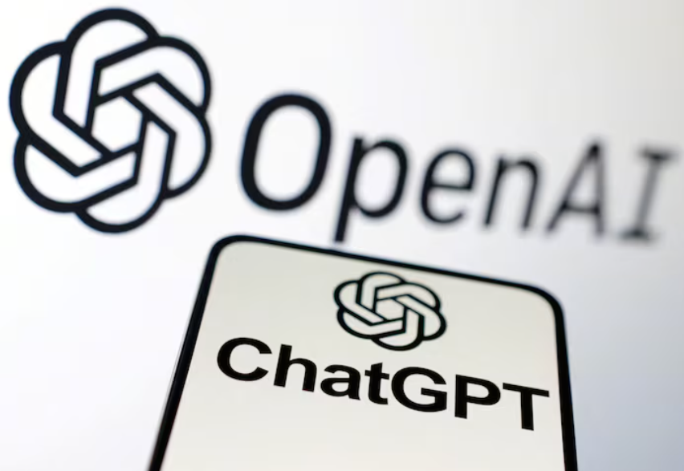

智能涌现和AGI的起源

## 1. 涌现

***Emergence***

涌现是指在复杂系统中，由大量简单个体的相互作用产生的不可预测的、新的模式或行为。

雪花的形成是一个很好的例子，展示了自然界中涌现现象的美丽和复杂性：单个水分子是简单的，但当无数的水分子在大气中遇到冷空气并开始结晶时，它们会自发地组织成复杂的、具有特定对称性的雪花晶体结构。

其他涌现现象的例子还包括蚁群的行为、鱼群的集群、鸟群的飞行模式等，这些都是从简单的个体行为中产生的复杂集体现象。

## 2. 诗云
《诗云》是由中国科幻作家刘慈欣发表于2003年3月份的《科幻世界》上的中篇小说，是刘慈欣“大艺术系列”之二 ，获得当年度中国科幻银河奖读者提名奖，后收录于《2003年度中国最佳科幻小说集》。

掌握强大技术的外星文明，有能力毁灭恒星，却在被他们视为杂草和虫豸的地球生物面前遭遇到挑战，因为他们发现人类所拥有的“诗艺”远在技术的控制范围之外。无法克隆人类“诗艺”的外星文明干脆开发出一种程序，以穷举的方式演算出所有文字可能的排列组合，并耗尽太阳系的全部能量，将规模惊人的数据存储起来，形成一片状如银河系的星云。

我猜这个‘2003年的外星文明’一定还没有遇到过“智能涌现”，否则他们就不会用这种穷举的方式来解决问题了。

## 2. 智能涌现

***Intelligence Emergence***

智能涌现是复杂系统科学中的一个核心概念，它描述的是在一个系统中，当大量简单的个体以一定方式相互作用时，会自发产生新的、不可预测的特性或行为。这些新特性不是单个个体所具有的，而是系统整体的属性。

在人工智能领域，智能涌现通常指的是随着AI模型规模的增大，如参数数量的增加，模型开始展现出一些预先没有被明确编程的能力或行为。

智能涌现的特点包括自适应、创新和复杂性。例如，大型语言模型如GPT-3在训练后能够展现出令人惊讶的创作能力，如写诗、编写文章甚至生成代码，这些能力并非在训练数据或程序中明确指定，而是从大量数据中自主学习得到的。

在GPT-3之前，人们可能很难想象一个AI模型能够如此自如地进行自然语言生成，但随着模型规模的增大和训练数据的增加，这种智能涌现的现象变得越来越普遍。

## 3. GPT-3的起源

1. 2017 年，Google 机器翻译团队发表的《Attention is All You Need》中，完全抛弃了RNN和CNN等网络结构，而仅仅采用Attention机制来进行机器翻译任务，并且取得了很好的效果，这是Transformer的首次提出。

>评论：此时的Transformer模型是一个encoder-decoder结构，只是为了用于机器翻译任务。 

2. 2018年6月，OpenAI 发表了《Improving Language Understanding by Generative Pre-Training》即GPT-1， 参数规模为1.17亿。模型采用Transformer的decoder部分进行特征抽取，这是首次将Transformer应用于预训练语言模型。预训练的语料库包括英文维基百科、WebText等大规模文本数据。

>评论：OpenAI看到了这篇Paper，并截取了decoder部分，进行自然语言理解。注意，此时OpenAI只是用来做NLU，包括意图识别，命名实体识别等自然语言处理任务。paper的名称Language Understanding可见其初衷。

3. 2018年10月，Google发表了《BERT: Pre-training of Deep Bidirectional Transformers for Language Understanding》，即Bert，参数规模为1.1亿-13亿。模型采用了Transformer的encoder部分进行特征抽取。在大量的NLP任务上优于GPT。

> 评论：谷歌发现了OpenAI的工作，为了新颖性，它便选择了encoder部分，用于自然语言理解。双向的特性使得Bert在自然语言理解任务上优于GPT。

4. 2019年2月，OpenAI发表了《Language Models are Unsupervised Multitask Learners》，即GPT-2，参数规模15 亿，模型依旧采用transformer的decoder部分进行特征抽取，性能和Bert相当。

>评论：OpenAI看到Bert打败了GPT，此时它有两种选择：要么选择谷歌成功的路继续研究，承认自己当初二选一的时候选错了；要么选择继续走自己的路，死磕decoder继续研究。OpenAI选择了后者，继续研究GPT，于是便有了GPT-2。
GPT-2在自然语言理解任务上性能和Bert相当，但是GPT-2有一定的语言生成能力--这也成了GPT-2的卖点。

5. 2020年6月，OpenAI发表了《Language Models are Few-Shot Learners》，即GPT-3，参数规模为1,750 亿，模型依旧采用transformer的decoder部分进行特征抽取，此时的GPT-3在文本生成上已经很惊艳了。
> 评论：大概是在研究GPT-2的时候，OpenAI发现了GPT-2的生成能力，于是便继续研究GPT-3，GPT-3在文本生成上已经很惊艳了。OpenAI的做法是继续扩大模型规模，此时 ***智能涌现*** 现象逐渐显现。

6. 2021年7月，OpenAI发表了《Evaluating Large Language Models Trained on Code》，即Codex

7. 2022年，openAI发布《Training language models to follow instructions with human feedback》即instruct-GPT

8. 2022年底，基于GPT-3.5，ChatGPT上线，成为现象级产品。

## 4. OpenAI轶事
GPT项目只是OpenAI的众多项目中的一个，甚至是最不起眼的一个,当初的项目有：
- ***Gym***:一个用于强化学习的开源工具包，被广泛应用于学术界和工业界；
- ***Universe***: 一个用于强化学习的平台，可以让AI在游戏中学习；
- ***OpenAI Five***:一个用于Dota2的AI，可以和人类玩家对战；
- ***Dactyl*** 一个用于机器人手臂的AI，可以进行各种操作
- 等等
可以看到OpenAI的项目更多的是围绕着强化学习展开的，感觉对标的是谷歌收购的DeepMind，后者的AlphaGo和AlphaStar都是很有名的。

## 5. 总结
OpenAI一开始也没有想到可以用decoder做语言模型,只是在探索过程中偶然发现了这个大力出奇迹的方法。

而谷歌在创造出Transformer之后，却没拿到先发优势，反而被OpenAI用在了GPT上, 这也导致了谷歌八子的离去. 

这就是科技发展的魅力所在，不是谁先发明了什么，而是谁能更好地利用这个发明。

## 参考

[1] [【科普阅读】又下雪了，你观察过雪花的形状吗？](https://www.cma.gov.cn/2011xwzx/2011xqxxw/2011xqxyw/201902/t20190214_514696.html)

[2] [诗云百科词条](https://baike.baidu.com/item/%E8%AF%97%E4%BA%91/6642267)

[3] [Attention Is All You Need](https://arxiv.org/pdf/1706.03762)

[4] [GPT-1](https://cdn.openai.com/research-covers/language-unsupervised/language_understanding_paper.pdf)

[5] [Bert](https://arxiv.org/pdf/1810.04805)

[6] [GPT-2](https://cdn.openai.com/better-language-models/language_models_are_unsupervised_multitask_learners.pdf)
 
[7] [GPT-3](https://arxiv.org/pdf/2005.14165)

[8] [36k:Transformer论文「重磅更新」，八子全部离职](https://36kr.com/p/2372013517760776)

## 欢迎关注我的GitHub和微信公众号，来不及解释了，快上船！

[GitHub: LLMForEverybody](https://github.com/luhengshiwo/LLMForEverybody)

仓库上有原始的Markdown文件，完全开源，欢迎大家Star和Fork！