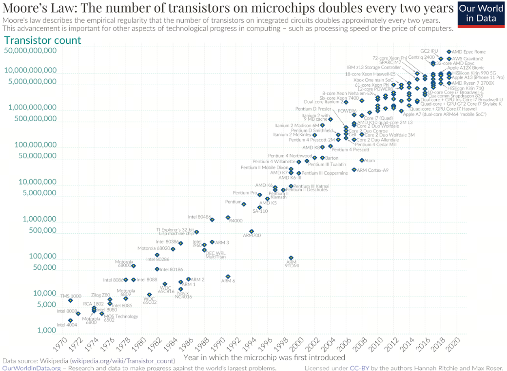

大家都谈的Scaling Law是什么?
## 1. 什么是Scaling Law?
"Scaling law"在中文中通常被翻译为“缩放定律”或“规模定律”。这个术语在不同的学科领域中有不同的应用，但核心概念是指在一定条件下，系统的性能或特性随着规模的变化而呈现出的规律性变化。

在人工智能和机器学习领域，Scaling Law通常用来描述模型性能如何随着模型大小（如参数数量）、数据集大小和计算资源的增加而变化, 并且这些变化通常遵循幂律关系。

## 2. 什么可以被称为Law定律?
定律是为实践和事实所证明，反映事物在一定条件下发展变化的客观规律的论断。

定律是一种理论模型，它用以描述特定情况、特定尺度下的现实世界，在其它尺度下可能会 ***失效***或者 ***不准确*** 。

可以称为定律的规律，通常是经过大量实验验证，被广泛接受的规律，如牛顿三大定律、摩尔定律等。

- 牛顿第一定律:  一切物体总保持匀速直线运动状态或静止状态，直到有外力迫使它改变这种状态为止;

- 摩尔定律: 集成电路上可容纳的晶体管数目，约每隔18个月便会增加一倍，性能也将提升一倍;

- 墨菲定律: 有可能出错的事情，就会出错（Anything that can go wrong will go wrong）;

- 帕累托法则: 80%的结果来自于20%的原因，也称为二八定律。

Scaling Law 规模定律通常会和摩尔定律相提并论, 摩尔定律在过去几十年中一直是计算机领域的一个重要定律，而规模定律则是在人工智能领域中刚提出的一个概念, 在大规模模型的训练和部署中具有重要意义, 但尚未经过时间的考验.

## 3. 定律一定是放之四海而皆准的吗?

### 火鸡与农场主理论

火鸡与农场主理论是一个经典的哲学思考，它源自于哲学家伯特兰·罗素提出的“火鸡问题”，后来在刘慈欣的科幻小说《三体》中被引用和扩展。这个理论讲述的是一个农场里有一群火鸡，农场主每天中午十一点来给它们喂食。火鸡中的一名科学家观察到这个现象，一直观察了近一年都没有例外，于是它也发现了自己宇宙中的伟大定律：“每天上午十一点，就有食物降临。”它在感恩节早晨向火鸡们公布了这个定律，但这天上午十一点食物没有降临，农场主进来把它们都捉去杀了。

这个理论用来说明我们对自然界规律的理解可能只是基于有限的观察和经验，而这些观察和经验可能并不完全揭示了事物的本质。它提醒我们，即使我们观察到的规律在大多数情况下都成立，也不能排除在某些未知或未观察到的情况下，这些规律可能会被打破。在《三体》中，这个理论被用来引发对科学规律、人类认知局限性和未知宇宙力量的深刻思考。

## 4. 为什么要研究Scaling Law?

- 预测模型性能：通过Scaling Law，研究者可以预测在给定的计算资源和数据量下，模型性能的潜在提升。这有助于在实际训练之前做出更有信息的决策。

- 资源优化：Scaling Law可以帮助研究者和工程师更有效地分配计算资源和数据，以在有限的预算内获得最佳的模型性能。

## 参考

[1] [deeplearning.ai](https://www.deeplearning.ai/courses/generative-ai-with-llms/)

[2] [定律-百科](https://baike.baidu.com/item/%E5%AE%9A%E5%BE%8B/2076576)

## 欢迎关注我的GitHub和微信公众号：

[GitHub: LLMForEverybody](https://github.com/luhengshiwo/LLMForEverybody)

