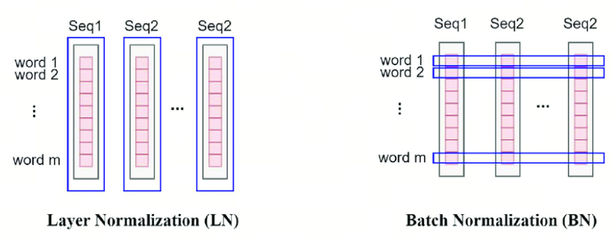

10分钟搞清楚为什么Transformer中使用LayerNorm而不是BatchNorm
## 1. Norm(Normalization)

首先，LayerNorm和BatchNorm的Norm是Normalization的缩写,不是Norm-范数。

Normalization在统计学中一般翻译为归一化，还有类似的是Standardization，一般翻译成标准化。这两个概念有什么区别呢？

归一化是将数据缩放到0-1之间，标准化是将数据缩放到均值为0，方差为1的正态分布。

有时候Normalization和Standardization会混淆，注意看清楚即可，不纠结细节。

## 2. BatchNorm
BatchNorm,（Batch Normalization），批归一化，旨在提高神经网络的训练速度、稳定性和性能。它由 Sergey Ioffe 和 Christian Szegedy 于 2015 年提出。BatchNorm 主要解决的问题是在训练深度神经网络时出现的内部协变量偏移（Internal Covariate Shift），即网络中各层输入数据分布的变化。

内部协变量偏移是指，随着网络层次的加深，每一层的输入数据（即前一层的输出）的分布可能会发生变化，这可能会导致训练过程中的梯度问题，比如梯度消失或梯度爆炸，从而影响网络的收敛速度和稳定性。

BatchNorm 的工作原理如下：

- 归一化：在训练过程中，BatchNorm 对每个小批量（mini-batch）的数据进行归一化处理，即计算该批量数据的均值和方差，并使用这些统计量将数据标准化，使得数据的均值为 0，方差为 1。

- 缩放和偏移：归一化后的数据会经过两个可学习的参数，即缩放因子（gamma）和偏移因子（beta），这两个参数允许网络在训练过程中学习到最佳的归一化方式。

- 应用：BatchNorm 通常在神经网络的层之间应用，特别是在卷积层或全连接层之后，激活函数之前。

在传统机器学习中，我们也经常会用到类似的方法：将某一个特征（batch维度）的数据归一化或者标准化来提高模型的泛化能力

## 3. LayerNorm
Layer Normalization（层归一化，简称LayerNorm）是一种在深度学习中用于稳定神经网络训练和提高性能的技术。它是由 Jimmy Lei Ba、Jamie Ryan Kiros、Geoffrey E. Hinton 在 2016 年提出的。LayerNorm 与 Batch Normalization 类似，都旨在减少内部协变量偏移，但它们在归一化的具体实现上有所不同。

LayerNorm 的主要思想是对神经网络的每一层（而不是每一个小批量）进行归一化处理。具体来说，LayerNorm 会计算单个样本在其所在层的所有激活值的均值和方差，并使用这些统计量来归一化该样本的激活值。这种方法不依赖于小批量统计量，因此可以减少 BatchNorm 中的噪声问题，并允许网络使用更小的小批量大小进行训练。

LayerNorm 的工作原理如下：

- 归一化：对于网络中的每一层，LayerNorm 会计算该层所有激活值的均值和方差。然后，使用这些统计量将激活值归一化，使得每个样本的激活值的均值为 0，方差为 1。

- 缩放和偏移：与 BatchNorm 类似，归一化后的数据会经过两个可学习的参数，即缩放因子（gamma）和偏移因子（beta），这两个参数允许网络在训练过程中学习到最佳的归一化方式。

- 应用：LayerNorm 可以应用于神经网络的任何层，包括卷积层和循环层，通常放在激活函数之前。

## 4. 为什么Transformer中使用LayerNorm而不是BatchNorm
Normalization技术旨在应对内部协变量偏移问题，它的核心在于将数据调整到一个统一的标准，以便进行有效的比较和处理。

为了实现这一目标，***我们需要确保参与归一化的数据点在本质上是可比的。***(记住这句话就可以了)

- **Batch Normalization（BatchNorm）**：这是一种对整个批次数据进行归一化的方法。具体来说，BatchNorm关注的是批次中每一列的数据，这些数据代表了不同样本的同一个特征。因为这些特征在统计上是相关的，所以它们可以被合理地放在一起进行归一化处理。这就像是在同一个班级里，比较不同学生的同一科目成绩，因为这些成绩都在相同的评分标准下，所以可以直接比较。

- **Layer Normalization（LayerNorm）**：与BatchNorm不同，LayerNorm适用于那些在不同样本之间难以直接比较的情况，如Transformer中的自注意力机制。在这些模型中，每个位置上的数据代表了不同的特征，因此直接归一化可能会失去意义。LayerNorm的解决方案是对每个样本的所有特征进行单独归一化，而不是基于整个批次。这就像是评估每个学生在所有科目中的表现，而不是仅仅关注单一科目，这样可以更全面地理解每个学生的整体表现。

## 参考

[1] [Do Standardization and normalization transform the data into normal distribution?](https://python.plainenglish.io/do-standardization-and-normalization-transform-the-data-into-normal-distribution-cb5857ab9c63)

[2] [Build Better Deep Learning Models with Batch and Layer Normalization](https://www.pinecone.io/learn/batch-layer-normalization/)

## 欢迎关注我的GitHub和微信公众号，来不及解释了，快上船！

[GitHub: LLMForEverybody](https://github.com/luhengshiwo/LLMForEverybody)

仓库上有原始的Markdown文件，完全开源，欢迎大家Star和Fork！

