## 零，引言

如果你最近被deepseek 刷屏了，你应该会去阅读它的技术报告，尤其是v3和r1，这两篇技术报告默认读者对于当前的大模型训练技术很了解。

所以对于初学者来讲，阅读这些技术报告会有痛苦和挑战，第一个挑战可能就是MLA(Multi-Head Latent Attention)，这是个来源于deepseek v2的技术。

本文试图从头开始，为大家梳理从MHA，MQA，GQA到MLA一路发展的脉络以及背后的原因，并尽量将所需要的知识直接附上，免去递归查找之苦。为了初学者友好，本文的思路是线性的，如果你已经了解某一块的知识，可以直接跳到其它感兴趣的部分。

通过本文，你会掌握MLA所需的前置知识包括：

1. 多头注意力机制MHA
2. 什么是位置编码和ROPE
3. KV Cache，prefilling&decoding
4. MHA为什么需要继续发展出MQA和GQA

并掌握MLA的技术核心：

1. MLA从0-1思路的猜测
2. MLA的技术要点

## 一，多头注意力机制MHA

如果你看GPT系列的论文，你学习到的self-attention是Multi-Head Attention(MHA)即多头注意力机制， MHA 包含h个Query、Key 和 Value 矩阵，所有注意力头(head)的 Key 和 Value 矩阵权重不共享。

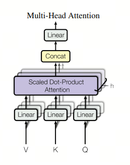

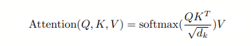

更细一点：

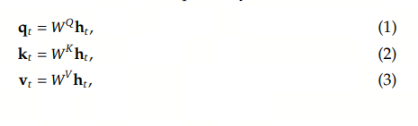

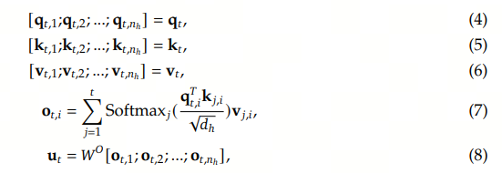

## 二，KV Cache：推理阶段的工程优化

KV Cache是GPT2开始就存在的工程优化。它主要用于在生成阶段（decode）缓存之前计算的键值对，避免重复计算，从而节省计算资源和时间。

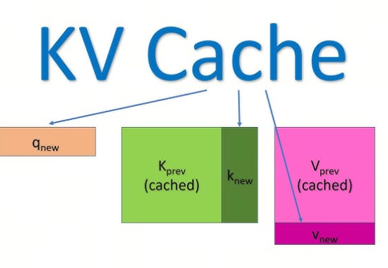

推理有两个阶段：prefill和decode。

Prefill阶段处理整个输入序列，生成第一个输出token，并初始化KV缓存。

Decode阶段则逐个生成后续的token，此时如果有KV缓存，每次只需处理新生成的token，而无需重新计算之前所有token的键值。

在Appendix 1，我放了一个KV Cache的例子作为参考。

## 三，MQA，GQA：多头注意力机制的降本增效

既然我们用空间换时间的方案，加快了推理速度，那占用显存空间又成了一个可以优化的点，有没有可能降低KV Cache的大小呢？

业界在2019年和2023年分别发明了MQA(Multi Query Attention)和GQA(Group Query Attention), 来降低KV 缓存的大小。

不可否认的是，这两者都会对大模型的能力产生影响，但两者都认为这部分的能力衰减可以通过进一步的训练或者增加FFN/GLU的规模来弥补。

MQA通过在Attention机制里面共享keys和values来减少KV cache的内容，query的数量还是多个，而keys和values只有一个，所有的query共享一组kv，这样KV Cache就变小了。

GQA不是所有的query共享一组KV，而是一个group的guery共享一组KV，这样既降低了KV cache，又能满足精度，属于MHA和MQA之间的折中方案。

## 四，MLA：山穷水尽疑无路，柳暗花明又一村

### 4.1 MHA，MQA，GQA 后下一个创新点在哪？

MQA 和 GQA 是在缓存多少数量KV的思路上进行优化：直觉是如果我缓存的KV个数少一些，显存就占用少一些，大模型能力的降低可以通过进一步的训练或者增加FFN/GLU的规模来弥补。

如果想进一步降低KV缓存的占用，从数量上思考已经不行了，那就势必得从KV本身思考，有没有可能每个缓存的KV都比之前小？

我们知道，一个M*N的矩阵可以近似成两个M*k和k*N矩阵的乘积，那如果我把一个K/或者V矩阵拆成两个小矩阵的乘积，缓存的时候显存占用不就变小了吗？

但这有一个问题，如果单纯的把一个大的K/V矩阵拆成2个小矩阵进行cache，那在推理的时候，还是需要计算出完整的K矩阵，这样就失去了缓存的意义，毕竟缓存的意义就是减少计算！

有没有一种方法，即能减少缓存大小，又不增加推理时候的计算？

我们看看deepseek v2中是怎么解这个问题的。

### 4.2 MLA面临的问题与解法

在v2的论文中， $K_t$ 的表达从 $W^Kh_t$ 变为 $W^{UK}W^{DKV}h_t$ , 原来缓存的是 $W^Kh_t$ ，而现在缓存的是 $K_t$ 的一部分 $W^{DKV}h_t$ ，论文中把它定义成 $c^{KV}_t$ ,这样就达到了降低 K 大小的目的。

注意到 $W^{UK}$ 中 $U$ 是UP的意思，指带将后面的矩阵维度升上去； $W^{DKV} 中 $D$ 是 Down 的意思，指将维度降下去，而 ${DK}$ 指的是对 K，V 矩阵的采用相同的降维矩阵，这样只用缓存相同的 $c^{KV}_t$ 。

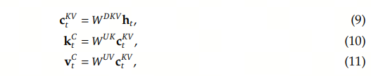

#### 4.2.1 推理阶段计算量的增加

到目前为止，似乎是so far so good，但是注意到在推理的时候，为了得到 $K^{C}_t$ 和 $V^{C}_t$ ，还得将 $W^{UK}$ 或者 $W^{UV}$ 乘上去，失去了缓存的意义，怎么办？

有没有什么办法在推理的时候，降低这一步的计算量呢？如果在推理中，一定要还原出 $W^{UK}$ 或者 $W^{UV}$ ，那就无解了，但好在 $W^{UK}$ 和 $W^{UV}$ 也只是中间变量，我们可以通过一定的变形巧妙的避免推理计算量。

我们看 Attention 因子的计算:

$${o}_{t,i} = \sum_{j=1}^{t} \text{Softmax}_j\frac{\mathbf{q}_{t,i}^T k_{t,j}}{\sqrt{d_h}}{v}_{j,i}$$

其中 $t$ 代表第 $t$ 次输入/输出， $i$ 代表第 $i$ 个head,

$$(W^q_tx_t)^{T}*W^{UK}_tc^{KV}_t 
= x_t^{T}*{W^q_t}^{T}*W^{UK}_t*c^{KV}_t 
= x_t^{T}*({W^q_t}^{T}*W^{UK}_t)*c^{KV}_t$$

利用矩阵的结合率，我们可以在推理的时候，提前算好 ${W^q_t}^{T}*W^{UK}_t$ ，这样在decode的时候，计算量基本没有增加，这被称为矩阵吸收（absorb）.

同理， $W^{UV}$ 也可以被吸收到 $W^{o}$ 中，注意这边我们需要小心的通过转置等手段保证数学上的恒等。

这样deepseek v2 就能既要又要了。

#### 4.2.2 MLA和RoPE位置编码不兼容

但是MLA又有一个新的问题，那就是和Rope位置编码的兼容性问题，为此他们还找过Rope的发明人苏剑林讨论过，这在苏2024年5月的博客里有提到，引用如下：

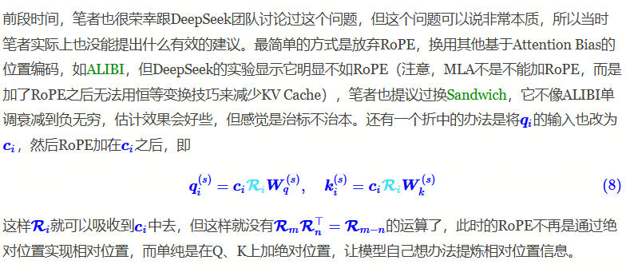

Deepseek最终的解决方案是在Q，K上新加d个维度，单独用来存储位置向量，在推理的时候，缓存 $c^{KV}_t$ 和 $K^R_t$ .

### 4.3 完整的MLA算法

我们可以看下完整的包含了RoPE的位置编码MLA算法，标框的是缓存的内容。

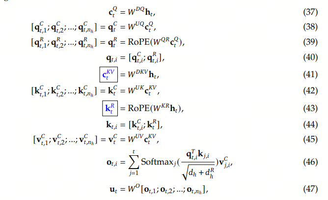

## Appendix 1，KV Cache

在推理阶段，KV Cache的存在与否对大模型的计算流程和效率有显著影响。

以下以prompt为“真忒修斯之船是一个”，生成completion “分享平台”为例，分别说明有无KV Cache的差异：

1. 无KV Cache的推理过程

原理：每次生成新token时，需要将整个历史序列（prompt+已生成tokens）重新输入模型，并重新计算所有token的Key和Value向量。  

示例流程：  

- Step 1：输入完整prompt“真忒修斯之船是一个”，计算所有token的Key/Value，生成第一个token“分”。  
  - 计算量：需处理9个token（假设“真忒修斯之船是一个”分词为9个token）。  
- Step 2：输入“真忒修斯之船是一个分”，重新计算全部10个token的Key/Value，生成“享”。  
  - 冗余计算：前9个token的Key/Value被重复计算。  
- Step 3：输入“真忒修斯之船是一个分享”，重新计算11个token的Key/Value，生成“平”。  
- Step 4：输入“真忒修斯之船是一个分享平”，重新计算12个token的Key/Value，生成“台”。  

问题：  

- 计算冗余：每生成一个token需重新计算所有历史token的Key/Value，复杂度为 $O(n^2)$ 显存和计算时间随序列长度急剧增长。  
- 显存占用高：显存需存储完整历史序列的中间结果，例如生成“台”时需缓存10个token的Key/Value。 

2. 有KV Cache的推理过程

原理：在prefill阶段计算prompt的Key/Value并缓存，后续decode阶段仅需计算新token的Key/Value，复用缓存的旧结果。  

示例流程：  
- Prefill阶段：输入完整prompt“真忒修斯之船是一个”，计算其9个token的Key/Value并缓存，生成第一个token“分”。  
- Decode阶段：  
  - Step 1：输入新token“分”，仅计算其Key/Value，与缓存的9个Key/Value合并，生成“享”。  
  - Step 2：输入新token“享”，计算其Key/Value，与缓存的10个Key/Value合并，生成“平”。  
  - Step 3：输入新token“平”，计算其Key/Value，与缓存的11个Key/Value合并，生成“台”。 

优势：  
- 计算量降低：复杂度从 $O(n^2)$ 降至 $O(n)$ 每个decode步骤仅需计算新token的Key/Value。  
- 显存优化：仅需存储缓存的Key/Value，显存占用公式为 $4blh(s+n)$ 但通过复用缓存避免了冗余存储。  
- 速度提升：实验显示，KV Cache可使吞吐量提升数十倍。  

3. 核心对比

| 维度 | 无KV Cache| 有KV Cache|
| :---: |:----:| :----: |
| 计算复杂度| $O(n^2)$ 随序列长度平方增长| $O(n)$ 仅需计算新token|
| 显存占用 |存储完整序列中间结果，显存需求高| 缓存Key/Value，显存需求可控 |
| 生成速度|慢（重复计算历史token）|快（仅计算新token，复用缓存）|
| 适用场景 |短序列生成（<100 tokens）|长序列生成（如API输入、视频生成）|

## Appendix 2，Rope相对位置编码

Rotation Position Encoding

RoPE提出为了能利用上 token 之间的相对位置信息，假定 query 向量$q_m$ 和 key 向量 kn之间的内积操作可以被一个函数 $g$ 表示，该函数 g 的输入是词嵌入向量 $x_m$，$x_n$ 和它们之间的相对位置 $m-n$ 

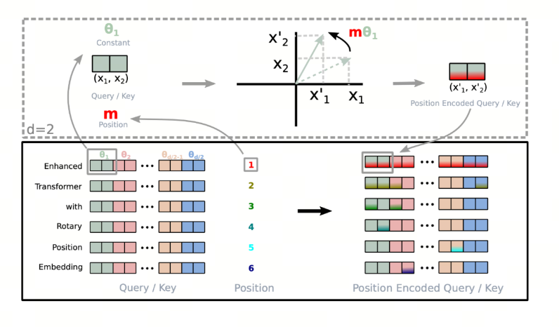

大胆假设，小心求证。 现在我们的目标就是找到一个合适的函数 $g$ ，使得 $g(x_m, x_n, m-n)$ 能够捕捉到词向量之间的相对位置信息。
RoPE提出，在词向量是二维的情况下，将平面转化为复平面，如果我们按照如下的方式定义函数 $f$ ，则可以找到对应的 $g$ 

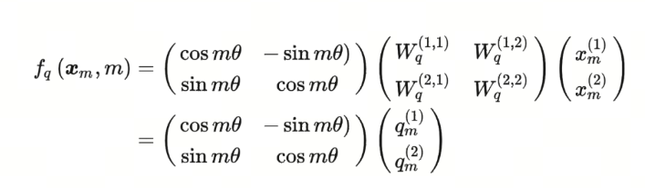

Re指的是复数的实数部分，更近一步，我们可以将函数 $f$ 定义为：

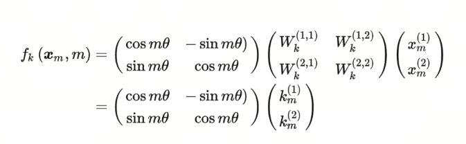

这边，不就是原来的query矩阵乘上了一个旋转矩阵吗？也就是说，加上$m$ 这个位置信息后，如果使用RoPE的设计方案，就相当于将原query矩阵进行了旋转。这就是旋转的由来。
同理，$f_K$ 可以表示为：

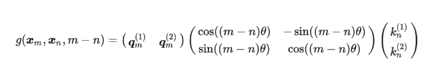

那么，对应的 $g$ 函数就是：

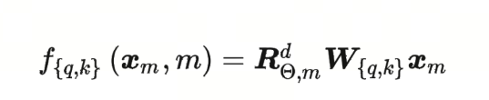

## 参考

[1] [Attention is all you need](https://arxiv.org/abs/1706.03762)

[2] [Fast Transformer Decoding: One Write-Head is All You Need](https://arxiv.org/abs/1911.02150)

[3] [GQA: Training Generalized Multi-Query Transformer Models from Multi-Head Checkpoints](https://arxiv.org/abs/2305.13245)

[4] [DeepSeek-V2: A Strong, Economical, and Efficient Mixture-of-Experts Language Model](https://arxiv.org/abs/2405.04434)

[5] [缓存与效果的极限拉扯：从MHA、MQA、GQA到MLA](https://spaces.ac.cn/archives/10091)
