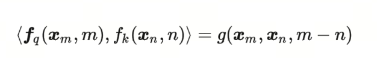
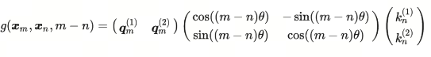
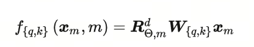
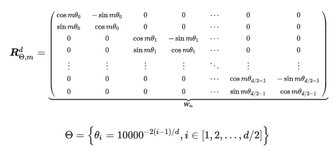
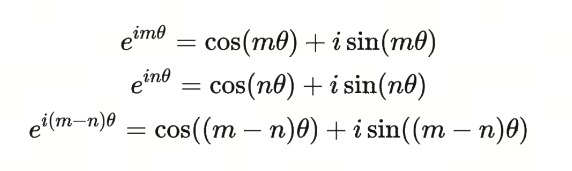

从欧拉公式的美到旋转位置编码RoPE

也许你在某些场合听说过欧拉公式，也许你干脆对数学不感冒。机缘巧合下，你点开了这篇文章，大致浏览了下然后关闭，继续为自己的工作学习忙碌。这不妨碍你暂停忙碌的脚步，欣赏她的美。
若干年后，你应该不曾记得看过这篇文章，但你会记得数学界有一个很美的公式。

## 1. 欧拉公式和欧拉恒等式

***欧拉公式***（Euler's formula）是复分析领域的公式，它将三角函数与复指数函数关联起来，因其提出者莱昂哈德·欧拉而得名。欧拉公式提出，对任意实数 x，都存在：
$$
e^{ix} = \cos(x) + i\sin(x)
$$ 
其中 e是自然对数的底数，i是虚数单位，而 cos和 sin则是余弦、正弦对应的三角函数，参数 x则以弧度为单位。

这是一个非常美丽的公式，它将三角函数，指数函数，复数联系在了一起，是数学中的一颗明珠。

***欧拉恒等式***（Euler's identity）是欧拉公式的一个特例，当 x = π 时，欧拉公式变为：
$$
e^{i\pi} + 1 = 0
$$
这个公式被认为是数学中最美丽的公式之一，它将五个最重要的数学常数联系在了一起：0、1、e、i和π。

>非常感谢**苏剑林**大神将这么漂亮公式引入到了位置编码的设计中，大家可以关注他的博客《科学空间》https://kexue.fm/, 可以学到很多东西。

## 2. 预备知识
为了看懂RoPE，我们需要了解一些预备知识，包括：
1）欧拉公式
2）复数/复平面
3）三角函数的几个公式

***重要！！！***   在你深入大量公式之前，先要了解：
- 复平面和欧拉公式的引入，只是为了简化计算过程；
- 欧拉公式经常在数学、物理和工程领域被如此广泛应用；
- 整个证明过程，先考虑词向量为二维，再利用矩阵的特性轻松拓展到多维；
- 在证明二维场景的时候，引入复平面，原因是可以这样可以使用欧拉公式获取漂亮的数学特性，来简化过程。

## 3. 旋转位置编码RoPE 
**Rotation Position Encoding**

RoPE提出为了能利用上 token 之间的相对位置信息，假定 query 向量$q_m$  和 key 向量  $k_n$之间的内积操作可以被一个函数$g$表示，该函数$g$的输入是词嵌入向量$x_m$，$x_n$ 和它们之间的相对位置$m-n$：

大胆假设，小心求证。 现在我们的目标就是找到一个合适的函数$g$，使得$g(x_m, x_n, m-n)$能够捕捉到词向量之间的相对位置信息。

RoPE提出，在词向量是二维的情况下，将平面转化为复平面，如果我们按照如下的方式定义函数$f$，则可以找到对应的$g$

$Re$指的是复数的实数部分，更近一步，我们可以将函数$f$定义为：

这边，不就是原来的query矩阵乘上了一个旋转矩阵吗？也就是说，加上$m$这个位置信息后，如果使用RoPE的设计方案，就相当于将原query矩阵进行了旋转。这就是**旋转**的由来。

同理，$f_K$可以表示为：

那么，对应的$g$函数就是：

## 4. 从二维到多维

在二维场景下，我们引入了复平面，是为了使用欧拉公式获取漂亮的数学特性，来简化过程。但是在多维场景下，我们可以直接使用矩阵的特性，来简化过程。将2维的RoPE推广到多维的RoPE，只需要将2维的RoPE的旋转矩阵$R$替换为多维的旋转矩阵$R$即可。

因为内积满足线性叠加性质，所以任意***偶数维***的RoPE都可以表示为二维情形拼接而成的形式。

即是在原来的$q*k$矩阵的基础上，加上了一个旋转矩阵$R^d_{\theta,m}$，这就是RoPE的设计思路。

在原始paper中，有一个直观的图

## 5.RoPE的证明
注意，现在的证明是建立在二维的基础上，二维可以用上一节的矩阵特性推广到多维。
二维的情况下，形式上我们将其转化为复平面。

按照RoPE的设计，编码后的$q,v$和内积$<q,v>$的形式是：

为什么上述公式满足：

首先，我们看到欧拉公式
$$
e^{ix} = \cos(x) + i\sin(x)
$$ 
则有：

我们看query矩阵，可以看到：

其中$W_q$是二维矩阵，$x_m$是二维向量，其乘积是一个二维向量，这边我们用$q_m$表示。$q^{(1)}_m$,$q^{(2)}_m$分别表示第一维和第二维。

我们这时，需要将$q_m$转化为复数形式，即将这个二维平面放到复平面上，复平面的实部是第一维（x轴），虚部是第二维（y轴）。

这时，我们可以将$f_q(x_m,m)$表示为：

这就是两个复数的积（将复数带入）

经过简单的展开：

再重新从复平面回到实数二维平面，我们可以将上述公式表示为：

事实上这就是没有位置信息的query向量乘上了一个旋转矩阵，这就是RoPE的设计思路。

同理，我们可以得到key向量的RoPE形式：

最后，我们可以得到RoPE的内积形式：

## 总结

RoPE非常巧妙的借助复平面和欧拉公式，将位置信息编码到了query和key向量中，使得模型能够利用上token之间的相对位置信息。RoPE的设计思路是将query和key向量进行旋转，这就是旋转的由来。

## 参考

[1] [十分钟读懂旋转编码（RoPE）](https://hub.baai.ac.cn/view/29979)

[2] [让研究人员绞尽脑汁的Transformer位置编码](https://kexue.fm/archives/8130)

[3] [Transformer升级之路：2、博采众长的旋转式位置编码](https://kexue.fm/archives/8265)

[4] [Transformer学习笔记一：Positional Encoding（位置编码）](https://zhuanlan.zhihu.com/p/454482273)

[5] [RoFormer: Enhanced Transformer with Rotary Position Embedding](https://arxiv.org/abs/2104.09864)

[6] [GitHub: LLMForEverybody](https://github.com/luhengshiwo/LLMForEverybody)