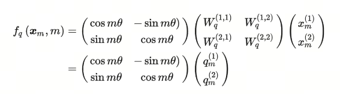

复变函数在大模型中的应用

## 1. 导入
说来惭愧，我研究生时的研究方向是复分析，但毕业近十年来几乎没用到它。

我还记得实习时做自我介绍时，我说我的研究方向是复分析。面试官不太了解，我便解释说，这是关于对 -1 开平方得到的虚数 i 的研究。

在人工智能领域，经常会用到的数学知识包括矩阵、概率论和一些微积分。然而，最近在研究大模型的位置编码时，我惊讶地发现了复分析的应用，10年前的记忆逐渐浮现。

## 2. 什么是复数
复数是数学中的一个基本概念，它扩展了实数系统，允许进行更广泛的数学运算。复数由两部分组成：实部和虚部。复数的一般形式可以表示为：

$$ a + bi$$ 

其中， a 是复数的实部， b  是复数的虚部，而  i 是虚数单位，满足 $ i^2 = -1 $。

复数的两个主要特征是：

1. **实数**：当虚部  b 为0时，复数退化为实数。
2. **虚数**：当实部  a 为0且虚部  b  非零时，复数被称为纯虚数。

复数可以进行加、减、乘、除等基本算术运算，这些运算遵循特定的规则。例如，两个复数的加法运算是将它们的实部和虚部分别相加：

$$ (a + bi) + (c + di) = (a + c) + (b + d)i $$

复数的乘法运算则稍微复杂一些，需要用到分配律和虚数单位 i 的性质：

$$(a + bi)(c + di) = ac + adi + bci + bdi^2 
 = (ac - bd) + (ad + bc)i $$

复数的除法运算涉及到将分母实数化，通常通过乘以共轭复数来实现。

复数在数学、物理、工程学等领域有着广泛的应用，如在信号处理、量子力学、电气工程等学科中，复数提供了一种描述周期性现象和旋转的有力工具。

## 3. 复变函数
复变函数是数学中的一个重要分支，它主要研究复数域上的函数，这些函数的自变量和因变量都是复数。复变函数论在许多工程和科学领域都有应用，以下是一些通常会学习复变函数的专业：

- 数学专业：复变函数是数学专业学生的必修课程之一，因为它是数学分析的延伸和深化。
- 电气工程：在信号处理和系统分析中，复变函数用于分析交流电路。
- 电子工程：在控制系统的设计和分析中使用复数域方法。
- 物理学专业：在量子力学和电磁学中，复变函数理论用于解决波动方程和势问题。

- 计算机科学与工程：在算法设计、图像处理和信号处理的算法开发中，复变函数有其应用。

- 航空航天工程：在流体动力学和控制系统分析中，复变函数用于数学建模。

- 机械工程：在振动分析和热传导问题中，复变函数理论有助于找到解决方案。

- 土木工程：在结构分析和地震工程中，复变函数用于解决某些动态问题。

- 生物学和生物医学工程：在生物信号处理和生物物理建模中，复变函数有助于分析和理解生物系统的动态行为。

- 金融数学和经济学：在某些高级经济模型和金融工具定价中，复变函数理论可以提供分析工具。

- 控制理论：在系统稳定性分析和控制器设计中，复变函数是基本工具之一。

学习复变函数的课程通常包括解析函数、复积分、级数展开、留数定理、共轭和谐函数等概念。

复数在机器学习中的应用相对较少，但在某些特定领域，如信号处理、图像处理和模式识别中，复数的性质和运算规则可以提供一些有用的工具和技术。

毕业十年后，我再一次领略了复数的魅力，这次是在大模型的位置编码中。复数的数学特性和运算规则为Transformer提供了一种新的位置编码方法，这种方法被称为RoPE（Rotary Position Embedding）。

## 4. 位置编码和RoPE

位置编码（Positional Encoding）是一种在处理序列数据时，用于向模型提供序列中每个元素位置信息的技术。

在自然语言处理（NLP）中，尤其是在使用Transformer模型时，位置编码尤为重要，因为Transformer模型本身并不包含处理序列顺序的机制。

位置编码的主要目的是让模型能够区分输入序列中词的顺序，从而更好地理解句子的结构和含义。

**Rotation Position Encoding**

RoPE提出为了能利用上 token 之间的相对位置信息，假定 query 向量$q_m$  和 key 向量  $k_n$之间的内积操作可以被一个函数$g$表示，该函数 $g$ 的输入是词嵌入向量$x_m$，$x_n$ 和它们之间的相对位置$m-n$：

大胆假设，小心求证。 现在我们的目标就是找到一个合适的函数$g$，使得$g(x_m, x_n, m-n)$能够捕捉到词向量之间的相对位置信息。

RoPE提出，在词向量是二维的情况下，将平面转化为复平面，如果我们按照如下的方式定义函数$f$，则可以找到对应的$g$

$Re$指的是复数的实数部分，更近一步，我们可以将函数$f$定义为：

这边，不就是原来的query矩阵乘上了一个旋转矩阵吗？也就是说，加上$m$这个位置信息后，如果使用RoPE的设计方案，就相当于将原query矩阵进行了旋转。这就是**旋转**的由来。

同理，$f_K$可以表示为：

那么，对应的$g$函数就是：

## 5. 一点想法
在RoPE中，没有引入很高深的复数知识，只是用了欧拉公式，而欧拉公式发表于1740年左右，但就这样简单的应用，就能在大模型中发挥作用。我在想，是不是还有其他数学知识，可以在大模型中发挥作用呢？

> 旋转位置编码由**苏剑林**大神设计，其引入数学中最美丽的公式-欧拉公式。
大家可以关注他的博客《科学空间》https://kexue.fm/, 会学到很多东西。

## 参考

[1] [RoFormer: Enhanced Transformer with Rotary Position Embedding](https://arxiv.org/abs/2104.09864)

[2] [GitHub: LLMForEverybody](https://github.com/luhengshiwo/LLMForEverybody)