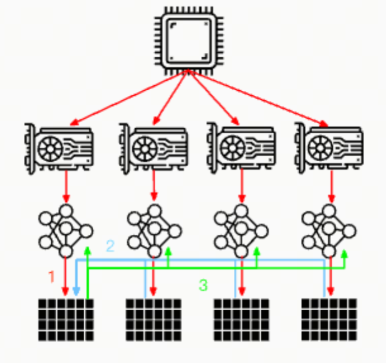

大模型分布式训练并行技术（二）数据并行

## 引言

数据并行（Data Parallelism）是一种常见的并行计算策略，它通过将大数据集分割成多个小批次（batches）或子集，然后在多个GPU上同时进行模型的训练。在LLM训练中，数据并行能够有效地加快模型训练的速度。

## DP & DDP

***DP (Data Parallel)*** ：（狭义的）数据并行DP是最简单的并行策略了，它是将模型的副本分布到单机多卡上，每个卡都有一个模型副本，然后每个卡都会处理不同的数据子集。在每个训练步骤结束时，所有卡都会同步模型参数。



***DDP (Distributed Data Parallel)*** 随着数据量的增大，单机多卡的训练效率会变得很低，这时候就需要使用分布式数据并行DDP。DDP是将模型的副本分布到多台机器上，每台机器上有多个卡，每个卡都有一个模型副本。在每个训练步骤结束时，所有卡都会同步模型参数。


## ZeRO Data Parallel

***ZeRO***，全称为"Zero Redundancy Optimizer"，是由微软研究院提出的一种用于优化分布式训练的内存管理技术。它旨在解决在大规模分布式训练中遇到的内存瓶颈问题，特别是在训练大型深度学习模型时。ZeRO 通过减少冗余数据来优化内存使用，使得在有限的硬件资源下训练更大的模型成为可能。


你可能也听过FSDP(Fully Sharded Data Parallel), 你可以把ZeRO Data Parallel和FSDP看作是一种相似的技术，它们都是通过将模型参数分片到多个设备上来实现数据并行的。


## ZeRO Data Parallel的原理

ZeRO Data Parallel原理理解起来并不复杂，我这边引用一下Huggingface的官方文档[1]中的解释。

考虑这个具有 3 层的简单模型，其中每层有 3 个参数：

La | Lb | Lc
---|----|---
a0 | b0 | c0
a1 | b1 | c1
a2 | b2 | c2

La 层具有权重 a0、a1 和 a2。

如果我们有 3 个 GPU，则分片 DDP（= Zero-DP）会将模型拆分到 3 个 GPU 上，如下所示：

GPU0:
La | Lb | Lc
---|----|---
a0 | b0 | c0

GPU1:
La | Lb | Lc
---|----|---
a1 | b1 | c1

GPU2:
La | Lb | Lc
---|----|---
a2 | b2 | c2

现在，每个 GPU 都将获得在 DP 中工作的常规小批量：

```Plain Text
x0 => GPU0
x1 => GPU1
x2 => GPU2
```

输入未经修改 - 它们（输入）认为它们将被正常模型处理。

首先，输入到达 La 层。

让我们只关注 GPU0：x0 需要 a0、a1、a2 参数来完成其前向路径，但 GPU0 只有 a0 - 它从GPU1 拿到 a1，从 GPU2 拿到 a2，将模型的所有部分组合在一起。

同时，GPU1 获得小批量（mini-batch） x1，它只有 a1，但需要 a0 和 a2 参数，因此它从 GPU0 和 GPU2 获取这些参数。

获得输入 x2 的 GPU2 也是如此。它从 GPU0 和 GPU1 获取 a0 和 a1，并使用其 a2 重建完整张量。

所有 3 个 GPU 都重建了完整张量，并进行前向传播。

一旦计算完成，不再需要的数据就会被丢弃 - 它仅在计算期间使用。重建是通过pre-fetch高效完成的。

整个过程先对 Lb 层重复，然后对 Lc 层向前重复，再对 Lc 层向后重复，然后向后 Lc -> Lb -> La。

## 更直观的解释

公司组织团建露营3天，大家都分别背上点东西：

```Plain Text
A扛帐篷
B扛零食
C扛水
```

现在，他们每天晚上都会与他人分享自己拥有的东西，并从他人那里获得自己没有的东西，早上收拾好分配给他们的装备，继续上路。这就是Sharded DDP/ZeRO DP。

将这种策略与简单的策略进行比较，简单的策略是每个人都必须携带自己的帐篷、零食和水，这会低效得多。简单策略就是DataParallel (DP 和 DDP)。

下一篇，我们看看流水线并行。

## 参考

<div id="refer-anchor-1"></div>

[1] [Model Parallelism](https://huggingface.co/docs/transformers/v4.15.0/en/parallelism)

[2] [ZeRO: Memory Optimizations Toward Training Trillion
Parameter Models](https://arxiv.org/pdf/1910.02054)

## 欢迎关注我的GitHub和微信公众号，来不及解释了，快上船！

[GitHub: LLMForEverybody](https://github.com/luhengshiwo/LLMForEverybody)

仓库上有原始的Markdown文件，完全开源，欢迎大家Star和Fork！