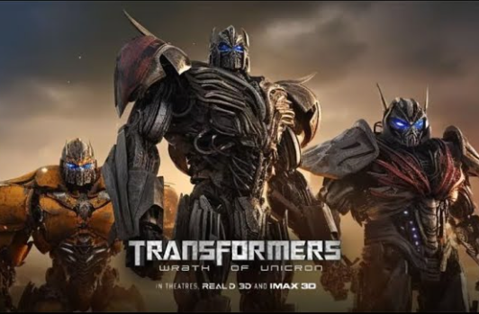

大模型训练框架（四）Megatron-LM

Megatron-LM[1](#refer-anchor-1) 是由 NVIDIA 推出的一个用于训练大型语言模型的分布式训练框架，它支持在多节点、多 GPU 环境下进行模型训练。Megatron-LM 通过模型并行（Model Parallelism）的方式，允许训练具有数千亿参数的模型。该框架综合应用了数据并行（Data Parallelism）、张量并行（Tensor Parallelism）和流水线并行（Pipeline Parallelism）来训练像 GPT-3 这样的大型模型。

`一个小tips`：**transformer** 也可以是**变形金刚**，而 **megatron** 是**威震天**。




## 1. Megatron-LM特点

Megatron-LM 通过数据并行、张量并行和流水线并行来复现大型模型如 GPT-3。它综合应用了多种并行策略来训练大型语言模型，包括张量并行（Tensor Parallelism）、流水线并行（Pipeline Parallelism）和数据并行（Data Parallelism）。这些技术帮助解决了显存限制、计算挑战和并行策略挑战等问题，使得在有限的硬件资源下训练更大的模型成为可能。


Megatron-LM 的特点包括：

1. **数据加载**：它带有一个高效的 DataLoader，其中数据在训练前被 tokenize 和 shuffle。它还将数据拆分为带有索引的编号序列，并将索引存储，因此 tokenize 只需要计算一次；

2. **融合 CUDA 内核**：Megatron-LM 使用 Apex 的 AdamW 融合实现，它比 PyTorch 实现更快。融合内核的思想是将通常由 PyTorch 单独执行的类似操作组合成一个单独的硬件操作，从而减少在多个离散计算中的内存移动次数；

3. **模型并行技术**：支持张量并行、序列并行、管道并行、上下文并行和 MoE 专家并行等多种并行策略；

4. **优化器和激活检查点**：内置分布式优化器和激活重计算功能，确保训练过程的高效性和稳定性；

5. **FlashAttention**：一种高效的注意力机制实现，显著提升了训练速度；

6. **多模态支持**：最新版本增加了对多模态训练的支持，扩展了应用场景。


## 2. Megatron-LM在pytorch中的实现

要在 PyTorch 中使用 Megatron-LM，你可以遵循以下步骤：

1. **安装依赖**：确保你的环境中安装了 PyTorch、CUDA 和 NCCL，以及 NVIDIA APEX。你可以使用 NVIDIA 的 NGC PyTorch 容器来简化环境设置。

2. **克隆 Megatron-LM 仓库**：
   ```bash
   git clone https://github.com/NVIDIA/Megatron-LM.git
   ```

3. **安装 Megatron-LM**：在克隆的仓库目录中，安装 Megatron-LM 的依赖项。
   ```bash
   cd Megatron-LM
   pip install -r requirements.txt
   ```

4. **数据准备**：Megatron-LM 支持多种数据集，如 Wikipedia、OpenWebText 等。你需要下载数据集并进行预处理，将其转换为模型可读的格式。

5. **模型训练**：Megatron-LM 提供了训练脚本，你可以修改配置文件来设置模型大小、训练轮次、学习率等参数，然后启动训练过程。

6. **模型评估和推理**：训练完成后，你可以使用 Megatron-LM 提供的评估脚本来评估模型性能，并进行文本生成或其他推理任务。


## 3. Megatron-LM在Accelerate中的实现:

在使用 Megatron-LM 时，可以通过 Hugging Face 的 Accelerate 库来简化分布式训练的流程。Accelerate 提供了一个简单的接口来集成 DeepSpeed 和 Megatron-LM，使得在 PyTorch 中进行分布式训练变得更加容易。

以下是使用 Megatron-LM 和 Accelerate 进行分布式训练的基本步骤：

1. **安装 Megatron-LM 和 Accelerate**：
   - 通过 `pip` 安装 Megatron-LM 和 Accelerate：
     ```bash
     pip install megatron-lm accelerate
     ```

2. **准备环境**：
   - 确保已安装最新版本的 PyTorch、CUDA、NCCL 以及 NVIDIA APEX 发行版。
   - 可以使用 NGC 提供的 NVIDIA PyTorch 容器，它包含了所有必需的安装。

3. **配置 Megatron-LM**：
   - 创建 Megatron-LM 的配置文件，定义模型参数、训练参数等。
   - 配置数据路径、模型保存路径等。

4. **编写训练脚本**：
   - 导入必要的库，并定义模型、数据加载器和优化器。
   - 使用 Accelerate 的 `Accelerator` 对象来准备模型、优化器和数据加载器。

5. **启动训练**：
   - 使用 Accelerate 的 `launch` 命令来启动分布式训练。
   - 指定配置文件和训练脚本，以及必要的参数。

6. **监控和调优**：
   - 在训练过程中，使用 Megatron-LM 提供的工具进行性能监控和调优。

7. **保存和加载检查点**：
   - 使用 Megatron-LM 的检查点机制来保存和加载模型。

截至本文完稿时（2024/10/14），Accelerate对Megatron-LM的支持主要在DP上，Accelerate暂时没有 PP 和 TP。


以下是各种框架对并行策略（截至2024/10/14）的支持情况：

| 框架 | DP| PP |TP|3D并行|
| :--- |:----:| :----: |:---: |:---: |
| Pytorch(FSDP)|是|否| 否|否|
| DeepSpeed |是| 是|是 |是|
| Megatron-LM|是|是|是|是|
| Accelerate |是|否|否|否|

## 参考

<div id="refer-anchor-1"></div>

[1] [Megatron-LM](https://github.com/NVIDIA/Megatron-LM)

## 欢迎关注我的GitHub和微信公众号[真-忒修斯之船]，来不及解释了，快上船！

[GitHub: LLMForEverybody](https://github.com/luhengshiwo/LLMForEverybody)

仓库上有原始的Markdown文件，完全开源，欢迎大家Star和Fork！