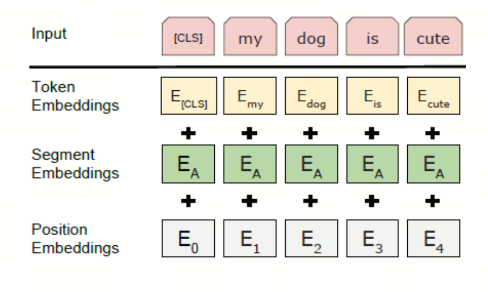

每天5分钟搞懂大模型的分词器tokenizer（三）：Wordpiece


WordPiece 是 Google 为预训练 BERT 而开发的标记化算法。此后,它在不少基于 BERT 的 Transformer 模型中得到重用,例如 DistilBERT、MobileBERT、Funnel Transformers 和 MPNET。它在训练方面与 BPE 非常相似,但实际标记化的方式不同。


WordPiece算法的名称由来可以追溯到它的核心功能——将单词（Word）分解成片段（Piece）。这个名称直观地反映了算法的基本操作。

本文尝试用最直观的语言和示例来解释 wordpiece 分词器算法。

本文的分词是在英文（拉丁语系）状态下进行的，中文状态下的分词会在后续的文章中讨论。

建议阅读前两篇文章：

> 插入链接

wordpiece 分词器的工作流程和BPE算法非常相似，只是在选择合并token的时候有所不同。

## 1. 直觉式理解

假设我们有一份语料，其中包含以下单词：

```plaintext
faster</ w>: 8, higher</ w>:6, stronger</ w>:7
```
其中，数字表示单词出现的次数。

>注： `</ w>` 表示单词的结束，使用 "w" 是因为它是 "word" 的首字母，这是一种常见的命名约定。然而，具体的标记token可能会根据不同的实现或者不同的分词方法有所不同。

**首先**，我们将其中的每个字符作为一个 token，得到的 token 如下：
```plaintext
f a s t e r</ w>: 8, h i g h e r</ w>: 6, s t r o n g e r</ w>: 7
```

对应的字典如下：
```plaintext
'a', 'e', 'f', 'g', 'h', 'i', 'n', 'o', 'r', 's', 't', 'r</ w>'
```

> 注意：从第二步开始和BPE有所不同了

**第二步**，统计两个token之间的**score**，得到如下结果：

score=(freq_of_pair)/(freq_of_first_element×freq_of_second_element)

你可能或看到带log的公式，这是为了把除法转换成减法，方便计算。

```plaintext
'fa':1/8,'as':1/15,'st':1/15,'te':8/(21*15),'er</ w>':1/21,'hi':1/6,'ig':1/13,'gh':1/13,'he':1/21,'tr':1/15,'ro':1/7,'on':1/7,'ng':1/13,'ge':7/(13*21)
```

此时，我们将得分最高(1/6)的字符对'h'和'i'合并'hi'，token变为：

```plaintext
f a s t e r</ w>: 8, hi g h e r</ w>: 6, s t r o n g e r</ w>: 7
```
对应的字典变化为：
```plaintext
'a', 'f', 'g', 'e','r','n', 'o', 's','r', 't', 'hi'
```

**重复上述步骤**，直到达到预设的token数量或者达到预设的迭代次数（或其他条件）；



这就是wordpiece算法的超参数，可以根据实际情况调整。

> 注意：huggingface的berttokenize使用的是wordpiece的分词算法,但是和上面描述不同的地方在于,其中额外使用"##"用于表示某个subword 不是一个单词的开头

搞清楚了wordpiece，后续我们再来看unigram和sentencepiece。

## 参考

[1] [WordPiece 标记化](https://huggingface.co/learn/nlp-course/zh-CN/chapter6/6?fw=pt)

[2] [tokenizers小结](https://zhuanlan.zhihu.com/p/360290118)

## 欢迎关注我的GitHub和微信公众号，来不及解释了，快上船！

[GitHub: LLMForEverybody](https://github.com/luhengshiwo/LLMForEverybody)

仓库上有原始的Markdown文件，完全开源，欢迎大家Star和Fork！