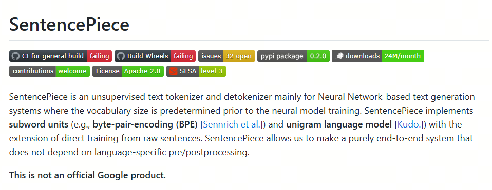

每天5分钟搞懂大模型的分词器tokenizer（五）：SentencePiece

太好了，终于到了大模型中使用最广泛的分词器: SentencePiece了.

之前介绍的分词器，英文（拉丁语系有空格）和中文（没有空格）会采用不同的分词方式，在大模型中，我们需要一个统一的分词器，这个分词器需要能够处理多种语言。

为此，我们需要一个统一的字符编码方式，这个编码方式需要能够处理多种语言，而且不会因为语言的不同而导致编码方式的不同。

## SentencePiece

SentencePiece是由Google开发的一种通用的分词器，它可以处理多种语言，它的名字就暗示了它的原理。

还记得之前的WordPiece吗？WordPiece是将word先切分成最小piece，然后再合新token。

而SentencePiece是将sentence切分成最小piece，然后再合并成token，（这是其中的BPE实现，当然如果是unigram实现，是另一个逻辑。但名称的由来就是这样。）

SentencePiece的特点包括：

- 纯数据驱动：直接从句子中训练分词和去分词模型，不需要预先分词；
- 语言无关：将句子视为Unicode字符序列，不依赖于特定语言的逻辑；
- 多种子词算法：支持BPE和Unigram算法；
- 快速且轻量：分割速度快，内存占用小；
- 自包含：使用相同的模型文件可以获得相同的分词/去分词结果；
- 直接生成词汇ID：管理词汇到ID的映射，可以直接从原始句子生成词汇ID序列；
- 基于NFKC的规范化：执行基于NFKC的文本规范化

## Unicode

unicode官网： https://home.unicode.org/

Unicode，全称为Unicode标准（The Unicode Standard），其官方机构Unicode联盟所用的中文名称为统一码，又译作万国码、统一字符码、统一字符编码，是信息技术领域的业界标准，其整理、编码了世界上大部分的文字系统，使得电脑能以通用划一的字符集来处理和显示文字，不但减轻在不同编码系统间切换和转换的困扰，更提供了一种跨平台的乱码问题解决方案。

这样，世界上所有的语言都用一个编码方式，对于大模型来说，只有一种语言，那就是Unicode。

在这个基础上，我们就可以用之前介绍的BPE或者Unigram算法来进行分词了。

BPE和Unigram算法的原理和实现，可以参考之前的文章。

最后，我们再来看下BPE的变种：BBPE。

## 参考

[1] [Unigram tokenization](https://huggingface.co/learn/nlp-course/en/chapter6/7?fw=pt)

[2] [github:sentencepiece](https://github.com/google/sentencepiece)

## 欢迎关注我的GitHub和微信公众号，来不及解释了，快上船！

[GitHub: LLMForEverybody](https://github.com/luhengshiwo/LLMForEverybody)

仓库上有原始的Markdown文件，完全开源，欢迎大家Star和Fork！