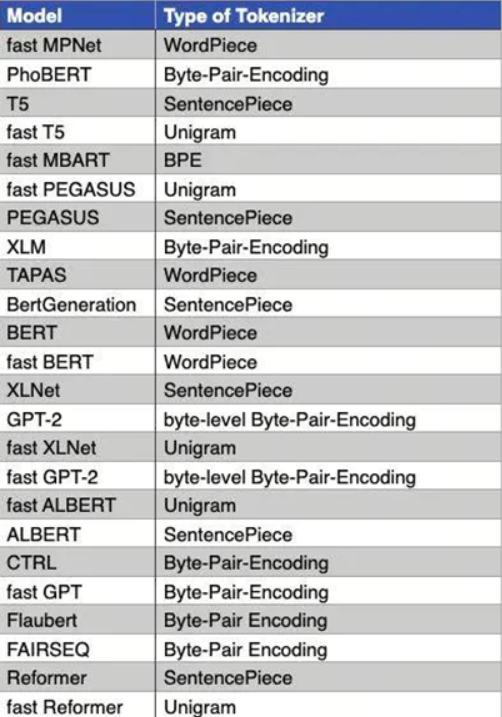

每天5分钟搞懂大模型的分词器tokenizer（六）：BBPE

BBPE是一种基于BPE的分词器，它是BPE的一种变种，是由Google Brain团队提出的。BBPE的全称是Byte-level BPE，它是一种基于字节级别的BPE分词器。

## 1. 直觉式理解

BPE参见之前的文章：[搞懂大模型的分词器tokenizer（二）：BPE (Byte-Pair Encoding)](搞懂大模型的分词器（二）.md)

BBPE的核心思想是将文本中的字符对（UTF-8编码中是字节对）进行合并，以形成常见的词汇或字符模式，直到达到预定的词汇表大小或者无法继续合并为止。

它和BPE的区别在于，BPE是基于字符级别character的，而BBPE是基于字节byte级别的。

BBPE具有如下的优点：

- 跨语言通用性：由于它基于字节级别，因此可以更容易地跨不同语言和脚本进行迁移；
- 减少词汇表大小：通过合并字节对，BBPE可以生成更通用的子词单元，从而减少词汇表的大小；
- 处理罕见字符OOV问题：BBPE可以更有效地处理罕见字符，因为它不会为每个罕见字符分配单独的词汇表条目，而是将它们作为字节序列处理

## 系列总结

在这个分词器系列分享中，我们从最简单的word level,character level开始，讲述了按词和字符分词的优缺点；

接着我们介绍了sub-word level分词器，包括BPE,WordPiece,Unigram等；

最后我们介绍了两个变种，一个是SentencePiece工具，它将多语言视为Unicode字符序列，不依赖于特定语言的逻辑，SentencePiece可以基于BPE或者Unigram算法，（也可是BBPE算法）；

另一个是BBPE算法，它是一种基于字节级别的BPE分词器，即最小单元是字节。

你已经掌握了分词器的基本原理和实现，接下来，我们将介绍更多关于大模型的知识，敬请期待！

## 参考

[1] [Unigram tokenization](https://huggingface.co/learn/nlp-course/en/chapter6/7?fw=pt)

## 欢迎关注我的GitHub和微信公众号，来不及解释了，快上船！

[GitHub: LLMForEverybody](https://github.com/luhengshiwo/LLMForEverybody)

仓库上有原始的Markdown文件，完全开源，欢迎大家Star和Fork！