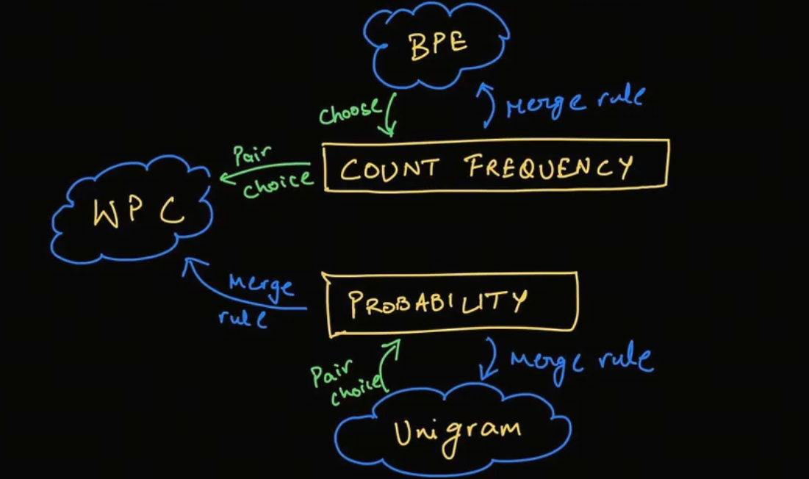

每天5分钟搞懂大模型的分词器tokenizer（四）：Unigram

在 SentencePiece 中经常使用 Unigram 算法,该算法是 AlBERT、T5、mBART、Big Bird 和 XLNet 等模型使用的标记化算法。


与 BPE 和 WordPiece 相比,Unigram是不同的思路: 它从一个较大的词汇表开始,然后从中删除token,直到达到所需的词汇表大小。

在训练的每一步,Unigram 算法都会在给定当前词汇的情况下计算语料库的损失。

然后,对于词汇表中的每个token,算法计算如果删除该token,整体损失会增加多少,并寻找损失最少的token。

这些token对语料库的整体损失影响较小,因此从某种意义上说,它们“不太需要”并且是移除的最佳备选。


## 构建基础词汇表

Unigram 算法的第一步是构建一个基础词汇表,该词汇表包含所有可能的token。

这边，我们不再使用olympic的例子，而是采用HuggingFace官方的例子，原因是这个博主比较懒，不想计算那么多概率值。

假设我们有一个预料库，其中包含以下单词：

```plaintext
("hug", 10), ("pug", 5), ("pun", 12), ("bun", 4), ("hugs", 5)
```

其中，数字表示单词出现的次数

所以，我们的基础词汇表如下，这个词汇表包含所有子词sub-word：

```plaintext
["h", "u", "g", "hu", "ug", "p", "pu", "n", "un", "b", "bu", "s", "hug", "gs", "ugs"]
```

## Unigram模型

首先，我们计算这个基础词汇表中的所有子词的出现频次

```plaintext
("h", 15) ("u", 36) ("g", 20) ("hu", 15) ("ug", 20) ("p", 17) ("pu", 17) ("n", 16) ("un", 16) ("b", 4) ("bu", 4) ("s", 5) ("hug", 15) ("gs", 5) ("ugs", 5)
```
频次之和为210，那其中一个子词'ug'的概率就是 20/210

unigram模型是最简单的语言模型，它假设每个词都是独立的，所以我们可以直接计算每个词的概率。

比如'pug'的一种分词方式['p','u','g']的概率为：

$$p(['p','u','g']) = P('p')*P('u')*P('g') = 5/210 * 36/210 * 20/210 = 0.000389$$

而'pug'的另一种分词方式['pu','g']的概率为：

$$p(['pu','g']) = P('pu')*P('g') = 5/210 * 20/210 = 0.0022676$$

所以，对于'pug'这个词，我们可以计算出所有分词方式的概率，然后选择概率最大的那个分词方式。

```plaintext
['p','u','g'] 0.000389
['pu','g'] 0.0022676
["p", "ug"] : 0.0022676
```
我们会选择概率最大的['pu','g']作为'pug'的分词方式，当出现概率相同时，我们可以选择第一个。

通过这个方式，我们可以对所有的word进行tokenizer，并生成上文中说的较大的词汇表。

在实际中，会有一个小问题，那就是穷举的话计算量太大了，大到这个博主一时间都计算不过来。

>求助： 假设我们的word有n个character，穷举的话一共有几种分词的方法？欢迎在留言区告诉我。

在实际中，我们可以使用维特比（Viterbi）算法来解决这个穷举问题。

维特比算法不在本文的讨论范围内，有兴趣的同学可以自行查阅资料。

## 删除token
此时，我们已经建立了一个较大的词汇表，接下来我们要删除一些token，直到达到我们的目标词汇表大小。

删除和裁员(打工人哭晕在厕所)的逻辑是一样的，谁对整体的影响最小，谁就被删除。

注意：基础的character是不能被删除的，我们需要它们来生成OOV的.

对于上文中的语料：
```plaintext
("hug", 10), ("pug", 5), ("pun", 12), ("bun", 4), ("hugs", 5)
```

假设我们经过上一步，已经对每一个word进行了分词,得到如下的分词和得分。

```plaintext
"hug": ["hug"] (score 0.071428)
"pug": ["pu", "g"] (score 0.007710)
"pun": ["pu", "n"] (score 0.006168)
"bun": ["bu", "n"] (score 0.001451)
"hugs": ["hug", "s"] (score 0.001701)
```

>注意: 上述的tokenizer省略了每一个字母character，比如，"hug"的分词是["h","u","g","hug"]，但是为了简化，我们省略了["h","u","g"].

现在就是计算每个token对整体的影响了，这个影响loss就是这些score的负对数似然 negative log likelihood.

初始loss就是：

$$10 * (-log(0.071428)) + 5 * (-log(0.007710)) + 12 * (-log(0.006168)) + 4 * (-log(0.001451)) + 5 * (-log(0.001701)) = 169.8$$

假设我们要去除的token是'hug',那么，受影响的是hug的分词和hugs的分词，我们可以更新'hug'后新token表的score:
    
```plaintext
"hug": ["hu", "g"] (score 0.006802)
"hugs": ["hu", "gs"] (score 0.001701)
```

loss的变化为：

$$hug：- 10 * (-log(0.071428)) + 10 * (-log(0.006802)) = 23.5 $$

$$hugs：- 5 * (-log(0.001701)) + 5 * (-log(0.001701)) = 0 $$

总变化为23.5.

我们遍历所有的token，找到loss最小的那个token，然后删除它；

重复上述步骤，直到达到我们的目标词汇表大小。



现在你已经明白了BPE和Unigram算法的基本原理，接下来我们讨论一个分词器工具：SentencePiece.

## 参考

<div id="refer-anchor-1"></div>

## 欢迎关注我的GitHub和微信公众号，来不及解释了，快上船！

[GitHub: LLMForEverybody](https://github.com/luhengshiwo/LLMForEverybody)

仓库上有原始的Markdown文件，完全开源，欢迎大家Star和Fork！