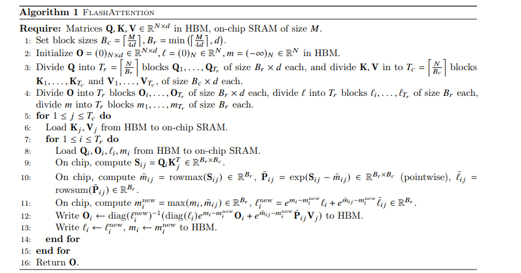

多年以后，面对**FlashAttention**，你会忍不住想起高三上学期的那节数学课。那时，暑假刚刚结束，烈日当空，教室里就像蒸笼一样，连空气都懒得流动。阳光透过窗帘的缝隙，像个顽皮的小孩，时不时跳到黑板上，给老师的公式镀上一层金边。老师在黑板前唾沫横飞，激情四溢地讲述着什么“等比数列”和“极限”，而你的脑袋却飞到了食堂，幻想着中午能不能抢到那份热气腾腾的番茄炒蛋。

“看好了，我要变形了！”老师的声音突然拔高，仿佛他要变身成超人。你这才从对食堂美食的遐想中惊醒，心想：变形？这数学题能变成午餐吗？教室里的同学们也都在努力保持清醒，有的趴在桌子上如同死去的昆虫，有的则在心里默默计算着这节课还剩多少时间。阳光在教室里肆意挥洒，照得你恍惚间觉得，或许数学也能像食堂的饭菜一样，变得简单易懂。

## 1 FlashAttention

Flash Attention 是一种新型的注意力机制算法，由斯坦福大学和纽约州立大学布法罗分校的科研团队共同开发，旨在解决传统 Transformer 模型在处理长序列数据时面临的时间和内存复杂度高的问题。该算法的核心思想是减少 GPU 高带宽内存（HBM）和 GPU 片上 SRAM 之间的内存读写次数，通过分块计算（tiling）和重计算（recomputation）技术，显著降低了对 HBM 的访问频率，从而提升了运行速度并减少了内存使用。

Flash Attention 通过 IO 感知的设计理念，优化了内存访问模式，使得 Transformer 模型在长序列处理上更加高效，为构建更长上下文的高质量模型提供了可能。

## 2 大模型需要的显卡知识

我们需要明确大模型训练与推理的基本需求。大模型通常意味着更高的计算需求和数据存储需求。因此，在选择GPU时，我们需要关注其计算能力、显存大小以及与其他硬件设备的兼容性。

**计算墙**，指的是单卡算力和模型总算力之间的巨大差异。A100 的单卡算力只有 312 TFLOPS，而 GPT-3 则需要 314 ZFLOPs 的总算力，两者相差了 9 个数量级。

**显存墙**，指的是单卡无法完整存储一个大模型的参数。GPT-3 的 1750 亿参数本身就需要 700 GB 的显存空间（每个参数按照 4 个字节计算），而 NVIDIA A100 GPU 只有 80 GB 显存。

**通信墙**，主要是分布式训练下集群各计算单元需要频繁参数同步，通信性能将影响整体计算速度。如果通信墙如果处理得不好，很可能导致集群规模越大，训练效率反而会降低。

当前显卡的计算能力是大于通信能力的，使得通信成为瓶颈，transformer的self-attention，会有大量的IO，即将数据从HBM读取到SRAM中再计算。

为此，FlashAttention的设计理念是通过增加计算量的方式减少I/O，来平衡当前显卡计算能力强于通信能力的特点。

## Self-Attention

为了看懂FlashAttention的核心算法，让我们从原始的Self-Attention开始。参考From Online Softmax to FlashAttention[1](#refer-anchor-1)

Self-Attention的计算，去掉batch和缩放因子，可以概括为：

> $Attention(Q, K, V) = softmax(\frac{QK^T}{\sqrt{d_k}})V$

其中，Q,K,V,O都是2维矩阵，形状是(L, D), L是序列长度，D是每个头的维度，softmax函数作用在后面的维度上。

标准的计算self-attention的计算流程有三步：

对于FlashAttention，我们不需要将X，A放到全局内存（HBM）上；我们将（1）放在一个cuda-kernel/tensor-kernel上。这样，我们就不需要大量的I/O。

FlashAttention不需要在全局内存上实现 X 和 A 矩阵，而是将公式(1)中的整个计算融合到单个 CUDA 内核中。这要求我们设计一种算法来仔细管理片上内存(on-chip memory)（如流算法），因为 NVIDIA GPU 的共享内存(SRAM)很小。对于矩阵乘法等经典算法，使用平铺(tiling)来确保片上内存不超过硬件限制。这种平铺方法是有效的原因是：加法是关联的，允许将整个矩阵乘法分解为许多平铺矩阵乘法的总和。然而，Self-Attention 包含一个不直接关联的 softmax 运算符，因此很难简单地平铺 Self-Attention。有没有办法让 softmax 具有关联性？

Gut-feeling：我们的目标是计算O，一般来说，我们需要获取所有的Q,K,V，然后分三步计算；我们也可以先获取一小块Q,K,V，一次计算得到部分的O，再想办法将部分的O合成全部的O。

难点：矩阵是可加的，但是soft-max是不可加的。

解决方案：高考数学最后一题--等比数列

## Safe Softmax
对于softmax，公式如下：

x_i 可能会非常大，那e^x_i会溢出：float16最大65536，那x_i大于12时，e^x就超过有效数字了。所以事实上的公式是safe-softmax：

其中：

基于此，我们可以总结下safe-softmax的计算步骤，称之为3步算法

这就是传统的self-attention算法，需要我们从1到N迭代3次。{x_i}是由QK计算出来的pre-softmax，这意味着我们需要读取Q,K三次，有很大的I/O开销。

## Online Softmax
如果我们在一个循环中融合方程 7、8 和 9，我们可以将全局内存访问时间从 3 减少到 1。不幸的是，我们不能在同一个循环中融合方程 7 和 8，因为 8 取决于 m_N，而 m_N 只有在第一个循环完成之后才能确定。

注意：高考数学来了！

为了移除对N的依赖，我们可以创建另一个序列作为原始序列的替代。即找到一个等比数列（递归形式），去除N的依赖。

这个递归形式只依赖于m_i 和 m_i-1，我们可以在同一个循环中同时计算 m_j 和 d'_j.

这是 Online Softmax 论文中提出的算法。但是，它仍然需要两次传递才能完成 softmax 计算，我们能否将传递次数减少到 1 次以最小化全局 I/O？

## FlashAttention

不幸的是，对于 softmax 来说，答案是不行，但在 Self-Attention 中，我们的最终目标不是注意力得分矩阵 A，而是等于 A V 的 O 矩阵。我们能找到 O 的一次递归形式吗？将 Self-Attention 计算的第 k 行（所有行的计算都是独立的，为了简单起见，我们只解释一行的计算）公式化为递归算法：

我们将公式 12 中的 a_i替换为公式 11 中的定义：

这仍然取决于 m_N 和 d_N，这两个值在前一个循环完成之前无法确定。但我们可以再次使用Online softmax节中的替代技巧，即创建替代序列 o'

我们可以找到 o_i 和 o_i-1 之间的递归关系

我们可以将 Self-Attention 中的所有计算融合到一个loop中：

此时，所有的数据都非常小并且可以加载到GPU的SRAM里面，由于该算法中的所有操作都是关联的，因此它与平铺兼容。如果我们逐个平铺地计算状态，则该算法可以表示如下：

## 总结
FlashAttention最核心的部分是构造出一个递归（等比数列），让部分结果可以累计到全局，这样就不用一下子加载所有值并分步计算了。

这个等比数列的构造，大概就是高考最后一道大题的水平。

## 参考

[1] From Online Softmax to FlashAttention: https://courses.cs.washington.edu/courses/cse599m/23sp/notes/flashattn.pdf

[2] [GitHub: LLMForEverybody](https://github.com/luhengshiwo/LLMForEverybody)