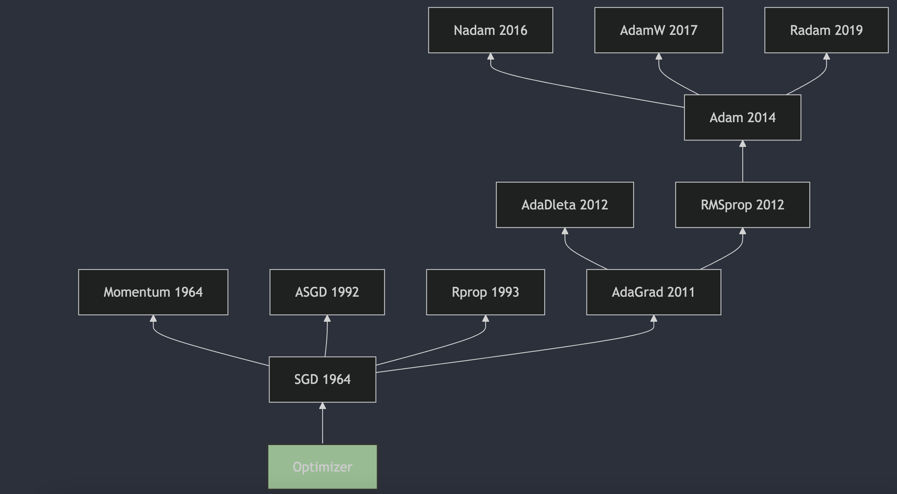

每天3分钟，彻底弄懂神经网络的优化器optimizer（一）概述

optimizer负责在训练过程中更新模型的参数, 目的是通过调整参数来最小化损失函数，即模型预测和实际数据之间的差异.

从1951年Herbert Robbins和Sutton Monro在其题为“随机近似方法”的文章中提出SGD，到2017年出现的AdamW成为最主流的选择，优化器的发展经历了70多年的时间。本系列从时间的角度出发，对神经网络的优化器进行梳理，希望能够帮助大家更好地理解优化器的发展历程。

## 发展历史

### 1. SGD 1951
随机梯度下降（Stochastic Gradient Descent，SGD）是一种用于优化可微分目标函数的迭代方法，它是梯度下降优化的随机近似。SGD的提出可以追溯到1951年，由Herbert Robbins和Sutton Monro在他们的论文《A Stochastic Approximation Method》[1](#refer-anchor-1)中首次描述了随机近似方法，这可以看作是SGD的前身。随后，J. Kiefer和J. Wolfowitz在1952年发表了论文《Stochastic Estimation of the Maximum of a Regression Function》[2](#refer-anchor-2)，这篇论文更接近于机器学习领域中SGD的现代理解。

### 2. Momentum 1964
动量（Momentum）方法最初由B.T.Polyak在1964年提出。这一方法被用来加速梯度下降算法的收敛，特别是在处理具有较大条件数的优化问题时。B.T.Polyak在论文《Some methods of speeding up the convergence of iteration methods》[3](#refer-anchor-3)中描述了这一方法，这篇论文发表在了《USSR Computational Mathematics and Mathematical Physics》上。动量方法通过在每一步的更新中加入一部分上一步的速度，帮助算法在相关方向上加速，并减少在目标函数的平坦区域中的震荡。这种方法后来被广泛应用于机器学习领域，尤其是在深度学习中，成为了优化算法中的一个重要组成部分。 

### 3. ASGD 1992
平均随机梯度下降（Average Stochastic Gradient Descent，ASGD）是一种用于优化可微分目标函数的迭代方法，它是梯度下降优化的随机近似。ASGD的提出可以追溯到1992年，由B.T.Polyak在他的论文《Acceleration of Stochastic Approximation by Averaging》[4](#refer-anchor-4)中首次描述了这一方法。ASGD通过对多个随机梯度的平均值进行更新，来减少随机梯度的方差，从而提高优化算法的收敛速度。这种方法在训练深度神经网络时，可以帮助算法更快地收敛到最优解。

### 4. Rprop 1993
Rprop（Resilient Backpropagation）算法是由Martin Riedmiller和Hermann Braun在1993年提出的。这一算法在论文《A Direct Adaptive Method for Faster Backpropagation Learning: The RPROP Algorithm》[5](#refer-anchor-5) 中被详细描述，该论文发表在1993年的IEEE国际会议上。Rprop算法通过仅使用梯度的符号来计算更新，而不是梯度的大小，从而动态地为每个权重独立地调整步长。这种方法克服了传统梯度下降算法的一些固有缺点，并且由于其对误差函数行为的局部适应性，使得学习过程更加高效和透明。

### 5. AdaGrad 2011
AdaGrad（Adaptive Gradient Algorithm）是由 John Duchi, Elad Hazan, 和 Yoram Singer 提出的。这个算法在2011年的论文《Adaptive Subgradient Methods for Online Learning and Stochastic Optimization》[6](#refer-anchor-6) 中被详细描述，并发表在了《Journal of Machine Learning Research》上。AdaGrad算法的主要特点是为每个参数独立地调整学习率，使得不频繁更新的参数可以获得更大的学习率，而频繁更新的参数则获得较小的学习率。这种自适应调整学习率的方法特别适合处理稀疏数据，因为它能够对稀疏特征给予更多的关注。然而，AdaGrad也有其缺点，主要是在学习过程中累积的平方梯度和会导致学习率变得过小，从而在训练后期几乎停止学习。为了解决这个问题，后续研究者提出了AdaGrad的变种，如AdaDelta和Adam等。

### 6. AdaDelta 2012
AdaDelta算法是由Matthew D. Zeiler在2012年提出的。这一算法的详细描述和原理可以在论文《ADADELTA: An Adaptive Learning Rate Method》[7](#refer-anchor-7)中找到。AdaDelta算法旨在解决AdaGrad算法中学习率单调递减的问题，通过限制累积梯度的窗口大小来调整学习率，使得算法在训练过程中能够自适应地调整每个参数的学习率，而不需要手动设置。这种方法对噪声梯度信息、不同的模型结构、各种数据模式以及超参数选择都表现出了较强的鲁棒性。

### 7. RMSprop 2012
RMSProp（Root Mean Square Propagation）算法由 Geoffrey Hinton 在他的 Coursera 课程《Neural Networks for Machine Learning》[8](#refer-anchor-8)中提出，该课程首次发布于2012年。RMSProp 算法是一种自适应学习率的优化方法，它通过使用梯度的平方的指数移动平均值来调整每个参数的学习率，从而加快学习速度并减少训练过程中的震荡。这种方法特别适合处理非凸优化问题，并且在深度学习中得到了广泛的应用。

### 8. Adam 2014
Adam(Adaptive Moment Estimation)算法是由Diederik P. Kingma和Jimmy Ba在2014年提出的。这一算法的详细描述和原理可以在论文《Adam: A Method for Stochastic Optimization》[9](#refer-anchor-9) 中找到，该论文最初是在2014年12月22日提交到arXiv的，并且后来在2015年的ICLR会议上发表。Adam算法结合了AdaGrad算法和RMSProp算法的优点，通过计算梯度的一阶矩估计和二阶矩估计来为不同的参数设计独立的自适应性学习率，从而实现更高效的网络训练。

***AdaMax*** 论文中也提到AdaMax作为算法的一个变种，它在某些情况下可能对特定问题进行更有效的优化。

### 9. Nadam 2016
Nadam（Nesterov-accelerated Adaptive Moment Estimation）算法是由Tim Salimans et al. 在2016年提出的。这一算法结合了Adam算法和Nesterov Accelerated Gradient（NAG）算法的优点，旨在提高优化算法的性能。Nadam算法的详细描述和原理可以在论文《Incorporating Nesterov Momentum into Adam》[10](#refer-anchor-10)中找到，该论文最初在2016年提交到arXiv，并且后来在2017年的ICLR会议上发表。

### 10. AdamW 2017
AdamW算法是由Ilya Loshchilov和Frank Hutter提出的。这一算法的详细描述和原理可以在论文《Decoupled Weight Decay Regularization》[11](#refer-anchor-11)中找到，该论文发表于2017年。在论文中，作者指出了传统Adam算法在权重衰减（weight decay）方面的一些问题，并提出了AdamW作为解决方案。AdamW通过将权重衰减从梯度更新中解耦，从而在每次迭代中更有效地应用权重衰减。这种方法在实践中被证明可以提高模型的收敛速度和泛化能力。

### 11. RAdam 2019
RAdam（Rectified Adam）是由Liyuan Liu et al. 提出的。这一算法的详细描述和原理可以在论文《On the Variance of the Adaptive Learning Rate and Beyond》[12](#refer-anchor-12)中找到，该论文首次发表于2019年，并在2020年的ICLR会议上发表。论文中提出了RAdam算法，通过引入一个修正项来解决自适应学习率在模型训练早期阶段过大的方差问题，从而改善了优化过程的稳定性和鲁棒性。

## 参考

[1] [A Stochastic Approximation Method](https://www.jstor.org/stable/2236626)

[2] [Stochastic Estimation of the Maximum of a Regression Function](https://projecteuclid.org/journals/annals-of-mathematical-statistics/volume-23/issue-3/Stochastic-Estimation-of-the-Maximum-of-a-Regression-Function/10.1214/aoms/1177729392.full)

[3] [Some methods of speeding up the convergence of iteration methods](https://www.sciencedirect.com/science/article/abs/pii/0041555364901375)

[4] [Acceleration of stochastic approximation by averaging](https://dl.acm.org/doi/10.1137/0330046)

[5] [A Direct Adaptive Method for Faster Backpropagation Learning: The RPROP Algorithm](https://citeseerx.ist.psu.edu/viewdoc/summary?doi=10.1.1.21.1417)

[6] [Adaptive Subgradient Methods for Online Learning and Stochastic Optimization](https://jmlr.org/papers/v12/duchi11a.html)

[7] [ADADELTA: An Adaptive Learning Rate Method](https://arxiv.org/abs/1212.5701)

[8] [Neural Networks for Machine Learning](https://www.cs.toronto.edu/~tijmen/csc321/slides/lecture_slides_lec6.pdf)

[9] [Adam: A Method for Stochastic Optimization](https://arxiv.org/abs/1412.6980)

[10] [Incorporating Nesterov Momentum into Adam](https://openreview.net/forum?id=OM0jvwB8jIp57ZJjtNEZ)

[11] [DECOUPLED WEIGHT DECAY REGULARIZATION](https://arxiv.org/pdf/1711.05101)

[12] [On the Variance of the Adaptive Learning Rate and Beyond](https://arxiv.org/abs/1908.03265)

[13] [Optimizers in Deep Learning](https://musstafa0804.medium.com/optimizers-in-deep-learning-7bf81fed78a0)

## 欢迎关注我的GitHub和微信公众号，来不及解释了，快上船！

[GitHub: LLMForEverybody](https://github.com/luhengshiwo/LLMForEverybody)

仓库上有原始的Markdown文件，完全开源，欢迎大家Star和Fork！