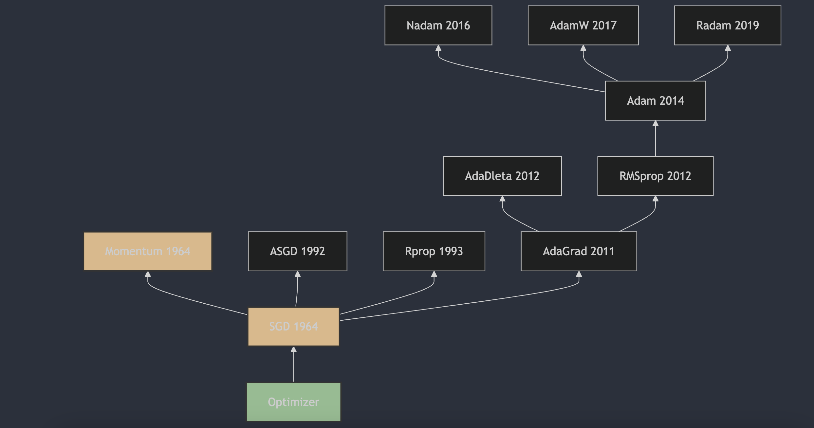

每天3分钟，彻底弄懂神经网络的优化器（三）Momentum

前面从最初的SGD开始，介绍SGD的算法细节，以及其在深度神经网络中的劣势，本文引入Momentum算法，解决SGD的一些问题。

## 1. Momentum算法的提出
动量（Momentum）方法最初由B.T.Polyak在1964年提出。这一方法被用来加速梯度下降算法的收敛，特别是在处理具有较大条件数的优化问题时。B.T.Polyak在论文《Some methods of speeding up the convergence of iteration methods》[1]中描述了这一方法，这篇论文发表在了《USSR Computational Mathematics and Mathematical Physics》上。动量方法通过在每一步的更新中加入一部分上一步的速度，帮助算法在相关方向上加速，并减少在目标函数的平坦区域中的震荡。这种方法后来被广泛应用于机器学习领域，尤其是在深度学习中，成为了优化算法中的一个重要组成部分。

## 2. 指数加权平均

在介绍Momentum算法之前，我们先来了解一下指数加权平均（Exponential Weighted Average）的概念。

指数加权平均（Exponentially Weighted Average，EWA）是一种统计方法，用于计算一组数值的加权平均，其中最近的数据点被赋予更高的权重。这种方法在信号处理、时间序列分析、机器学习等领域中非常有用，尤其是在需要对数据的最新变化做出快速反应时。

指数加权平均的计算公式如下：

$$ \text{EWA}_t = \beta \cdot \text{EWA}_{t-1} + (1 - \beta) \cdot x_t $$

其中：
- $ \text{EWA}_t $ 是在时间点 $t$ 的指数加权平均值。
- $\beta$ 是介于 0 和 1 之间的衰减系数（decay factor），决定了历史数据的权重。
- $x_t$ 是在时间点 $t$ 的观测值。
- $\text{EWA}_{t-1}$ 是前一时间点的指数加权平均值。

衰减系数 $\beta$ 的选择对指数加权平均的影响很大。如果 $\beta$ 接近 1，那么历史数据的影响会持续很长时间，平滑效果更强；如果 $\beta$ 接近 0，则新数据的影响更大，对变化的反应更快。

指数加权平均的一个特性是它对异常值（outliers）不太敏感，因为每个数据点的权重都会随着时间的推移而指数级减少。这使得它在处理含有噪声的数据时非常有用。

## 3. Momentum 

动量（Momentum）方法是一种在深度学习中广泛使用的优化策略，它通过引入动量项来加速梯度下降算法的收敛并提高其稳定性。动量方法的核心思想是模拟物理学中的动量概念，通过累积过去梯度的信息来调整参数更新的方向和幅度。动量通过指数加权平均的方式来计算。

动量方法的更新公式可以表示为：
$$
\begin{align}
v_t &= \gamma v_{t-1} + \eta_t \nabla J(\theta_t) \\
\theta_t &= \theta_{t-1} - v_t 
\end{align}
$$

其中：
- $ v_t$ 是时间步 $t$ 的动量项, 这个动量项是通过指数加权平均的方式计算得到的;
- $\gamma$ 是动量衰减系数，通常设置在 $[0,1)$ 之间，如 0.9 或 0.99;
- $\eta_t$ 是学习率;
- $\nabla J(\theta_t) $ 是在参数 $\theta_t$ 处的损失函数梯度。

动量方法的优势包括：
1. **加速收敛**：通过累积历史梯度，可以在相关方向上加速参数更新；
2. **抑制振荡**：有助于减少训练过程中的震荡，特别是在目标函数的平坦区域或接近最小值时；
3. **跳出局部最小值**：在某些情况下，动量可以帮助算法跳出局部最小值，从而找到更好的全局最小值。

## 4. 指数加权平均为什么叫“指数”？

之所以被称为“指数”，是因为它在计算平均值时，给予不同时间点的数据以指数级衰减的权重。

在每次计算时，新数据 $x_t$ 被赋予的权重是 $(1 - \beta)$，而之前的指数加权平均 $\text{EWA}_{t-1}$ 被赋予的权重是 $\beta$。由于 $\beta$ 接近 1，所以越早的数据其权重会以 $\beta$ 的多次方的速度迅速减小，这就是“指数”名称的来源。

$$ 
\begin{align*}
v_{100} &= 0.9 \cdot v_{99} + 0.1 \cdot \theta_{100} \\
v_{99} &= 0.9 \cdot v_{98} + 0.1 \cdot \theta_{99} \\
v_{98} &= 0.9 \cdot v_{97} + 0.1 \cdot \theta_{98} \\
v_{97} &= 0.9 \cdot v_{96} + 0.1 \cdot \theta_{97} \\
\cdots \\ 
v_{1} &= 0.9 \cdot v_{0} + 0.1 \cdot \theta_{1} \\
v_{0} &= 0
\end{align*}
$$

将其展开计算$v_{100}$

$$
v_{100} = 0.1 \cdot \theta_{100} + 0.9 \cdot 0.1 \cdot \theta_{99} + 0.9^2 \cdot 0.1 \cdot \theta_{98} + \cdots + 0.9^{99} \cdot 0.1 \cdot \theta_{1} 
$$

一般来讲，超过一定时间步后，前面的数据对最终结果的影响会变得非常小，当 $\beta = 0.9$ 时，$0.9^{99} \approx 1.0 \times 10^{-5}$，这意味着 $v_{100}$ 中的 $\theta_{1}$ 对结果的影响几乎可以忽略不计。一般来说，我们最多取到 $1/1-\beta$ 个时间步的数据，之后的数据对结果的影响可以忽略不计。

根据极限公式：

$$lim_{{x\to 0}}{(1-x)^{\frac{1}{x}}} = \frac{1}{e}$$

这边，当 $x= 1- \beta $ 时，${\beta^{\frac{1}{1-\beta}}} = \frac{1}{e}$

## 5. Momentum算法为什么要叫“动量”？

动量算法的命名灵感来源于物理学中的动量概念，它通过在参数更新中加入过去迭代的梯度信息，模拟了物体运动时动量的效果，使得算法在优化过程中能够保持一定的“惯性”，从而在面对目标函数的曲率变化或噪声时，能够更加平滑地调整搜索方向和步长。

在物理学中，动量是物体运动状态的量度，它与物体的质量和速度有关。类似地，动量算法在机器学习中的作用可以类比为在优化过程中增加了一种“惯性”，使得算法在迭代过程中能够根据之前的梯度信息调整当前的更新方向和步长，从而在目标函数的曲面上更加平滑地滚动，避免在局部最小值或平坦区域停滞不前。

## 参考
[1] [Some methods of speeding up the convergence of iteration methods](https://www.sciencedirect.com/science/article/abs/pii/0041555364901375)

## 欢迎关注我的GitHub和微信公众号，来不及解释了，快上船！

[GitHub: LLMForEverybody](https://github.com/luhengshiwo/LLMForEverybody)

仓库上有原始的Markdown文件，完全开源，欢迎大家Star和Fork！