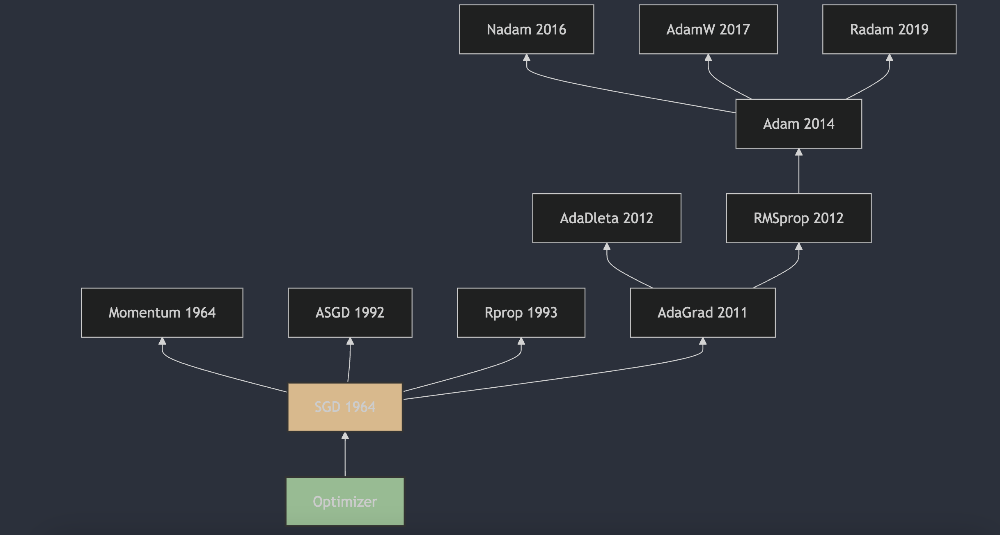

每天3分钟，彻底弄懂神经网络的优化器（二）SGD

## 1. SGD
随机梯度下降（Stochastic Gradient Descent，SGD）是一种用于优化可微分目标函数的迭代方法，它是梯度下降优化的随机近似。SGD的提出可以追溯到1951年，由Herbert Robbins和Sutton Monro在他们的论文《A Stochastic Approximation Method》[1]中首次描述了随机近似方法，这可以看作是SGD的前身。随后，J. Kiefer和J. Wolfowitz在1952年发表了论文《Stochastic Estimation of the Maximum of a Regression Function》[2]，这篇论文更接近于机器学习领域中SGD的现代理解。

随机梯度下降（SGD）的更新公式是梯度下降法的一种变体，它用于优化目标函数，特别是在处理大规模数据集时。SGD 在每次迭代中只使用一个或一小批样本来计算梯度，然后更新模型参数。这样做可以减少每次迭代的计算成本，并有助于算法逃离局部最小值。

SGD 的参数更新公式如下：

$$\theta_{t+1} = \theta_t - \eta_t \nabla J(\theta_t; x^{(i)}, y^{(i)})$$

其中：
- $\theta_t$表示在时间步 t的模型参数（可以是权重和偏置）；
- $\eta_t$表示学习率，用于控制参数更新的步长；
- $\nabla J(\theta_t; x^{(i)}, y^{(i)})$表示损失函数 J 对参数 $\theta_t$ 在样本 $(x^{(i)}, y^{(i)})$ 处的梯度；
- $\theta_{t+1}$是更新后的模型参数。

在实际应用中，学习率$\eta_t$可以是一个固定的值，也可以随着时间步逐渐减小（学习率衰减），以确保算法在训练过程中的稳定性和收敛性。

## 2. SGD的缺点-非凸优化问题

非凸优化问题是指目标函数具有多个局部最小值的情况，这种情况下，SGD可能会陷入局部最小值，并且很难跳出。这是因为SGD在每次迭代中只使用一个或一小批样本来计算梯度，这样可能导致梯度的方向不准确，从而影响参数更新的方向。

**鞍点**

在优化和机器学习领域，鞍点（Saddle Point）是指目标函数的临界点，在这个点上，某些方向的导数为正（上升），而另一些方向的导数为负（下降）。换句话说，鞍点既不是局部最小值也不是局部最大值，而是局部最小值和局部最大值的某种组合。

具体来说：

- 局部最小值：在该点的所有邻域内，函数值都大于或等于该点的函数值；
- 局部最大值：在该点的所有邻域内，函数值都小于或等于该点的函数值；
- 鞍点：在该点的某些邻域方向上，函数值大于或等于该点的函数值，而在另一些邻域方向上，函数值小于或等于该点的函数值。

在二维空间中，可以将鞍点想象成马鞍的形状，从马鞍的一侧走到顶部再走到另一侧，你会先经历一个上升过程（局部最小值的特征），然后是一个下降过程（局部最大值的特征）。

在机器学习中，尤其是在深度学习中，鞍点的存在可能会使基于梯度的优化算法（如梯度下降）遇到难题，因为梯度下降算法可能会在接近鞍点时停滞不前，因为梯度在该点为零，算法无法判断下一步应该向哪个方向移动。

## 参考

[1] [A Stochastic Approximation Method](https://www.jstor.org/stable/2236626)

[2] [Stochastic Estimation of the Maximum of a Regression Function](https://projecteuclid.org/journals/annals-of-mathematical-statistics/volume-23/issue-3/Stochastic-Estimation-of-the-Maximum-of-a-Regression-Function/10.1214/aoms/1177729392.full)

## 欢迎关注我的GitHub和微信公众号，来不及解释了，快上船！

[GitHub: LLMForEverybody](https://github.com/luhengshiwo/LLMForEverybody)

仓库上有原始的Markdown文件，完全开源，欢迎大家Star和Fork！