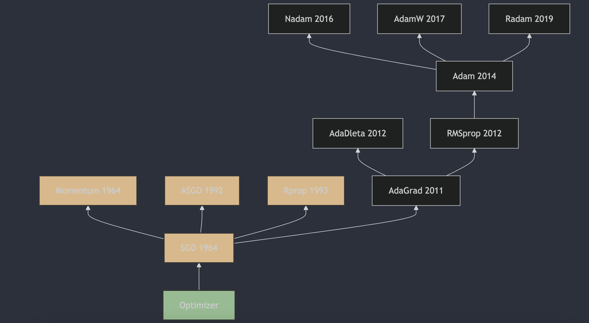

每天3分钟，彻底弄懂神经网络的优化器（五）Rprop

Resilient Backpropagation算法是由Martin Riedmiller和Hermann Braun在1993年提出的。Rprop算法通过仅使用梯度的符号来计算更新，而不是梯度的大小，从而动态地为每个权重独立地调整步长

## 1. Rprop算法的提出
Rprop（Resilient 弹性 Backpropagation）算法是由Martin Riedmiller和Hermann Braun在1993年提出的。这一算法在论文《A Direct Adaptive Method for Faster Backpropagation Learning: The RPROP Algorithm》[1](#refer-anchor-5) 中被详细描述，该论文发表在1993年的IEEE国际会议上。Rprop算法通过仅使用梯度的符号来计算更新，而不是梯度的大小，从而动态地为每个权重独立地调整步长。这种方法克服了传统梯度下降算法的一些固有缺点，并且由于其对误差函数行为的局部适应性，使得学习过程更加高效和透明。

## 2. Rprop算法的原理

1. **初始化**：为每个权重 $w_i$ 初始化学习率 $\eta_i$ 和变化量 $\Delta_i$，通常 $\Delta_i$ 的初始值设为一个小的正数。

2. **更新规则**：
   - 如果 $g_t$（当前梯度）和 $ g_{t-1} $（上一时刻的梯度）同号，则增加学习率：
     $\Delta_i = \min(\Delta_{\text{max}}, \eta_i + \Delta_i)$
   - 如果 $ g_t $ 和 $ g_{t-1} $ 异号或 $ g_t $ 为零，则减少学习率：
     $\Delta_i = \max(\Delta_{\text{min}}, \eta_i - \Delta_i)$
   - 如果 $ g_t $ 和 $ g_{t-1} $ 都为零，则重置学习率：
     $\Delta_i = \Delta_{\text{init}}$

3. **权重更新**：
   $w_i = w_i - \Delta_i \cdot \text{sign}(g_t)$
   其中 $g_t$ 是当前梯度，$\text{sign}(g_t)$ 是梯度的符号函数。

### 参数：
- $\Delta_{\text{max}}$：最大变化量，防止步长过大；
- $\Delta_{\text{min}}$：最小变化量，防止步长过小；
- $\Delta_{\text{init}}$：初始变化量；

Rprop算法通过这种方式，能够自适应地调整每个权重的学习率，从而在训练过程中更加灵活和有效。它特别适合于那些需要精细调整学习率以避免陷入局部最小值的问题。

## 3. Rprop算法的主要特点：

1. **自适应学习率**：Rprop算法为每个权重单独设置学习率，而不是使用全局学习率。这意味着每个权重的学习率可以根据其历史梯度信息进行调整；

2. **快速收敛**：由于学习率的自适应调整，Rprop通常能够更快地收敛；

3. **鲁棒性**：Rprop算法对初始学习率的选择不敏感，这使得它在不同的问题上具有较好的鲁棒性。

## 参考
[1] [A Direct Adaptive Method for Faster Backpropagation Learning: The RPROP Algorithm](https://citeseerx.ist.psu.edu/viewdoc/summary?doi=10.1.1.21.1417)

## 欢迎关注我的GitHub和微信公众号，来不及解释了，快上船！

[GitHub: LLMForEverybody](https://github.com/luhengshiwo/LLMForEverybody)

仓库上有原始的Markdown文件，完全开源，欢迎大家Star和Fork！