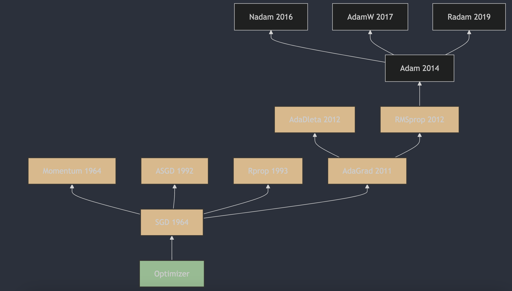

每天3分钟，彻底弄懂神经网络的优化器（八）RMSprop

## 1. RMSprop算法的提出
RMSProp（Root Mean Square Propagation）算法由 Geoffrey Hinton 在他的 Coursera 课程《Neural Networks for Machine Learning》[1](#refer-anchor-1)中提出，该课程首次发布于2012年。RMSProp 算法是一种自适应学习率的优化方法，它通过使用梯度的平方的指数移动平均值来调整每个参数的学习率，从而加快学习速度并减少训练过程中的震荡。这种方法特别适合处理非凸优化问题，并且在深度学习中得到了广泛的应用。

## 2. RMSprop算法的原理

RMSprop（Root Mean Square Propagation）是一种自适应学习率的优化算法，它是为了解决Adagrad算法中学习率递减导致的问题而提出的。RMSprop通过使用指数加权移动平均来调整每个参数的学习率，使得学习率的调整更加平滑。

RMSprop的更新规则如下：
1. 初始化参数 $\theta$，设置学习率 $\eta$，衰减系数 $\rho$（通常设为0.9），以及数值稳定性的小常数 $\epsilon$（通常设为 $1e-8$ ）；
2. 在每次迭代中，计算参数 $\theta$ 的梯度 $g$ ；
3. 更新累积平方梯度的指数加权移动平均 $r$ ：
   $r = \rho \cdot r + (1 - \rho) \cdot g^2$
4. 计算参数更新量：
   $\Delta\theta = \frac{\eta}{\sqrt{r + \epsilon}} \cdot g$
5. 更新参数 $ \theta $：
   $\theta = \theta - \Delta\theta$

## 3. RMSprop算法的主要特点

RMSprop算法的优点包括：
- 自适应学习率调整，不需要手动设置学习率;
- 适合处理非平稳目标函数和循环神经网络（RNN）;
- 可以缓解梯度消失或梯度爆炸的问题

RMSprop算法的缺点包括：
- 需要调整新的超参数——衰减速率 $\rho$;
- 依然依赖于全局学习速率 $ eta$，如果设置不当，可能会导致模型训练效果不佳。

在实际应用中，建议从较小的全局学习速率开始尝试，并逐步增加以找到最佳性能。同时，可以尝试不同的衰减速率 $\rho$ 以找到最适合模型的设置。

## 4. RMSprop和AdaGrad的区别

最大的改进在于累积梯度的处理方式:

- AdaGrad: 累积所有过去的梯度平方（无遗忘因子）。这意味着它会不断地累积梯度信息，导致学习率随着时间逐渐减小，可能在后期变得过小，以至于无法继续有效更新；

- RMSprop: 使用指数加权平均来累积过去的梯度平方（有遗忘因子）。这种方式使得算法对最近的梯度给予更多的权重，而对旧的梯度逐渐“遗忘”，从而避免了学习率过快减小的问题。

## 参考

[1] [Neural Networks for Machine Learning](https://www.cs.toronto.edu/~tijmen/csc321/slides/lecture_slides_lec6.pdf)

## 欢迎关注我的GitHub和微信公众号，来不及解释了，快上船！

[GitHub: LLMForEverybody](https://github.com/luhengshiwo/LLMForEverybody)

仓库上有原始的Markdown文件，完全开源，欢迎大家Star和Fork！