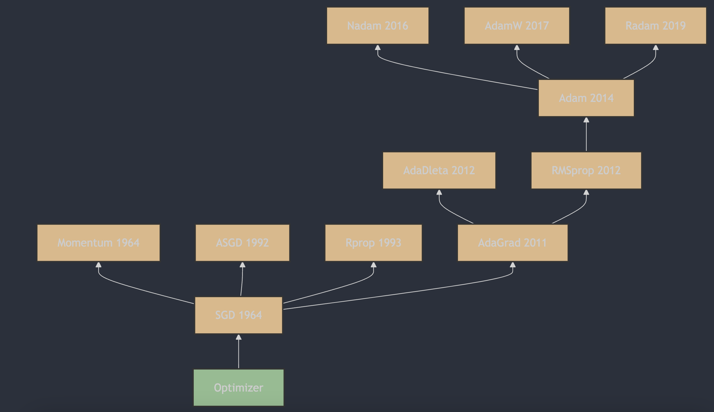

每天3分钟，彻底弄懂神经网络的优化器（十二）RAdam

## 1. RAdam算法的提出
RAdam（Rectified 修正 Adam）是由Liyuan Liu et al. 提出的。这一算法的详细描述和原理可以在论文《On the Variance of the Adaptive Learning Rate and Beyond》[1](#refer-anchor-1)中找到，该论文首次发表于2019年，并在2020年的ICLR会议上发表。论文中提出了RAdam算法，通过引入一个修正项来解决自适应学习率在模型训练早期阶段过大的方差问题，从而改善了优化过程的稳定性和鲁棒性。

## 2. RAdam算法的原理

Radam（Rectified Adam）是一种优化算法，它是Adam优化器的一个变种，旨在解决Adam在不同数据集和任务中性能不一致的问题。Radam通过动态调整学习率来适应不同的训练阶段，从而提高模型的训练效果。

### Radam的主要特点：

1. **动态调整学习率**：Radam根据训练的进展动态调整学习率，以适应不同阶段的训练需求。

2. **适应性**：Radam能够根据训练数据的特点自动调整优化策略，提高了对不同数据集和任务的适应性。

3. **简单易用**：Radam的实现与Adam类似，易于在现有的深度学习框架中使用。

### Radam的更新规则：

Radam的更新规则与Adam类似，但在更新参数时加入了一个修正项，以提高优化的效率。具体的更新公式如下：

1. 初始化一阶矩估计（动量）$m_t$ 和二阶矩估计（梯度平方的移动平均）$v_t$ 为0，以及时间步长 $t=1$。

2. 在每次迭代中，计算梯度 $g_t$。

3. 更新一阶矩估计 $m_t$ 和二阶矩估计 $v_t$：

   $m_t = \beta_1 \cdot m_{t-1} + (1 - \beta_1) \cdot g_t$

   $v_t = \beta_2 \cdot v_{t-1} + (1 - \beta_2) \cdot g_t^2$

4. 计算偏差修正的一阶矩估计 $\hat{m}_t $ 和二阶矩估计 $ \hat{v}_t$：

   $\hat{m}_t = \frac{m_t}{1 - \beta_1^t}$

   $\hat{v}_t = \frac{v_t}{1 - \beta_2^t}$

5. 根据训练阶段动态调整学习率：

    $\rho_\infty = \frac{2}{1 - \beta_2} - 1$

    $\rho_t = \rho_\infty - \frac{2t\beta_2^t}{1 - \beta_2^t}$

    $\text{如果 } \rho_t > 5, \text{ 则:}$

    $r_t = \sqrt{\frac{(\rho_t - 4)(\rho_t - 2)\rho_\infty}{(\rho_\infty - 4)(\rho_\infty - 2)\rho_t}}$

    $\text{否则:}$

    $r_t = 1$

6. 更新参数 $\theta$：

   $\theta_t = \theta_{t-1} - \eta_t \cdot \frac{\hat{m}_t}{\sqrt{\hat{v}_t} + \epsilon}$

其中，$\eta$ 是初始学习率，$\epsilon$ 是为了数值稳定性而添加的小常数（例如 $1e-8$ ），$\beta_1$ 和 $\beta_2$ 是超参数，通常分别设为0.9和0.999。

## Radam的优点和缺点：

**优点**：
- 动态调整学习率，提高了优化的效率。
- 适应性强，适用于多种数据集和任务。

**缺点**：
- 相对于原始的Adam，Radam的实现稍微复杂一些。
- 需要调整的超参数更多，可能会增加调参的难度。

Radam在某些任务中可能会比Adam和其他优化器有更好的表现，但它的效果也受到具体任务和数据集的影响。在实际应用中，可能需要通过实验来确定Radam是否适合特定的任务。

## 参考

[1] [On the Variance of the Adaptive Learning Rate and Beyond](https://arxiv.org/abs/1908.03265)

## 欢迎关注我的GitHub和微信公众号，来不及解释了，快上船！

[GitHub: LLMForEverybody](https://github.com/luhengshiwo/LLMForEverybody)

仓库上有原始的Markdown文件，完全开源，欢迎大家Star和Fork！