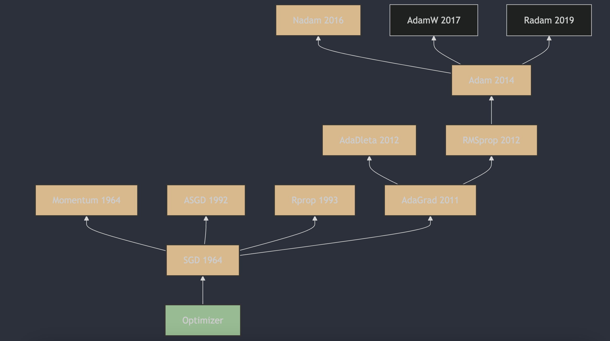

每天3分钟，彻底弄懂神经网络的优化器（十）Nadam

## 1. Nadam算法的提出
Nadam（Nesterov-accelerated Adaptive Moment Estimation）算法是由Tim Salimans et al. 在2016年提出的。这一算法结合了Adam算法和Nesterov Accelerated Gradient（NAG）算法的优点，旨在提高优化算法的性能。Nadam算法的详细描述和原理可以在论文《Incorporating Nesterov Momentum into Adam》[1](#refer-anchor-1)中找到，该论文最初在2016年提交到arXiv，并且后来在2017年的ICLR会议上发表。

## 2. Nadam算法的原理

Nadam（Nesterov-accelerated Adaptive Moment Estimation）是一种结合了Nesterov动量（NAG）和Adam优化算法的优化器。它旨在提高优化过程的性能，特别是在深度学习中。

Nadam的更新规则如下：

1. 初始化一阶矩估计（动量）$m_0$ 和二阶矩估计（梯度平方的移动平均）$v_0$ 为0，以及时间步长 $t=1$;
2. 在每次迭代中，计算梯度 $g_t$;
3. 更新一阶矩估计 $m_t$ 和二阶矩估计 $v_t$：

   $m_t = \beta_1 \cdot m_{t-1} + (1 - \beta_1) \cdot g_t$

   $v_t = \beta_2 \cdot v_{t-1} + (1 - \beta_2) \cdot g_t^2$

4. 计算偏差修正的一阶矩估计 $\hat{m}_t$ 和二阶矩估计 $\hat{v}_t$ ：

   $\hat{m}_t = \frac{m_t}{1 - \beta_1^t}$

   $\hat{v}_t = \frac{v_t}{1 - \beta_2^t}$

5. 计算Nadam特有的修正动量 $\hat{m}_t^{'}$ ：

   $\hat{m}_t^{'} = \beta_1 \cdot m_{t-1} +\frac{(1 - \beta_1) \cdot g_t}{1 - \beta_1^t}$

6. 更新参数 $\theta$：

   $\theta_t = \theta_{t-1} - \eta \cdot \frac{\hat{m}_t^{'}}{\sqrt{\hat{v}_t} + \epsilon}$

在Nadam的更新公式中，$\hat{m}_t^{'}$ 是结合了Nesterov动量的修正动量，它在计算更新时考虑了前一步的速度。这种结合Nesterov动量的特性是Nadam与Adam的主要区别。

## 3. Nadam算法的主要特点

Nadam算法的优点包括：
- 结合了Nesterov动量和Adam算法的优点，既有自适应学习率，又有Nesterov动量，可以更快地收敛。
- 对于深度学习模型的优化效果较好。

Nadam算法的缺点可能包括：
- 需要人工设置初始学习率和两个衰减系数，调参较为复杂。
- 可能会导致训练过程中的震荡，尤其是在学习率较高的情况下。
- 结合了Adam和Nesterov动量，所以其可能会导致优化过程过于复杂，从而增加了计算负担。

在实际应用中，Nadam通常被用于深度学习模型的训练，尤其是在需要快速收敛和对稀疏数据集进行优化时。它在许多情况下都能提供良好的性能，但使用时需要注意调整超参数以达到最佳效果。   

## 参考

[1] [Incorporating Nesterov Momentum into Adam](https://openreview.net/forum?id=OM0jvwB8jIp57ZJjtNEZ)

## 欢迎关注我的GitHub和微信公众号，来不及解释了，快上船！

[GitHub: LLMForEverybody](https://github.com/luhengshiwo/LLMForEverybody)

仓库上有原始的Markdown文件，完全开源，欢迎大家Star和Fork！