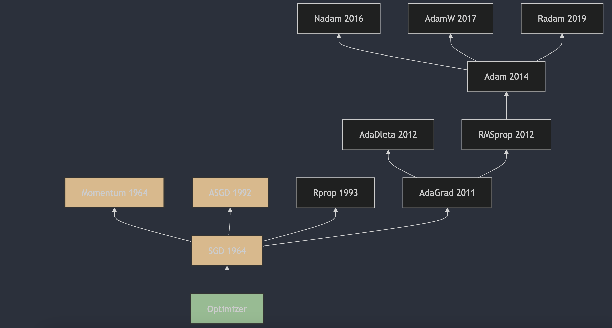

每天3分钟，彻底弄懂神经网络的优化器（四）ASGD

## 1. ASGD算法的提出
平均随机梯度下降（Average Stochastic Gradient Descent，ASGD）是一种用于优化可微分目标函数的迭代方法，它是梯度下降优化的随机近似。ASGD的提出可以追溯到1992年，由B.T.Polyak在他的论文《Acceleration of Stochastic Approximation by Averaging》[1](#refer-anchor-4)中首次描述了这一方法。ASGD通过对多个随机梯度的平均值进行更新，来减少随机梯度的方差，从而提高优化算法的收敛速度。这种方法在训练深度神经网络时，可以帮助算法更快地收敛到最优解。

## 2. ASGD算法的原理

不同于上一篇聊到的momentum对梯度进行指数加权平均，ASGD是对多个随机梯度进行平均。ASGD的更新公式如下：

1. 初始化参数 $\theta_0$ 和学习率 $\eta$;
2. 对于每次迭代 $t$，计算梯度 $g_t$;
3. 更新参数 $\theta$：
   $$\theta_{t+1} = \theta_t - \eta \cdot \frac{1}{t+1} \sum_{i=1}^{t} g_i$$
   其中 $g_i$ 是第 $i$ 次迭代的梯度。

这个更新公式中，$\sum_{i=1}^{t} g_i$ 是从第一次迭代到当前迭代所有梯度的累加和，然后除以 $t+1$ 来计算平均值。随着迭代次数的增加，学习率 $\eta $ 乘以的系数 $\frac{1}{t+1}$ 会逐渐减小，这使得更新步长逐渐变小，有助于算法在接近最优解时更加稳定。

ASGD的一个关键特性是它会在训练过程中累积所有梯度的和，并用这个累积和来更新参数，这有助于减少随机梯度下降中的噪声，并且随着时间的推移，参数更新会逐渐趋向于零，使得算法能够稳定在最优解附近。此外，ASGD通常还会在训练结束后使用所有迭代中参数的平均值作为最终模型参数，这进一步提高了模型的泛化能力。

## 3. ASGD和Momentum的区别

ASGD和Momentum都是用于优化神经网络的优化算法，它们之间的主要区别在于参数更新的方式。它们都旨在改进基本的随机梯度下降（SGD）算法，但它们在实现上有所不同：

1. **Momentum**:
   - Momentum算法通过将之前梯度的指数加权平均值（动量项）与当前梯度相结合来更新参数，这有助于加速梯度下降过程中的收敛，并减少梯度在高曲率区域的振荡。

2. **ASGD**:
   - ASGD算法通过计算所有历史梯度的简单平均值来更新参数，而不是像Momentum那样使用指数加权平均。
   - ASGD的一个关键特点是它在每次迭代中都使用相同的学习率，并且随着时间推移，学习率会自然减小，因为分母 \( t \) 随着迭代次数的增加而增加。

**主要区别**:
- **动量项的计算方式**：Momentum使用指数加权平均来计算动量，而ASGD使用简单算术平均；
- **学习率的调整**：在Momentum中，学习率是固定的，或者可以随着时间进行调整；而在ASGD中，学习率随着迭代次数的增加而自然减小；
- **收敛行为**：Momentum通常在高曲率区域提供更好的加速效果，而ASGD则通过平均历史梯度来平滑梯度更新，减少噪声的影响。

## 参考
[1] [Acceleration of stochastic approximation by averaging](https://dl.acm.org/doi/10.1137/0330046)

## 欢迎关注我的GitHub和微信公众号，来不及解释了，快上船！

[GitHub: LLMForEverybody](https://github.com/luhengshiwo/LLMForEverybody)

仓库上有原始的Markdown文件，完全开源，欢迎大家Star和Fork！