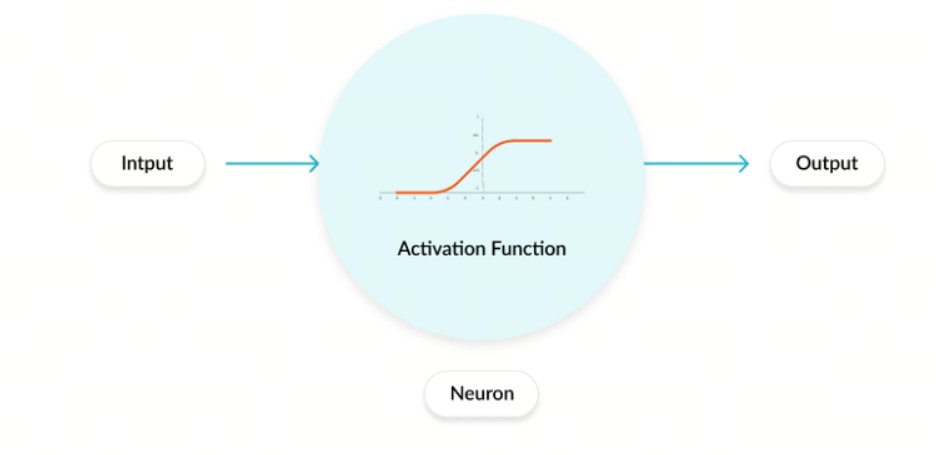

神经网络的激活函数（一）综述

激活函数（Activation Function）是人工神经网络中的一个关键组件，它的作用是为神经网络引入非线性因素。如果没有激活函数，神经网络无论有多少层，都只能表示输入和输出之间的线性关系，这大大限制了网络处理复杂问题的能力。激活函数通常在神经网络的每个神经元或节点上应用，它们帮助网络学习和表示复杂的函数。

##  发展历史

### 1. Sigmoid
Sigmoid函数是最早被广泛使用的激活函数之一，它的公式为：

$$\sigma(x) = \frac{1}{1+e^{-x}}$$ 

Sigmoid函数的输出范围在0到1之间，Sigmoid函数的主要问题是在输入很大或很小的情况下，梯度会变得很小，这会导致梯度消失的问题，从而影响网络的训练效果。

历史背景：早在19世纪，数学家们就研究了类似的函数形式；在1986年，David Rumelhart、Geoffrey Hinton和Ronald Williams在提出多层感知器（MLP）和反向传播算法时，Sigmoid函数被广泛使用，因为它的导数形式简单，便于计算梯度。

### 2. Softmax
Softmax函数是一种常用的多分类激活函数，它的公式为：

$$\sigma(x)_i = \frac{e^{x_i}}{\sum_{j=1}^{n}e^{x_j}}$$

Softmax函数的输出是一个概率分布，它将输入映射到一个概率分布上，使得每个类别的概率之和为1。Softmax函数通常用于多分类问题中的输出层。

历史背景：Softmax函数的概念来源于统计力学中的Boltzmann分布，它在20世纪中期开始被应用于神经网络中。

### 3. Tanh
Tanh函数是双曲正切函数，它的公式为：

$$\tanh(x) = \frac{e^x - e^{-x}}{e^x + e^{-x}}$$

Tanh函数的输出范围在-1到1之间， Tanh函数相对于Sigmoid函数来说，输出的范围更广，可以将输入映射到-1到1之间，从而减少梯度消失的问题。

历史背景：Tanh函数与双曲函数的研究可以追溯到18世纪。它在数学和工程学中有广泛的应用，特别是在信号处理和控制系统中。随着神经网络的发展，Tanh函数被引入作为一种激活函数。

### 4. ReLU
ReLU函数是修正线性单元函数，它的公式为：

$$\text{ReLU}(x) = \max(0, x)$$ 

ReLU函数在输入大于0时输出等于输入，否则输出为0。ReLU函数的优点是计算简单，收敛速度快，但它也存在一个问题，就是在输入小于0时，梯度为0，这会导致神经元无法更新权重，从而出现“神经元死亡”的问题。

提出时间: 2010年，由Vinod Nair和 Geoffrey Hinton在他们的论文《Rectified Linear Units Improve Restricted Boltzmann Machines》[1](#refer-anchor-1)中展示了ReLU在深度神经网络中的有效性。自此，ReLU成为了深度学习中最流行的激活函数之一。

### 5. Leaky ReLU
Leaky ReLU函数是ReLU函数的改进版本，它的公式为：

$$\text{Leaky ReLU}(x) = \max(\alpha x, x)$$

其中$\alpha$是一个小于1的常数，通常取0.01。Leaky ReLU函数在输入小于0时，不再输出0，而是输出一个很小的值$\alpha x$，这样可以避免ReLU函数的“神经元死亡”问题。

提出时间： 2013年,Leaky ReLU首次出现在论文《Rectifier Nonlinearities Improve Neural Network Acoustic Models》[2](#refer-anchor-2)中，该论文由Andrew L. Maas、Awni Y. Hannun和Andrew Y. Ng撰写.

### 6. PReLU

PReLU函数是带参数的ReLU函数，它的公式为：

$$\text{PReLU}(x) = \max(\alpha x, x)$$

其中$\alpha$是一个可学习的参数，通常在训练过程中通过反向传播来更新。PReLU函数在输入小于0时，不再输出0，而是输出一个由参数$\alpha$控制的值，这样可以更灵活地调整激活函数的形状。

提出时间: PReLU是由何凯明（Kaiming He）、张翔（Xiangyu Zhang）、任少卿（Shaoqing Ren）和孙剑（Jian Sun）在2015年的论文《Delving Deep into Rectifiers: Surpassing Human-Level Performance on ImageNet Classification》[3](#refer-anchor-3)中提出的。

### 7. ELU
ELU函数是指数线性单元函数，它的公式为：

$$\text{ELU}(x) = \begin{cases} x, & \text{if } x > 0 \\ \alpha(e^x - 1), & \text{if } x \leq 0 \end{cases}$$ 

其中$\alpha$是一个大于0的常数，通常取1。ELU函数在输入大于0时输出等于输入，否则输出一个由参数$\alpha$控制的值，这样可以避免ReLU函数的“神经元死亡”问题，并且在输入小于0时，输出的值是连续的，有助于提高网络的稳定性。

提出时间: ELU激活函数是在2015年由Djork-Arné Clevert、Thomas Unterthiner和Sepp Hochreiter在论文《Fast and Accurate Deep Network Learning by Exponential Linear Units (ELUs)》[4](#refer-anchor-4)中提出的。

### 8. GLU
GLU函数是门控线性单元函数，它的公式为：

$$\text{GLU}(x) = \sigma(x) \odot \tanh(x)$$

其中$\sigma(x)$是Sigmoid函数，$\odot$表示元素级乘法。GLU函数在输入上应用了门控机制，通过Sigmoid函数来控制输入的信息流动，从而提高网络的表达能力。

提出时间: GLU激活函数是在2017年由Yann Dauphin等人在论文《Language Modeling with Gated Convolutional Networks》[5](#refer-anchor-5)中提出的。

### 9. SELU
SELU函数是自归一化指数线性单元函数，它的公式为：

$$\text{SELU}(x) = \lambda \begin{cases} x, & \text{if } x > 0 \\ \alpha(e^x - 1), & \text{if } x \leq 0 \end{cases}$$ 

其中$\lambda$和$\alpha$是两个常数，通常取1.0507和1.6733。SELU函数在输入大于0时输出等于输入，否则输出一个由参数$\alpha$控制的值，这样可以避免ReLU函数的“神经元死亡”问题，并且在输入小于0时，输出的值是连续的，有助于提高网络的稳定性。SELU函数还具有自归一化的性质，可以使得网络的输出保持稳定。

提出时间: SELU激活函数是在2017年由Günter Klambauer、Thomas Unterthiner、Andreas Mayr和Sepp Hochreiter在论文《Self-Normalizing Neural Networks》[7](#refer-anchor-7)中提出的。

### 10. GELU
GELU函数是高斯误差线性单元函数，它的公式为：

$$\text{GELU}(x) = 0.5x(1 + \tanh(\sqrt{2/\pi}(x + 0.044715x^3)))$$ 

GELU函数在输入大于0时输出等于输入，否则输出一个由参数$\alpha$控制的值，这样可以避免ReLU函数的“神经元死亡”问题，并且在输入小于0时，输出的值是连续的，有助于提高网络的稳定性。GELU函数在很多实际应用中表现出了比ReLU函数更好的性能。

提出时间: GELU激活函数是在2016年由Dan Hendrycks和Kevin Gimpel在论文《Gaussian Error Linear Units (GELUs)》中提出的。

### 11. Swish
Swish函数是自门控激活函数，它的公式为：

$$\text{Swish}(x) = x \cdot \sigma(x)$$

Swish函数在输入大于0时输出等于输入，否则输出一个由Sigmoid函数控制的值，这样可以避免ReLU函数的“神经元死亡”问题，并且在输入小于0时，输出的值是连续的，有助于提高网络的稳定性。Swish函数在很多实际应用中表现出了比ReLU函数更好的性能。

提出时间: Swish激活函数是在2017年由Google Brain团队在论文《Searching for Activation Functions》[6](#refer-anchor-6)中提出的。

### 12. Mish
Mish函数是自门控激活函数，它的公式为：

$$\text{Mish}(x) = x \cdot \tanh(\ln(1 + e^x))$$

Mish函数在输入大于0时输出等于输入，否则输出一个由Sigmoid函数控制的值，这样可以避免ReLU函数的“神经元死亡”问题，并且在输入小于0时，输出的值是连续的，有助于提高网络的稳定性。Mish函数在很多实际应用中表现出了比ReLU函数更好的性能。

提出时间: Mish激活函数是在2019年由Diganta Misra在论文《Mish: A Self Regularized Non-Monotonic Neural Activation Function》中提出的。

### 13. SwiGLU
SwiGLU函数是自门控激活函数，它的公式为：

$$\text{SwiGLU}(x) = x \cdot \sigma(x) + \tanh(x)$$ 

SwiGLU函数在输入大于0时输出等于输入，否则输出一个由Sigmoid函数控制的值，这样可以避免ReLU函数的“神经元死亡”问题，并且在输入小于0时，输出的值是连续的，有助于提高网络的稳定性。SwiGLU函数在很多实际应用中表现出了比ReLU函数更好的性能。

提出时间: SwiGLU激活函数是在2021年由DeepMind团队在论文《Scaling Vision Transformers》[7](#refer-anchor-7)中提出的。

## 参考

[1] [Rectified Linear Units Improve Restricted Boltzmann Machines](https://www.cs.toronto.edu/~hinton/absps/reluICML.pdf)

[2] [Rectifier Nonlinearities Improve Neural Network Acoustic Models](http://robotics.stanford.edu/~amaas/papers/relu_hybrid_icml2013_final.pdf)

[3] [Delving Deep into Rectifiers: Surpassing Human-Level Performance on ImageNet Classification](https://arxiv.org/abs/1502.01852)

[4] [Fast and Accurate Deep Network Learning by Exponential Linear Units (ELUs)](https://arxiv.org/abs/1511.07289)

[5] [Language Modeling with Gated Convolutional Networks](https://arxiv.org/abs/1612.08083)

[6] [Searching for Activation Functions](https://arxiv.org/abs/1710.05941)

[7] [Scaling Vision Transformers](https://arxiv.org/abs/2106.04560)

[8] [Self-Normalizing Neural Networks](https://arxiv.org/abs/1706.02515)

[9] [Gaussian Error Linear Units (GELUs)](https://arxiv.org/abs/1606.08415)

[10] [Mish: A Self Regularized Non-Monotonic Neural Activation Function](https://arxiv.org/abs/1908.08681)

## 欢迎关注我的GitHub和微信公众号[真-忒修斯之船]，来不及解释了，快上船！

[GitHub: LLMForEverybody](https://github.com/luhengshiwo/LLMForEverybody)

仓库上有原始的Markdown文件，完全开源，欢迎大家Star和Fork！