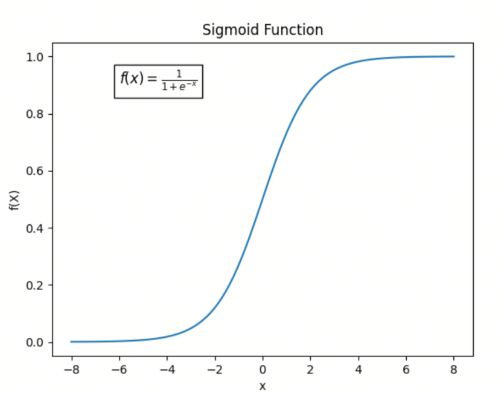

神经网络的激活函数（二）Sigmiod、Softmax和Tanh

本文我们介绍三个古早的激活函数，虽然古老，但是在神经网络中仍然有着广泛的应用，尤其是Softmax作为输出层，仍然是统治地位.

## 1. Sigmoid函数

Sigmoid函数的概念可以追溯到19世纪，但在现代科学和工程中，它的广泛应用主要是从20世纪中期开始的。



### 定义

Sigmoid函数的数学形式为：

$$\sigma(x) = \frac{1}{1 + e^{-x}}$$

### 关键性质

1. **输出范围**：Sigmoid函数的输出值在0到1之间，可以看作是一个概率值。
2. **平滑性**：Sigmoid函数是一个平滑的、连续的函数，具有良好的导数性质。
3. **非线性**：Sigmoid函数是一种非线性函数，可以引入非线性变换，增加神经网络的表达能力。

### 历史背景

1. **早期数学背景**：
   - Sigmoid函数的数学形式（通常表示为 $\sigma(x) = \frac{1}{1 + e^{-x}}$）与累积分布函数（CDF）有相似之处。早在19世纪，数学家们就研究了类似的函数形式，特别是在概率和统计学中。

2. **生物学和神经科学中的应用**：
   - 在20世纪中期，生物学家和神经科学家开始使用Sigmoid函数来描述神经元的激活函数。特别是，神经科学家Warren McCulloch和Walter Pitts在1943年提出的McCulloch-Pitts神经元模型中，使用了类似于Sigmoid函数的激活函数。

3. **人工神经网络中的应用**：
   - 在20世纪80年代，随着人工神经网络的兴起，Sigmoid函数成为一种标准的激活函数。特别是在多层感知器（MLP）和反向传播算法（由David Rumelhart、Geoffrey Hinton和Ronald Williams在1986年提出）中，Sigmoid函数被广泛使用，因为它的导数形式简单，便于计算梯度。


## 2. Softmax函数
Softmax函数是一种广泛应用于机器学习和深度学习中的激活函数，特别是在多分类任务中。它将一个包含任意实数的向量转换为一个概率分布。Softmax函数的提出和应用与统计力学和信息理论中的概念有关。


### 2.1 定义

给定一个包含 $n$ 个实数的向量 $\mathbf{z} = [z_1, z_2, \ldots, z_n]$，Softmax函数将其转换为一个概率分布 $\mathbf{p} = [p_1, p_2, \ldots, p_n]$，其中每个 $ p_i $ 的计算公式为：

$$p_i = \frac{e^{z_i}}{\sum_{j=1}^n e^{z_j}}$$

### 2.2 关键性质

1. **非负性**：对于任意 $i$， $p_i \geq 0$。
2. **归一化**：所有输出的和为1，即 $\sum_{i=1}^n p_i = 1$。
3. **指数函数的使用**：指数函数 $e^{z_i}$ 确保了输出值为正，并且放大了较大的 $z_i$ 值的差异。

### 2.3 历史背景

Softmax函数的概念来源于统计力学中的Boltzmann分布（也称为Gibbs分布），它描述了系统在热平衡状态下不同能量状态的概率分布。这个概念在信息理论和机器学习中得到了广泛应用。

1. **统计力学**：在19世纪末和20世纪初，Ludwig Boltzmann和Josiah Willard Gibbs等科学家研究了热力学系统的能量分布，提出了Boltzmann分布。
2. **信息理论**：20世纪中期，Claude Shannon的工作奠定了信息理论的基础，其中包括熵和信息量的概念，这些概念与概率分布密切相关。
3. **机器学习**：在20世纪后期，特别是随着神经网络和深度学习的兴起，Softmax函数被引入到多分类问题中，用于输出层的激活函数，以将网络的输出转换为概率分布。

### 应用

**多分类问题**：Softmax函数常用于神经网络的输出层，在多分类问题中将网络的输出转换为类别的概率分布。

### 示例

假设有一个包含三个元素的向量 $\mathbf{z} = [2.0, 1.0, 0.1]$，则Softmax函数的输出为：

```python
import numpy as np

z = np.array([2.0, 1.0, 0.1])
softmax = np.exp(z) / np.sum(np.exp(z))

print(softmax)
```

输出：

```
[0.65900114 0.24243297 0.09856589]
```

这表示第一个元素的概率最大，约为0.659，第二个元素的概率约为0.242，第三个元素的概率最小，约为0.099.

## 3. Tanh函数


### 3.1 定义
Tanh函数（双曲正切函数）是一个常见的激活函数，广泛应用于神经网络和机器学习中。它的数学表达式为：

$$\text{tanh}(x) = \frac{e^x - e^{-x}}{e^x + e^{-x}}$$

Tanh函数的导数可以表示为：

$$\frac{d}{dx} \text{tanh}(x) = 1 - \text{tanh}^2(x)$$

这意味着在输入值接近 $-1$ 或 $1$ 时，导数值接近0，而在输入值接近0时，导数值接近1

### 3.2 关键性质

1. **输出范围**：Tanh函数的输出值在 $-1$ 到 $1$ 之间。
2. **中心对称性**：Tanh函数是关于原点对称的，即 $\text{tanh}(-x) = -\text{tanh}(x)$。
3. **平滑性**：Tanh函数是一个平滑的、连续的函数，具有良好的导数性质。


### 3.3 历史背景

Tanh函数与双曲函数的研究可以追溯到18世纪。它在数学和工程学中有广泛的应用，特别是在信号处理和控制系统中。随着神经网络的发展，Tanh函数被引入作为一种激活函数。

### 3.4 应用

在神经网络中，Tanh函数常用于隐藏层的激活函数。它的输出范围在 $-1$ 到 $1$ 之间，这使得它在某些情况下比Sigmoid函数更有优势，因为它的输出是零中心的，有助于加速梯度下降的收敛。


## 总结
今天我们介绍了三个古老的激活函数，它们在神经网络中仍然有着广泛的应用。Sigmoid函数作为一种非线性函数，可以引入非线性变换，增加神经网络的表达能力；Softmax函数常用于多分类问题，将网络的输出转换为类别的概率分布；Tanh函数作为隐藏层的激活函数，输出范围在 $-1$ 到 $1$ 之间，有助于加速梯度下降的收敛。

下一次我们进入到更加现代的激活函数，如ReLU、Swish等，敬请期待！

## 参考

[1] [Sigmoid Activation Function](https://www.codecademy.com/resources/docs/ai/neural-networks/sigmoid-activation-function)

[2] [A pseudo-softmax function for hardware-based high speed image classification](https://www.nature.com/articles/s41598-021-94691-7)

[3] [Hyperbolic Tangent](https://mathworld.wolfram.com/HyperbolicTangent.html)

## 欢迎关注我的GitHub和微信公众号[真-忒修斯之船]，来不及解释了，快上船！

[GitHub: LLMForEverybody](https://github.com/luhengshiwo/LLMForEverybody)

仓库上有原始的Markdown文件，完全开源，欢迎大家Star和Fork！