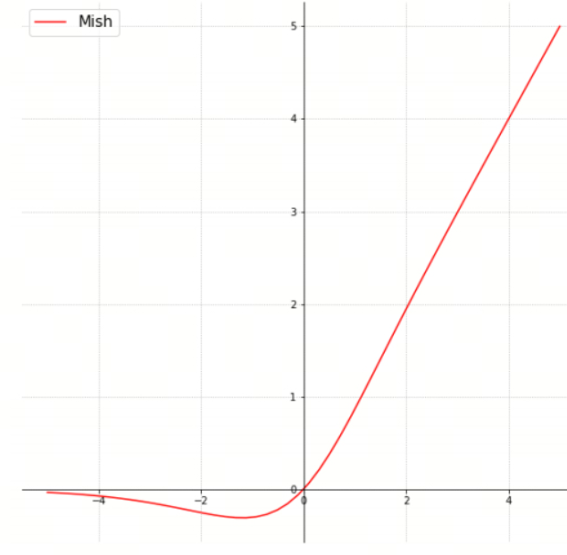

神经网络的激活函数（六）GELU和Mish

## 1. GELU


GELU（Gaussian Error Linear Unit，高斯误差线性单元）是一种在深度学习中广泛应用的激活函数。GELU通过高斯误差函数（即标准正态分布的累积分布函数）对输入进行平滑处理，从而提高模型的性能。GELU在许多任务中表现出色，特别是在自然语言处理（NLP）和计算机视觉任务中。

### 1.1 数学定义

GELU函数的数学表达式为：

$$\text{GELU}(x) = x \cdot \Phi(x)$$

其中：
- $x$ 是输入。
- $\Phi(x)$ 是标准正态分布的累积分布函数，定义为：
$\Phi(x) = \frac{1}{2} \left( 1 + \text{erf}\left( \frac{x}{\sqrt{2}} \right) \right)$

其中，$\text{erf}(x)$ 是误差函数。

### 1.2 近似表达式

为了简化计算，GELU函数通常采用以下近似表达式：

$$\text{GELU}(x) \approx 0.5 \cdot x \cdot \left( 1 + \tanh\left( \sqrt{\frac{2}{\pi}} \left( x + 0.044715 x^3 \right) \right) \right)$$

这种近似计算在实际应用中非常常见，因为它计算效率更高。

### 1.3 关键性质

1. **平滑性**：GELU函数是连续且平滑的，这有助于提高模型的稳定性和收敛速度。
2. **非线性**：GELU结合了线性和非线性变换，使得模型能够学习复杂的模式。
3. **概率解释**：GELU通过高斯误差函数对输入进行平滑处理，从而具有概率解释，即输入值越大，通过的概率越高。

### 1.4 提出时间

GELU激活函数是在2016年由Dan Hendrycks和Kevin Gimpel在论文《Gaussian Error Linear Units (GELUs)》中提出的。

### 解决的问题

1. **平滑激活**：GELU通过引入高斯误差函数，使得激活函数在输入的正负区间内都具有平滑性，从而提高模型的稳定性。
2. **非线性增强**：GELU结合了线性变换和非线性激活，从而增强了模型的非线性特性。
3. **概率解释**：GELU具有概率解释，使得输入值越大，通过的概率越高，从而更好地模拟神经元的激活过程。


### 示例

以下是一个简单的Python示例，展示如何计算GELU函数：

```python
from scipy.special import erf

# 定义GELU函数
def gelu(x):
    return 0.5 * x * (1 + erf(x / np.sqrt(2)))
```

## Mish



Mish激活函数是一种在深度学习中使用的非线性激活函数，由Diganta Misra在2019年提出。Mish激活函数通过平滑的非线性变换来增强模型的性能，并且在许多任务中表现出色，包括计算机视觉和自然语言处理。

### 数学定义

Mish激活函数的数学表达式为：

$$\text{Mish}(x) = x \cdot \tanh(\text{softplus}(x))$$

其中：
- $\text{softplus}(x) = \ln(1 + e^x)$ 是Softplus函数。
- $\tanh(x)$ 是双曲正切函数。

### 关键性质

1. **平滑性**：Mish函数是连续且平滑的，这有助于提高模型的稳定性和收敛速度。
2. **非单调性**：Mish函数是非单调的，这意味着它在某些区间内是递增的，而在其他区间内是递减的。这种特性使得Mish能够捕捉到更复杂的模式。
3. **无界性**：与ReLU不同，Mish函数在负值区域是无界的，这有助于梯度流动，避免梯度消失问题。
4. **近似ReLU**：当输入值较大时，Mish函数近似于ReLU函数。

### 提出时间

Mish激活函数是在2019年由Diganta Misra在论文《Mish: A Self Regularized Non-Monotonic Neural Activation Function》中提出的。


### 解决的问题

1. **平滑激活**：Mish通过引入Softplus和双曲正切函数，使得激活函数在输入的正负区间内都具有平滑性，从而提高模型的稳定性。
2. **非单调性**：Mish的非单调性使得它能够捕捉到更复杂的模式，比ReLU等单调激活函数更具表现力。
3. **梯度流动**：Mish在负值区域是无界的，这有助于梯度流动，避免梯度消失问题。


### 示例

以下是一个简单的Python示例，展示如何计算Mish函数：

```python
import numpy as np
import matplotlib.pyplot as plt

# 定义Softplus函数
def softplus(x):
    return np.log1p(np.exp(x))

# 定义Mish函数
def mish(x):
    return x * np.tanh(softplus(x))

```


## 参考

[1] [Gaussian Error Linear Units (GELUs)](https://arxiv.org/abs/1606.08415)

[2] [Mish: A Self Regularized Non-Monotonic Neural Activation Function](https://arxiv.org/abs/1908.08681)


## 欢迎关注我的GitHub和微信公众号[真-忒修斯之船]，来不及解释了，快上船！

[GitHub: LLMForEverybody](https://github.com/luhengshiwo/LLMForEverybody)

仓库上有原始的Markdown文件，完全开源，欢迎大家Star和Fork！