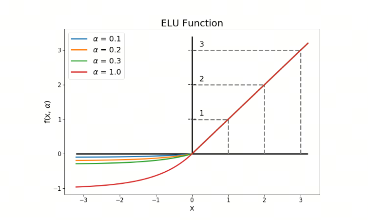

神经网络的激活函数（四）ELU和它的变种SELU

ELU（Exponential Linear Unit，指数线性单元）激活函数是为了进一步改进ReLU及其变体（如Leaky ReLU和PReLU）的性能而提出的。ELU旨在解决ReLU的一些固有问题，特别是负区间的特性和输出均值的偏移。

## 1. ELU函数

ELU通过在负区间引入指数函数来改进ReLU及其变体的性能。ELU旨在解决ReLU的一些固有问题，如Dying ReLU问题和输出均值偏移问题。

### 1.1 数学定义

ELU的数学表达式为：

$$\text{ELU}(x) = \begin{cases} 
x & \text{if } x \geq 0 \\
\alpha (e^x - 1) & \text{if } x < 0 
\end{cases}$$

其中，$\alpha$ 是一个超参数，通常取值为1。

### 1.2 关键性质

1. **非线性**：与ReLU一样，ELU引入了非线性特性，使得神经网络能够学习复杂的模式。
2. **避免Dying ReLU问题**：通过在负区间引入指数函数，ELU确保了所有神经元都有梯度，从而有效地避免了Dying ReLU问题。
3. **输出均值接近零**：ELU的负区间输出为$\alpha (e^x - 1)$，这使得其输出均值更接近于零，从而有助于加速神经网络的学习过程。相比之下，ReLU在负区间的输出为零，这可能导致输出均值偏移。
4. **平滑性**：ELU在负区间的输出是连续且光滑的，这有助于提高模型的稳定性和收敛速度。

### 1.3 提出时间

ELU激活函数是在2015年由Djork-Arné Clevert、Thomas Unterthiner和Sepp Hochreiter在论文《Fast and Accurate Deep Network Learning by Exponential Linear Units (ELUs)》中提出的。

### 1.4 应用

ELU在许多深度学习模型中得到了应用，特别是在卷积神经网络（CNN）和其他需要处理大量非线性数据的模型中。它通过改进负区间的特性和输出均值，使得模型能够更快地收敛并达到更高的性能。

## 2. SELU函数

SELU（Scaled Exponential Linear Unit，缩放指数线性单元）激活函数是ELU的一个变体，通过引入缩放因子来进一步改进神经网络的性能。SELU不仅解决了ReLU的一些问题，还引入了自归一化（self-normalizing）的特性，使得神经网络在训练过程中能够自动保持均值和方差的稳定。

### 2.1 数学定义

SELU的数学表达式为：

$$\text{SELU}(x) = \lambda \begin{cases} 
x & \text{if } x \geq 0 \\
\alpha (e^x - 1) & \text{if } x < 0 
\end{cases}$$

其中，$\alpha$ 和 $\lambda$ 是两个固定的参数，通常取值为：
- $\alpha \approx 1.67326$
- $\lambda \approx 1.0507$

### 2.2 关键性质

1. **非线性**：与ReLU和ELU一样，SELU引入了非线性特性，使得神经网络能够学习复杂的模式。
2. **避免Dying ReLU问题**：通过在负区间引入指数函数，SELU确保了所有神经元都有梯度，从而有效地避免了Dying ReLU问题。
3. **自归一化**：SELU的一个重要特性是其自归一化特性，即在每一层的输出均值和方差能够自动趋于稳定。这有助于加速训练过程并提高模型的性能。
4. **输出均值和方差稳定**：SELU的缩放因子 $\lambda$ 和 $\alpha$ 的选择，使得其输出均值和方差能够保持稳定，从而有助于防止梯度消失和梯度爆炸问题。

### 2.3 提出时间

SELU激活函数是在2017年由Günter Klambauer、Thomas Unterthiner、Andreas Mayr和Sepp Hochreiter在论文《Self-Normalizing Neural Networks》中提出的。

## 参考

[1] [Fast and Accurate Deep Network Learning by Exponential Linear Units (ELUs)](https://arxiv.org/abs/1511.07289)

[2] [Self-Normalizing Neural Networks](https://arxiv.org/abs/1706.02515)

## 欢迎关注我的GitHub和微信公众号[真-忒修斯之船]，来不及解释了，快上船！

[GitHub: LLMForEverybody](https://github.com/luhengshiwo/LLMForEverybody)

仓库上有原始的Markdown文件，完全开源，欢迎大家Star和Fork！