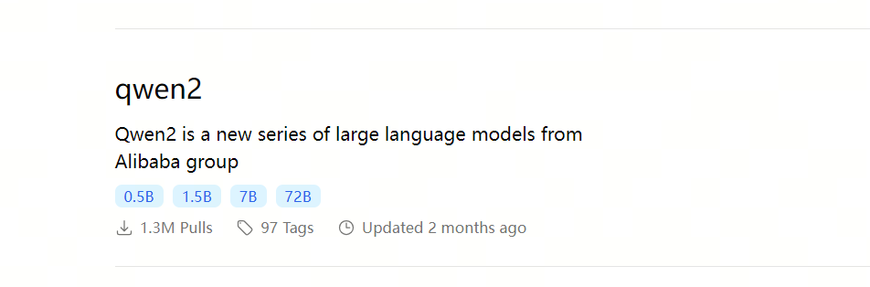
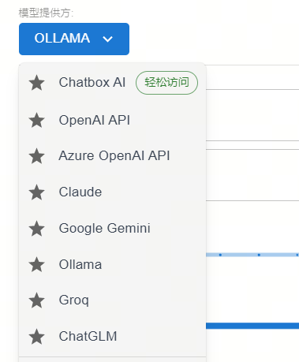

## 导入

如今, 私有化部署一个大模型早已不是什么有门槛或技术含量的工作了，更多的只是一种信息差而已。Ollama提供了最简便的部署方式。

技术要求：会点鼠标，会打字😀 我们只需要两个软件：

Ollama: https://ollama.com/

ChatBox：https://chatboxai.app/zh

## Ollama
Ollama是一个开源的大型语言模型（LLM）服务工具，它旨在简化在本地运行大语言模型的过程，降低使用大语言模型的门槛。它允许开发者、研究人员和爱好者在本地环境中快速实验、管理和部署最新的大语言模型，包括但不限于Qwen2、Llama3、Phi3、Gemma2等开源的大型语言模型。Ollama通过提供一个简单而高效的接口，使用户能够轻松地创建、运行和管理这些模型，同时还提供了丰富的预构建模型库，方便集成到各种应用程序中。

### 1. 下载Ollama 

官网下载Ollama  https://ollama.com/

### 2. 安装Ollama
一路点点点，安装完成。

### 3. 下载模型
在Ollama的模型仓库https://ollama.com/library，查找你喜欢的模型，为了测试方便我们可以找一个tiny点的大模型

我们可以使用qwen2 0.5b的模型，这个模型用了4bit的量化，模型大小只有352MB。

在终端cmd中，输入拉取模型的命令：

> ollama pull qwen2:0.5b

### 4. 启动Ollama

输入命令，启动 qwen2:0.5b：

> ollama run qwen2:0.5b

至此，你的电脑里已经有了一个本地大模型了，你也可以拉取其它更大的模型来提升模型效果。

## ChatBox

Chatbox AI 是一款 AI 客户端应用和智能助手，支持众多先进的 AI 模型和 API，可在 Windows、MacOS、Android、iOS、Linux 和网页版上使用。

### 1. 下载ChatBox
在官网下载chatbox https://chatboxai.app/zh#download

### 2. 安装ChatBox
一路点点点，安装完成。

### 3. 配置ChatBox
在chatbox左下角找到设置

模型提供方选ollama

api设置为: http://localhost:11434

模型设置为：qwen2:0.5b

点击保存

测试

9

可以看到已经使用qwen2:0.5b回答了。如果你有很强的GPU，完全可以拉取更大的模型部署，效果更好。
全程不需要高深的计算机知识，只需要正常安装软件的能力即可。

## 欢迎关注我的GitHub和微信公众号[真-忒修斯之船]，来不及解释了，快上船！

[GitHub: LLMForEverybody](https://github.com/luhengshiwo/LLMForEverybody)

仓库上有原始的Markdown文件，完全开源，欢迎大家Star和Fork！