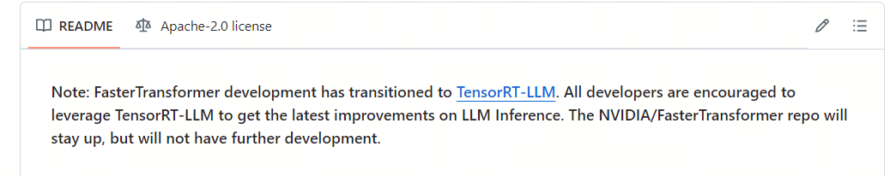

大模型推理框架（四）TensorRT-LLM

`TensorRT-LLM` [1](#refer-anchor-1)是 NVIDIA 提供的一个用于优化大型语言模型（LLMs）在 NVIDIA GPU 上的推理性能的开源库。它通过一系列先进的优化技术，如量化、内核融合、动态批处理和多 GPU 支持，显著提高了 LLMs 的推理速度，与传统的基于 CPU 的方法相比，推理速度可提高多达 8 倍；

## 1. Fast Transformer or TensorRT-LLM?

Fast Transformer 已不再更新！！

TensorRT-LLM 可以视为 TensorRT 和 FastTransformer 的结合体，旨在为大模型推理加速而生。它不仅包含了 FastTransformer 对 Transformer 做的 attention 优化、softmax 优化、算子融合等方式，还引入了众多的大模型推理优化特性

`TensorRT` 是NVIDIA开发的一款用于GPU上高性能深度学习推理的SDK（软件开发工具包）。它能够优化神经网络模型，加速推理过程，显著提升GPU上的推理性能和效率。TensorRT的主要功能包括：

1. **模型优化**：TensorRT可以导入从主要深度学习框架训练好的模型，并生成优化的运行时引擎，这些引擎可以部署在数据中心、汽车和嵌入式环境中。

2. **高性能推理优化**：TensorRT通过层融合、精度校准、内核自动调优等技术，大幅提升推理速度。

3. **低延迟**：TensorRT优化计算图和内存使用，从而显著降低推理延迟，适用于实时AI应用。

4. **多精度支持**：TensorRT支持FP32、FP16、INT8等多种精度，允许在精度和性能之间进行平衡。

## 2. 加速推理技术

1. Quantization

量化技术是LLM领域中用于优化模型的一种方法，特别是在模型部署到资源受限的环境（如移动设备、嵌入式系统或需要低延迟的服务器）时。量化的基本思想是将模型中的权重和激活值从浮点数（如32位浮点数，FP32）转换为低精度的表示，比如8位整数（INT8）或更低位的格式.

2. In-flight Batching
也称Continuous Batching，是一种提高LLM推理效率的技术。它通过连续处理多个输入样本，减少了推理过程中的空闲时间，提高了计算效率和吞吐量。在LLM推理中，通过批处理多个输入样本，可以更有效地利用GPU的计算资源，减少推理过程中的等待时间，提高整体的推理速度。

3. Attention

`KV Cache` 采用以空间换时间的思想，复用上次推理的 KV 缓存，可以极大降低内存压力、提高推理性能，而且不会影响任何计算精度。

decoder架构里面最主要的就是 transformer 中的 self-attention 结构的堆叠，KV-cache的实质是用之前计算过的 key-value 以及当前的 query 来生成下一个 token。

prefill指的是生成第一个token的时候，kv是没有任何缓存的，需要预填充prompt对应的KV矩阵做缓存，所以第一个token生成的最慢，而从第二个token开始，都会快速获取缓存，并将前一个token的kv也缓存。

可以看到，这是一个空间换时间的方案，缓存会不断变大，所以在私有化部署计算显存的时候，除了模型大小，还要要看你的应用中prompt和completion的大小（当然还有batch-size）。

而增加了空间后，显存又是一个问题，于是人们尝试在attention机制里面共享keys和values来减少KV cache的内容。

这就有了`Multi-Query Attention(MQA)`，即query的数量还是多个，而keys和values只有一个，所有的query共享一组。这样KV Cache就变小了。

但MQA的缺点就是损失了精度，所以研究人员又想了一个折中方案：不是所有的query共享一组KV，而是一个group的guery共享一组KV，这样既降低了KV cache，又能满足精度。这就有了`Group-Query Attention(GQA)`。

4. Graph Rewriting

Graph Rewriting 是 TensorRT-LLM 中用于优化神经网络模型的一种技术。在深度学习模型部署到硬件之前，通常会经过一个图优化的过程，这个过程被称为图重写。TensorRT-LLM 使用声明式方法来定义神经网络，这意味着模型是通过描述其结构和操作的方式来构建的，而不是通过编程的方式逐步构建。

通过图重写，TensorRT-LLM 能够为特定的硬件平台生成优化的执行图，从而在 NVIDIA GPU 上实现高效的推理性能。这种优化可以显著提高模型的运行速度，减少延迟，并提高整体的吞吐量，特别是在处理大型语言模型时尤为重要。

## 参考

[1] [TensorRT-LLM](https://github.com/NVIDIA/TensorRT-LLM/tree/release/0.5.0)

## 欢迎关注我的GitHub和微信公众号[真-忒修斯之船]，来不及解释了，快上船！

[GitHub: LLMForEverybody](https://github.com/luhengshiwo/LLMForEverybody)

仓库上有原始的Markdown文件，完全开源，欢迎大家Star和Fork！