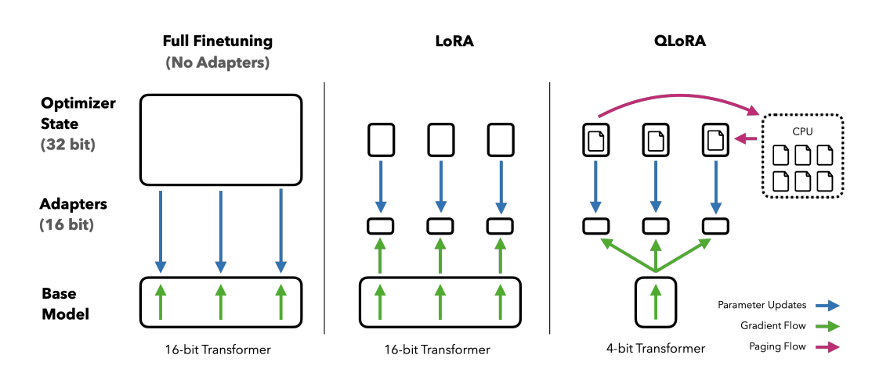

LoRA不是唯一选择，Adapters微调大模型的奥秘（一）综述

大家应该都知道LoRA了，这是非常流行的PEFT方法，属于Adapters的一种。Adapters是一种非常好的微调大模型的方法，可以在不改变原模型参数的情况下，增加新的任务。这个系列会介绍Adapters的几种变种，包括LoRA、QLoRA、AdaLoRA等。

之前我们介绍过PEFT的Soft Prompts系列，这次我们介绍Adapter系列，重点放在LoRA和几个变种上。

## Adpater

基于适配器Adapter的方法在冻结的预训练模型的注意层和全连接层之后添加额外的可训练参数，以减少内存使用量并加快训练速度。该方法因Adapter而异，它可能只是一个额外的添加层，也可能将权重更新 ∆W 表示为权重矩阵的低秩分解。无论哪种方式，适配器通常都很小，但表现出与完全微调模型相当的性能，并且能够用更少的资源训练更大的模型。

## 常见的Adapters方法

### LoRA

LoRA（Low-Rank Adapter）[1](#refer-anchor-1) 是最流行的 PEFT 方法之一，如果你刚开始使用 PEFT，它是一个很好的起点。它最初是为大型语言模型开发的，但由于其效率和有效性，它是一种非常流行的扩散模型训练方法。

LoRA 通过低秩分解用两个较小的矩阵（称为更新矩阵）表示权重更新 ∆W。这些新矩阵可以训练以适应新数据，同时保持参数总数较低。原始权重矩阵保持冻结状态，不会收到任何进一步的更新。为了产生最终结果，将原始权重和额外调整后的权重组合在一起。你还可以将适配器权重与基础模型合并，以消除推理延迟。

### QLoRA

QLoRA（Quantized Low-Rank Adapter）[2](#refer-anchor-2)是一种新型的微调大型语言模型（LLM）的方法，它能够在减少内存使用的同时保持模型性能。这一技术由华盛顿大学提出，主要针对内存需求巨大的问题，使得在单个48GB GPU上微调650亿个参数的模型成为可能，同时保持完整的16位微调任务性能。

QLoRA的工作原理是先将预训练语言模型进行4位量化，显著减少模型的内存占用，然后使用低阶适配器（LoRA）方法对量化的模型进行微调。这种方法不仅减少了模型的体积，提高了速度，而且还保留了原始预训练语言模型的大部分准确性。

### AdaLoRA

看到Ada，就得知道是Adaptive的意思。

AdaLoRA（Adaptive Low-Rank Adapter）[3](#refer-anchor-3)是一种用于高效微调大型预训练语言模型的方法，它能够自适应地根据权重矩阵的重要性来分配参数预算。这种方法通过将权重矩阵的增量更新参数化为奇异值分解（Singular Value Decomposition, SVD）的形式，有效地剪枝不重要更新的奇异值，减少它们的参数预算，同时避免了进行密集的精确SVD计算。

AdaLoRA包含两个主要模块：

- SVD形式参数更新：直接将增量矩阵Δ参数化为SVD的形式，从而避免了在训练过程中进行SVD计算带来的资源消耗；

- 基于重要程度的参数分配：基于新的重要性度量标准，动态地在增量矩阵之间分配参数预算，通过操纵奇异值来实现

## 参考

[1] [LoRA: Low-Rank Adaptation of Large Language Models](https://arxiv.org/pdf/2106.09685)

[2] [QLORA: Efficient Finetuning of Quantized LLMs](https://arxiv.org/pdf/2305.14314)

[3] [ADALORA: ADAPTIVE BUDGET ALLOCATION FOR PARAMETER-EFFICIENT FINE-TUNING](https://arxiv.org/pdf/2303.10512)

[4] [huggingface: adapter](https://huggingface.co/docs/peft/conceptual_guides/adapter)

## 欢迎关注我的GitHub和微信公众号[真-忒修斯之船]，来不及解释了，快上船！

[GitHub: LLMForEverybody](https://github.com/luhengshiwo/LLMForEverybody)

仓库上有原始的Markdown文件，完全开源，欢迎大家Star和Fork！