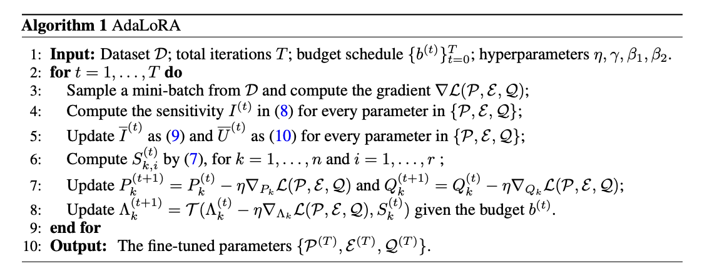

LoRA不是唯一选择，Adapters微调大模型的奥秘（四）AdaLoRA

## 1.技术解读

AdaLoRA是一种对LoRA技术的改进，它的核心思想是根据模型中不同权重矩阵的重要性来动态分配参数预算。换句话说，它让模型自己决定哪些部分在微调时更重要，从而在这些部分使用更多的参数进行更新，而对于不那么重要的部分则减少参数更新，以此来提高微调效率和模型性能。

AdaLoRA通过奇异值分解（Singular Value Decomposition, SVD）来评估每个矩阵的重要性。在SVD中，一个矩阵可以被分解为三个特定的矩阵，其中一个包含了所谓的奇异值，这些奇异值可以告诉我们矩阵的哪些部分是重要的。AdaLoRA利用这些信息来动态调整每个LoRA矩阵的秩，秩较高的矩阵会有更多的参数被更新，而秩较低的则反之。

AdaLoRA的这种方法使得模型能够在保持整体参数量不变的情况下，对不同部分进行不同程度的微调，从而在有限的资源下实现更优的性能。这就像是老师在指导学生学习时，会根据每个学生在不同科目上的表现来分配辅导时间，表现较差的科目会得到更多的关注和资源，而表现好的科目则不需要那么多的辅导时间。

## 2.直观理解

想象一下，你是一个厨师，你有一个巨大的菜谱书（就像一个大型的语言模型），这本书里有很多不同的菜谱（模型的参数）。现在，你想在这本书里加一些新的菜谱或者修改一些旧的菜谱，以便做出更符合特定口味的菜肴（微调模型以适应新任务）。

在传统的微调中，你可能需要一页一页地去修改这本书，这非常耗时和费力。而LoRA方法就像是你只需要在书的某些页面上贴便利贴，写下新的修改（在模型中添加低秩矩阵进行更新）。

但AdaLoRA更聪明，它不仅贴便利贴，还会根据每个菜谱的重要性来决定贴多少便利贴。比如，对于一道非常重要的新菜，你可能会在相关的页面上贴更多的便利贴，写下更详细的步骤和技巧。而对于已经很好的菜谱，你可能只需要贴一两个便利贴，做一点点调整。

AdaLoRA通过一种特殊的方法（奇异值分解）来决定哪些部分更重要，然后在这些部分使用更多的参数（便利贴）进行更新。这就像是你根据菜谱的使用频率和效果来决定投入多少精力去改进它们。

最终，AdaLoRA使得你不需要修改整本书（不需要更新所有模型参数），而是聪明地在关键的地方做修改，这样既节省了时间，又确保了菜肴的质量（提高了模型的性能和效率）。

## 参考

[1] [ADALORA: ADAPTIVE BUDGET ALLOCATION FOR PARAMETER-EFFICIENT FINE-TUNING](https://arxiv.org/pdf/2303.10512)

## 欢迎关注我的GitHub和微信公众号[真-忒修斯之船]，来不及解释了，快上船！

[GitHub: LLMForEverybody](https://github.com/luhengshiwo/LLMForEverybody)

仓库上有原始的Markdown文件，完全开源，欢迎大家Star和Fork！