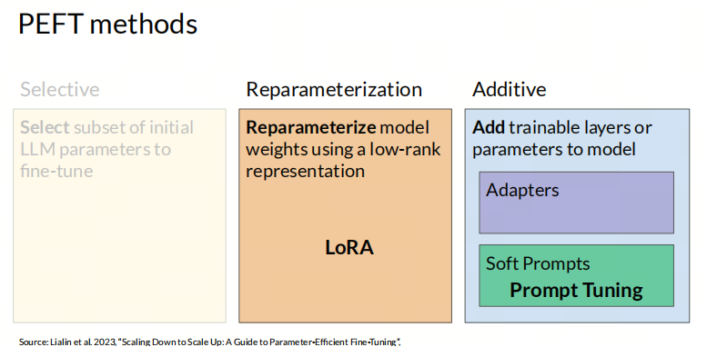
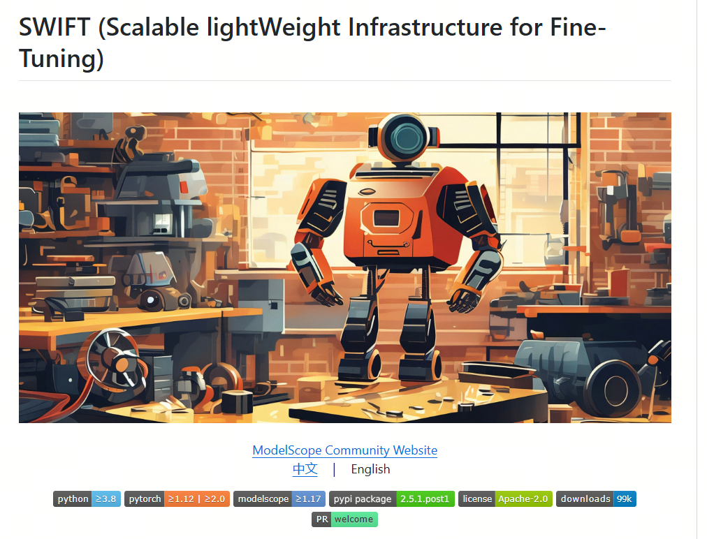
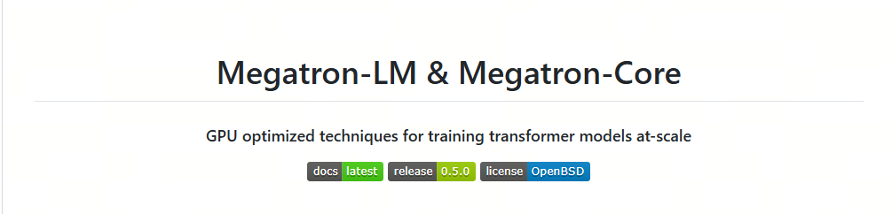
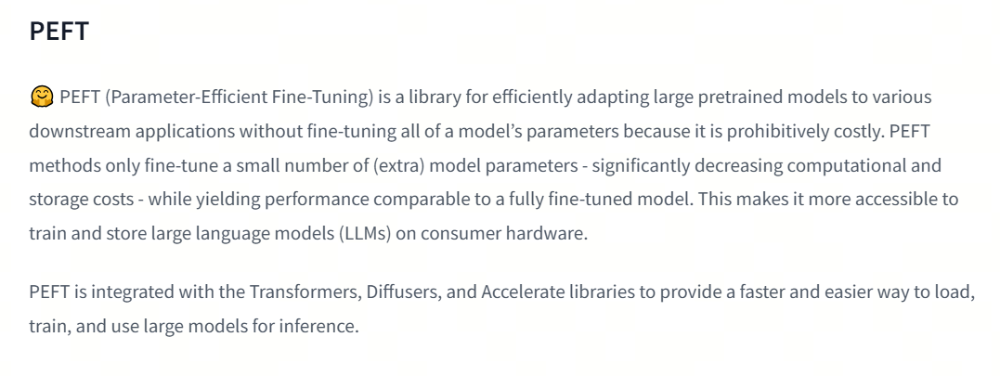

一文带你了解大模型微调框架

## 1. 什么是大模型的微调

大模型的微调（Fine-tuning），通常是指在已经预训练好的大型语言模型（Large Language Models，简称LLMs）基础上，使用特定的数据集进行进一步的训练，以使模型适应特定的任务或领域。这个过程可以让模型学习到特定领域的知识，优化其在特定NLP任务中的表现，比如情感分析、实体识别、文本分类、对话生成等。

1. **预训练模型**：在微调之前，大模型通常已经经过大量的无监督预训练，这使得模型掌握了语言的基本统计特征和知识，具备了预测下一个词的能力。

2. **任务特定的数据集**：微调时，会使用与特定任务相关的标注数据对模型进行训练。这些数据提供了模型需要学习的特定领域的信息。

3. **权重调整**：微调过程中，模型的权重会根据特定任务的数据进行调整。这可以是全量参数更新（Full Fine-tuning），也可以是参数高效微调（Parameter-Efficient Fine-Tuning，PEFT），后者只更新模型中的一部分参数。

## 2. PEFT（Parameter-Efficient Fine-Tuning）

与传统的微调方法相比，PEFT有效地降低了计算和内存需求，因为它只对模型参数的一小部分进行微调，同时冻结大部分预训练网络。这种策略减轻了大语言模型灾难性的遗忘，并显著降低了计算和存储成本。

PEFT的主要方法 见  Adapters 和 Soft prompts 的链接。



## 3. 框架综述

1. **huggingface/peft**[1](#refer-anchor-1)：huggingface开源的参数高效微调（Parameter-Efficient Fine-Tuning）基础工具；


2. **modelscope/ms-swift**[2](#refer-anchor-2)：modelscope开源的轻量级微调框架，以中文大模型为主，支持各类微调方法。可以通过执行脚本进行微调，也可以在代码环境中一键微调，自带微调数据集和验证数据集，可以一键微调+模型验证；



3. **hiyouga/LLaMA-Factory**[3](#refer-anchor-3)：一个全栈微调工具，支持海量模型+各种主流微调方法。它支持运行脚本微调、基于Web端微调，并自带基础训练数据集。除微调外，还支持增量预训练和全量微调；


4. **NVIDIA/Megatron-LM**[4](#refer-anchor-4)：NVIDIA开发的大模型训练框架，支持大规模的预训练和微调。适用于需要极高性能和规模的大模型训练和微调。




## 4. PEFT库

PEFT（参数高效微调）是一个库，用于高效地将大型预训练模型适配到各种下游应用，而无需微调模型的所有参数，因为这样做成本过高。PEFT 方法仅微调少量（额外）模型参数，同时产生与完全微调模型相当的性能。这使得在消费硬件上训练和存储大型语言模型 (LLM) 变得更加容易。



PEFT 与 Transformers、Diffusers 和 Accelerate 库集成，提供更快、更简单的方法来加载、训练和使用大型模型进行推理。

PEFT库的使用方法可以概括为以下几个步骤：

### 1. 安装PEFT库

PEFT库可以通过PyPI安装，命令如下：
```bash
pip install peft
```
或者，如果需要从源码安装以获取最新功能，可以使用以下命令：
```bash
pip install git+https://github.com/huggingface/peft
```
对于想要贡献代码或查看实时结果的用户，可以从GitHub克隆仓库并安装可编辑版本：
```bash
git clone https://github.com/huggingface/peft
cd peft
pip install -e .
```


### 2. 配置PEFT方法
每个PEFT方法由一个`PeftConfig`类定义，存储构建`PeftModel`的所有重要参数。以LoRA为例，需要指定任务类型、是否用于推理、低秩矩阵的维度等参数：
```python
from peft import LoraConfig, TaskType
peft_config = LoraConfig(task_type=TaskType.SEQ_2_SEQ_LM, inference_mode=False, r=8, lora_alpha=32, lora_dropout=0.1)
```


### 3. 加载预训练模型并应用PEFT
加载要微调的基础模型，并使用`get_peft_model()`函数包装基础模型和`peft_config`以创建`PeftModel`：
```python
from transformers import AutoModelForSeq2SeqLM
from peft import get_peft_model
model = AutoModelForSeq2SeqLM.from_pretrained("bigscience/mt0-large")
model = get_peft_model(model, peft_config)
```


### 4. 训练模型
现在可以用Transformers的`Trainer`、Accelerate，或任何自定义的PyTorch训练循环来训练模型。例如，使用`Trainer`类进行训练：
```python
from transformers import TrainingArguments, Trainer
training_args = TrainingArguments(
    output_dir="your-name/bigscience/mt0-large-lora",
    learning_rate=1e-3,
    per_device_train_batch_size=32,
    num_train_epochs=2,
    weight_decay=0.01,
)
trainer = Trainer(
    model=model,
    args=training_args,
    train_dataset=tokenized_datasets["train"],
    eval_dataset=tokenized_datasets["test"],
    tokenizer=tokenizer,
    data_collator=data_collator,
    compute_metrics=compute_metrics,
)
trainer.train()
```


### 5. 保存和加载模型
模型训练完成后，可以使用`save_pretrained`函数将模型保存到目录中，或者使用`push_to_hub`函数将模型保存到Hugging Face Hub：
```python
model.save_pretrained("output_dir")
from huggingface_hub import notebook_login
notebook_login()
model.push_to_hub("your-name/bigscience/mt0-large-lora")
```


### 6. 推理
使用`AutoPeftModel`类和`from_pretrained`方法轻松加载任何经过PEFT训练的推理模型：
```python
from peft import AutoPeftModelForCausalLM
from transformers import AutoTokenizer
model = AutoPeftModelForCausalLM.from_pretrained("ybelkada/opt-350m-lora")
tokenizer = AutoTokenizer.from_pretrained("facebook/opt-350m")
inputs = tokenizer("Preheat the oven to 350 degrees and place the cookie dough", return_tensors="pt")
outputs = model.generate(input_ids=inputs["input_ids"], max_new_tokens=50)
print(tokenizer.batch_decode(outputs.detach().cpu().numpy(), skip_special_tokens=True)[0])
```


## 5. LLaMA-Factory

很多人第一次接触大模型微调，是从LLama-Factory 的 LoRA开始的，类似于之前数据科学家从Kaggle的泰坦尼克号生存预测开始一样，LLama-Factory的LoRA是一个很好的开始。

- 3

## 1. Web-UI

LLaMA Factory 提供了一个用户友好的可视化界面（WebUI），使得用户可以无需编写代码即可进行大型语言模型的微调。

**界面概览**：
   - LLaMA Factory 的 WebUI 主要分为四个界面：训练、评估与预测、对话、导出。

**训练界面**：
   - 用户可以在训练界面中指定模型名称及路径、训练阶段、微调方法、训练数据集、学习率、训练轮数等训练参数，并启动训练。
   - 支持断点重连，适配器断点保存于 `output_dir` 目录下。

**评估预测与对话界面**：
   - 在模型训练完毕后，用户可以在评估与预测界面通过指定模型及适配器的路径在指定数据集上进行评估。
   - 用户也可以通过对话界面与模型进行对话，观察模型效果。

**导出界面**：
   - 如果用户对模型效果满意并需要导出模型，可以在导出界面通过指定模型、适配器、分块大小、导出量化等级及校准数据集、导出设备、导出目录等参数后点击导出按钮导出模型。

**使用步骤**：
   - 用户可以通过浏览器访问 `http://localhost:7860` 进入 Web 界面，进行模型选择、参数配置，并监控训练任务的进度。
   - 支持切换语言为中文，方便国内用户使用。

**支持的模型和数据集**：
   - LLaMA Factory 支持多种预训练模型，如LLaMA、BLOOM、Mistral等，并且可以自动下载并缓存魔搭社区（ModelScope）的模型和数据集资源。

**微调方法**：
   - 提供多种微调方法选择，包括全参数微调、冻结微调、LoRA微调等。

**参数配置**：
   - WebUI 允许用户通过简单的拖放和参数调整来优化模型，使得即使是不熟悉编程的用户也能轻松参与模型优化的过程。

- 0

## 2.  LoRA 之外

LLaMA-Factory 提供了一系列高阶功能，以支持复杂的大模型微调和部署需求：

**多模型兼容**：LLaMA-Factory 支持多种大型语言模型，如 LLaMA、BLOOM、Mistral、Baichuan、Qwen、ChatGLM 等；

**训练算法集成**：框架集成了多种训练算法，包括增量预训练、指令监督微调、奖励模型训练、PPO训练、DPO训练、KTO训练、ORPO训练等；

**运算精度与优化算法**：提供多种运算精度选择，如32比特全参数微调、16比特冻结微调、16比特LoRA微调，以及基于AQLM/AWQ/GPTQ/LLM.int8的2/4/8比特QLoRA微调。同时支持GaLore、DoRA、LongLoRA、LLaMA Pro、LoRA+、LoftQ和Agent微调等先进算法；

**推理引擎支持**：支持 Transformers 和 vLLM 推理引擎，为用户提供灵活的推理选项；

**实验面板集成**：与 LlamaBoard、TensorBoard、Wandb、MLflow 等多种实验面板工具集成，方便监控和分析训练过程；

**API Server功能**：LLaMA-Factory 支持启动 API Server，允许用户通过 API 接口调用模型，方便模型的集成和应用；

**大模型评测 benchmark**：提供大模型主流评测 benchmark 工具，帮助用户评估模型性能；

**Docker 安装与华为 NPU 适配**：支持 Docker 安装和在华为 NPU 上的适配使用，增加了框架的可移植性和硬件兼容性；

**量化技术**：支持 PTQ、QAT、AQLM、OFTQ 等量化技术，优化模型部署效率和性能；

这些高阶功能使得 LLaMA-Factory 不仅能够支持基础的模型微调，还能够满足更复杂的研究和应用需求，为用户提供了一个强大而灵活的工具集。

## 参考

<div id="refer-anchor-1"></div>

[1] [peft](https://huggingface.co/docs/peft/index)

<div id="refer-anchor-2"></div>

[2] [ms-swift](https://github.com/modelscope/ms-swift)

<div id="refer-anchor-3"></div>

[3] [LLaMA-Factory](https://github.com/hiyouga/LLaMA-Factory)

<div id="refer-anchor-4"></div>

[4] [Megatron-LM](https://github.com/NVIDIA/Megatron-LM)

## 欢迎关注我的GitHub和微信公众号[真-忒修斯之船]，来不及解释了，快上船！

[GitHub: LLMForEverybody](https://github.com/luhengshiwo/LLMForEverybody)

仓库上有原始的Markdown文件，完全开源，欢迎大家Star和Fork！