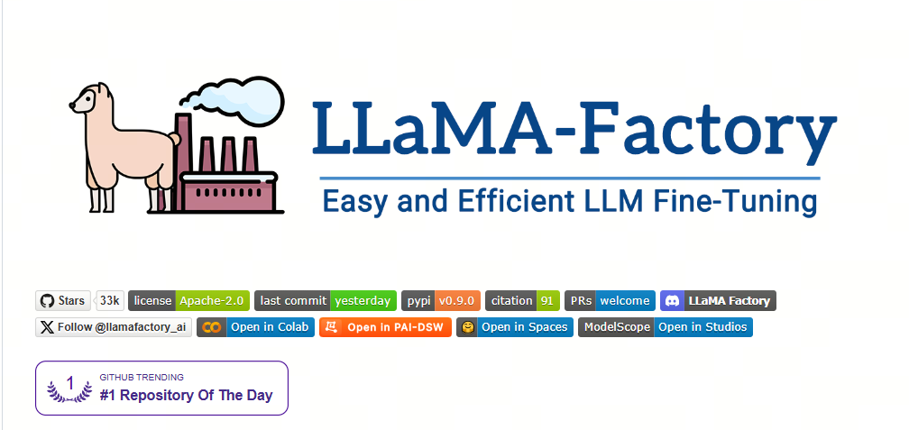
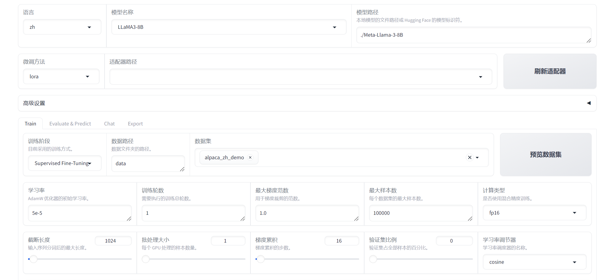

很多人第一次接触大模型微调，是从LLama-Factory 的 LoRA开始的，类似于之前数据科学家从Kaggle的泰坦尼克号生存预测开始一样，LLama-Factory的LoRA是一个很好的开始。

## 1. Web-UI

LLaMA Factory 提供了一个用户友好的可视化界面（WebUI），使得用户可以无需编写代码即可进行大型语言模型的微调。

**界面概览**：
   - LLaMA Factory 的 WebUI 主要分为四个界面：训练、评估与预测、对话、导出。

**训练界面**：
   - 用户可以在训练界面中指定模型名称及路径、训练阶段、微调方法、训练数据集、学习率、训练轮数等训练参数，并启动训练。
   - 支持断点重连，适配器断点保存于 `output_dir` 目录下。

**评估预测与对话界面**：
   - 在模型训练完毕后，用户可以在评估与预测界面通过指定模型及适配器的路径在指定数据集上进行评估。
   - 用户也可以通过对话界面与模型进行对话，观察模型效果。

**导出界面**：
   - 如果用户对模型效果满意并需要导出模型，可以在导出界面通过指定模型、适配器、分块大小、导出量化等级及校准数据集、导出设备、导出目录等参数后点击导出按钮导出模型。

**使用步骤**：
   - 用户可以通过浏览器访问 `http://localhost:7860` 进入 Web 界面，进行模型选择、参数配置，并监控训练任务的进度。
   - 支持切换语言为中文，方便国内用户使用。

**支持的模型和数据集**：
   - LLaMA Factory 支持多种预训练模型，如LLaMA、BLOOM、Mistral等，并且可以自动下载并缓存魔搭社区（ModelScope）的模型和数据集资源。

**微调方法**：
   - 提供多种微调方法选择，包括全参数微调、冻结微调、LoRA微调等。

**参数配置**：
   - WebUI 允许用户通过简单的拖放和参数调整来优化模型，使得即使是不熟悉编程的用户也能轻松参与模型优化的过程。

## 2.  LoRA 之外

LLaMA-Factory 提供了一系列高阶功能，以支持复杂的大模型微调和部署需求：

**多模型兼容**：LLaMA-Factory 支持多种大型语言模型，如 LLaMA、BLOOM、Mistral、Baichuan、Qwen、ChatGLM 等；

**训练算法集成**：框架集成了多种训练算法，包括增量预训练、指令监督微调、奖励模型训练、PPO训练、DPO训练、KTO训练、ORPO训练等；

**运算精度与优化算法**：提供多种运算精度选择，如32比特全参数微调、16比特冻结微调、16比特LoRA微调，以及基于AQLM/AWQ/GPTQ/LLM.int8的2/4/8比特QLoRA微调。同时支持GaLore、DoRA、LongLoRA、LLaMA Pro、LoRA+、LoftQ和Agent微调等先进算法；

**推理引擎支持**：支持 Transformers 和 vLLM 推理引擎，为用户提供灵活的推理选项；

**实验面板集成**：与 LlamaBoard、TensorBoard、Wandb、MLflow 等多种实验面板工具集成，方便监控和分析训练过程；

**API Server功能**：LLaMA-Factory 支持启动 API Server，允许用户通过 API 接口调用模型，方便模型的集成和应用；

**大模型评测 benchmark**：提供大模型主流评测 benchmark 工具，帮助用户评估模型性能；

**Docker 安装与华为 NPU 适配**：支持 Docker 安装和在华为 NPU 上的适配使用，增加了框架的可移植性和硬件兼容性；

**量化技术**：支持 PTQ、QAT、AQLM、OFTQ 等量化技术，优化模型部署效率和性能；

这些高阶功能使得 LLaMA-Factory 不仅能够支持基础的模型微调，还能够满足更复杂的研究和应用需求，为用户提供了一个强大而灵活的工具集。

## 参考

[1] [LLaMA-Factory](https://github.com/hiyouga/LLaMA-Factory)

## 欢迎关注我的GitHub和微信公众号[真-忒修斯之船]，来不及解释了，快上船！

[GitHub: LLMForEverybody](https://github.com/luhengshiwo/LLMForEverybody)

仓库上有原始的Markdown文件，完全开源，欢迎大家Star和Fork！