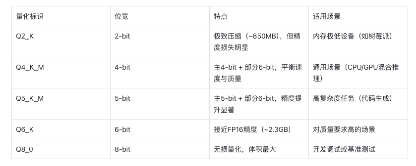
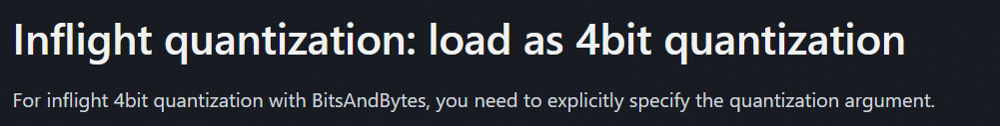
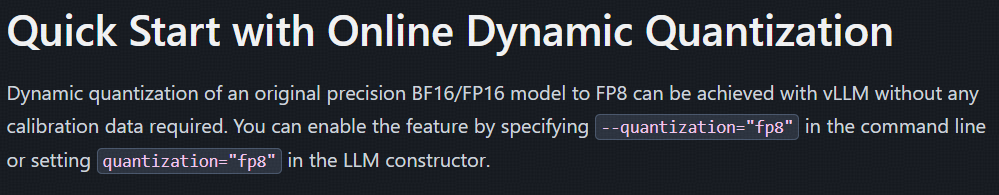

在大模型技术落地的实践中，量化作为重要的工程化手段，不同角色的技术人员需要建立差异化的认知体系。我认为"量化三重境界"可以帮助从业者构建符合自身职业定位的技术认知框架。

第一境：应用开发者的技术通识（知其然）
面向调用API进行应用开发的技术人员，量化认知应聚焦技术本质与业务价值。需要掌握量化技术降低推理成本的核心原理（如INT8量化带来的显存优化），理解量化对推理速度、模型精度的影响规律，以及不同量化方案（动态/静态量化）的适用场景。这个阶段的重点是建立量化技术与业务指标（响应延迟、服务成本）的关联认知，能够合理评估量化方案在具体业务场景中的ROI。

第二境：部署工程师的工程实践（行其道）
进阶到模型部署与运维领域，需要深入掌握量化工具链的实战能力。重点包括：熟练运用主流框架的量化接口，理解模型转换过程中的校准机制（Calibration），掌握量化模型的服务部署技巧（显存分配优化、混合精度推理）。典型案例如基于llama.cpp实现微调模型的4bit量化部署，或使用AutoGPTQ完成业务模型的在线量化推理。此阶段强调对量化全流程的工程控制能力，需建立从原始模型到量化产出的完整工程认知。

第三境：算法研究者的理论突破（究其理）
面向基础模型研发和算法创新的研究者，需要深入量化算法的数学本质。这包括：掌握基于Hessian矩阵的量化敏感度分析（GPTQ算法核心），理解基于最优传输理论的量化参数优化，以及探索量化与模型架构的协同设计（如MoE架构的量化特性）。该阶段的认知突破往往带来技术范式的革新，例如研究者通过改进量化聚类算法实现同等精度下提升3倍压缩率，或开发出适应万亿参数模型的分布式量化方案。

## 1. 第一境：应用开发者的技术通识（知其然）

对于大多数应用开发者来说，事实上只需要掌握量化技术降低推理成本的核心原理即可。这些核心原理包含了：
什么是量化、量化的目标、量化的方式、量化的粒度、量化的对象等等。

### 什么是量化？
量化是大模型领域中的一项关键技术，它通过降低模型参数的精度，将浮点数转换为整数或定点数，从而实现模型的压缩和优化。这样做的主要目的是减少模型的存储需求、加快推理速度，并降低模型的计算复杂度，使得大模型能够更高效地在资源受限的设备上运行，例如移动设备、嵌入式系统等场景；

### 量化的目标？
在不明显损失效果的前提下，降低显存占用，提高推理速度；

### 量化的方式？
训练后量化（Post Training Quantization, PTQ）是一种在模型训练完成后应用的技术，目的是减少模型的大小和提高推理速度，同时尽量保持模型的性能。PTQ特别适合部署到资源受限的设备上，如移动设备和嵌入式设备。在PTQ中，量化操作可以应用于模型的输入、权重和激活值上；

量化感知训练（Quantization Aware Training, QAT）是一种在训练深度学习模型时引入量化操作的技术，目的是在减少模型大小和提高运行效率的同时，尽量减少量化带来的精度损失 。 与传统的训练后量化（不同，QAT在训练过程中模拟量化的效果，使模型能够适应量化带来的信息损失，从而在实际应用量化时保持更高的性能。
我们现在的量化基本都是PTQ


### 量化的粒度？
量化粒度（Quantization Granularity）是量化技术中的一个重要概念，它决定了量化操作的精细程度。量化粒度影响着量化参数的共享方式，即量化的规模和范围。不同的量化粒度可以带来不同的精度和效率的权衡。
量化粒度有以下几种形式：（这边有个github的图）
- Per-tensor：整个张量或整个层级共享相同的量化参数（scale和zero-point）。这种方式的优点是存储和计算效率较高，但可能会导致精度损失，因为一个固定的量化参数难以覆盖所有数据的动态范围;
- Per-channel：每个通道或每个轴都有自己的量化参数。这种方式可以更准确地量化数据，因为每个通道可以有自己的动态范围，但会增加存储需求和计算复杂度;
- Per-group：在量化过程中，将数据分成块或组，每块或每组有自己的量化参数。


### 量化的对象？
- Weights 仅权重量化：比如AWQ & GPTQ
- Activations 权重激活同时量化：比如SmoothQuant
- KV Cache

### 量化的类型？
对称线性量化，对称量化的特点是量化后的值中零点必须对应于原始值中的零，即量化操作的零点固定不变。这种方式通常使用两个参数（量化的最小值和最大值）来定义量化的范围，而这个范围是以零为中心对称的。


非对称线性量化，非对称量化不强制要求量化后的零点对应于原始数据中的零点。这种量化方法使用三个参数来定义从原始数值到量化数值的映射关系：量化最小值、量化最大值和零点。这意味着量化操作可以有一个任意的零点，这个零点被映射到量化范围内的某个整数值上，非对称量化特别适合于原始数据分布不关于零对称的情况，例如当数据集中包含大量正值或负值时。它允许更灵活的量化范围定义，以适应数据的实际分布，从而减少量化误差，提高量化后的模型精度


### 静态/动态量化
- 静态量化：通过校准数据离线获取量化参数
- 动态量化：在线推理时动态计算量化参数


## 2. 第二境：部署工程师的工程实践（行其道）

在实际使用中，我们可能会进行静态量化或者动态量化
对于静态量化：我们会读取一个已量化的模型，或者对一个原始的模型进行某种量化；
对于动态量化：我们在推理的时候加载一个原始模型，并在推理的时候实时进行量化。
第二重境界是指我们能够使用某些开源框架进行上述操作，完成某个特定任务。
所有这些都涉及到对模型文件的操作，所以首先我们要知道，主流的模型格式和量化后的格式有哪些！

### 2.1 模型格式

tensorflow和pytorch曾经是两个最流行的深度学习框架，而现在pytorch基本已经一统江湖了，下面梳理一下pytroch生态下的模型格式。

如果你查看huggingface上的模型文件，基本会看到以下的类型：.pt、.bin、.safetensor、.GGUF的格式，这基本上涵盖主流的模型了。

***PyTorch 格式（.pth/.pt）​***​
特点：PyTorch 默认格式，支持保存完整模型结构或仅权重参数（state_dict），灵活性强。
优势：与 PyTorch 生态无缝集成，适合研究、微调和调试。
局限：依赖 Python 的 pickle 序列化，存在安全风险，加载速度较慢

***通用二进制格式（.bin）***​​
特点：无框架绑定的纯二进制存储，需手动管理元数据。
适用场景：轻量级部署或自定义模型存储

***Safetensors：安全与效率的平衡者***
特点：由Hugging Face团队开发，采用二进制格式，支持内存映射（mmap），避免传统序列化格式（如PyTorch的.pt）因使用Pickle而存在的代码执行安全风险。
优势：加载速度极快，尤其适合大规模模型；文件结构简洁，支持跨框架（如PyTorch、TensorFlow）兼容；安全性高，无恶意代码注入风险。
应用场景：开源社区共享、需要快速加载的推理服务。
代表模型：Hugging Face生态的多数模型均支持该格式

***GGUF：高性能本地化首选***
特点：由llama.cpp创始人Georgi Gerganov设计，是GGML格式的升级版，专为本地推理优化。采用二进制编码，支持内存映射和单文件部署，显著降低资源占用。
优势：加载速度快、内存占用低；支持量化技术（如4位、5位量化），压缩模型体积；兼容多种硬件（CPU/GPU）。
应用场景：边缘设备部署、需要低延迟的本地应用（如Llama系列模型的本地推理）。

Hugging Face模型格式的演进体现了安全性、效率和兼容性的平衡:

早期: .pt/.pth是主流,但存在安全隐患;
中期: .bin提升效率, .safetensors 解决安全问题;
近期: gguf针对大模型本地化需求,通过量化和单文件部署成为趋势

### 2.2 GGUF的解读
GGUF（GPT-Generated Unified Format）是一种专为大语言模型设计的二进制文件格式，由llama.cpp创始人Georgi Gerganov提出，旨在优化模型的加载效率、资源消耗及跨平台兼容性。

在使用Ollama进行本地化部署的时候，经常会看到l类似**Q4_K_M的模型文件，这种命名方式是什么意思呢？

GGUF文件名中的量化标识（如Q4_K_M）遵循标准化的命名规则，通过字母和数字组合直观反映量化参数、优化方法及质量等级。以下是对其命名方式的详细解析：

命名结构解析示例：Q4_K_M  

该标识可拆分为三个核心部分：
1. 主位宽（Main Bit Width）Q4表示主量化位宽为4-bit，即模型权重大部分以4位存储。常见的位宽包括：

• Q2（2-bit）、Q3（3-bit）、Q4（4-bit）
• Q5（5-bit）、Q6（6-bit）、Q8（8-bit）

2. 优化方法标识（K-Quant）_K表示采用分块量化（Block-wise Quantization）和K-Quant算法，通过动态调整不同张量的量化策略，平衡精度与体积。例如：

• Q4_K_M对部分张量（如attention.wv）使用更高精度（6-bit），其余使用4-bit。

3. 质量等级（Quality Level）_M表示中等质量等级，其他选项包括：

- _S（Small）：更小体积，但精度损失较大
- _M（Medium）：平衡体积与精度
- _L（Large）：接近原始模型精度，体积较大



### 2.3  静态量化

在静态量化中，我们会读取/部署一个已量化的模型，或者对一个原始的模型进行某种量化

**部署已量化的模型**

部署一个已量化模型很简单，如果你想做些模型方面的实验，可以用huggingface的transformer框架进行读取；如果是本地（个人PC，Mac）部署，可以用Ollama；如果是私有化部署，可以用vLLM或者SGLang.

**自行量化一个模型**
一般来说，社区的模型都会提供量化版本，除非你就是先行者（Respect！！！），否则一般不需要自行量化开源大模型。
但如果你自己微调了一个大模型，或者你自己训练了一个大模型，想要量化，可以通过一些框架来操作，比如
AWQ、GPTQ、llama.cpp等等，具体的代码参考对应框架的文档即可。 

### 2.4 动态量化

我们也可以在线推理时动态计算量化参数，而不用提前进行量化再加载。（说实话我暂时并不了解这种功能对应的场景是什么）.
比如如果使用vLLM进行部署的时候：

```python
from vllm import LLM
import torch
model_id = "huggyllama/llama-7b"
llm = LLM(model=model_id, dtype=torch.bfloat16, trust_remote_code=True, \
quantization="bitsandbytes")
```

> 注：vLLM文档在两个地方提到了动态量化，一个是quantization/bnb的章节，这边他们称之为Inflight quantization；而在quantization/fp8的章节，又称之为Dynamic Quantization. 从示例代码上看，两者应该是一个意思，我认为这两个文档应该出自不同人之手。又或者bnb和FP8量化的paper就是这么命名的？





## 3. 第三境：算法研究者的理论突破（究其理）

量化算法在做什么？

如果你已经掌握了第一境，你就会知道量化算法的本质建立一个浮点数到整数的线性映射。线性映射的建立看上去是一个挺简单的工作，为什么还会卷出那么多Paper/算法/框架呢？

下面是两种典型的量化算法的解读：

**GPTQ的直觉式理解**

由于使用到Hessian矩阵近似，GPTQ算法脱胎于OBS算法，GPTQ的学习曲线十分陡峭，对于算法研究者来说没有捷径，只能一点一点吃透；而对于应用开发者来说，如果只是想了解大概，只需要建立直觉式理解即可。

一、选样本试运行
用100-200条文本让原模型"表演"推理过程（校准数据），记录每层神经网络的输出结果。

二、逐层精细裁剪
从第一层神经网络开始，像整理衣柜一样处理：
分组打包：把每层的权重矩阵拆成128个为一组的小包裹
称重计价：给每组包裹贴不同的"运费标签"（量化参数），重要组用精细包装（4-bit），普通组用简装（2-bit）

三、连锁误差补偿
量化就像切蛋糕总会掉渣，GPTQ用巧妙方法弥补：
当切掉某块蛋糕（量化某个权重）时，立即调整旁边蛋糕的大小（更新未量化权重）
使用数学公式（Hessian矩阵近似）计算最佳补偿方案，让整个蛋糕看起来依然完整

**AWQ的直觉式理解**

相较于GPTQ的paper用到了Hessian矩阵，AWQ理解起来相当的直观：

AWQ的直觉本质是「抓大放小」：

通过激活值识别关键权重，放大保护以降低相对误差；

通过数学等效缩放避免硬件适配难题；

最终实现模型轻量化与精度保留的平衡。

这种思路不仅适用于大模型，也可类比于数据压缩、图像处理等领域中「保留关键信息，压缩冗余细节」的通用原则


# 总结

技术认知的深度应与角色定位相匹配。应用开发者无需深究OBS算法的矩阵运算，就像算法研究者不必纠结Docker环境的量化服务部署。

建议从业者以"二八定律"构建认知体系：用20%的核心知识解决80%的工作需求，在能力边界与业务价值的交汇点持续深耕。当技术认知与岗位需求形成共振，才能实现真正的价值创造。

## 参考

[1][大模型经典PTQ量化方法总结](https://zhuanlan.zhihu.com/p/704280420)

[2][Hugging Face 模型格式大揭秘：从 PyTorch 到 GGUF，一文搞懂！](https://mp.weixin.qq.com/s?__biz=MzI2Mzc3OTcyNw==&mid=2247486230&idx=1&sn=8b00b599d49fe22beab60eb1fe337f08&chksm=eb6e8a10980e7680044b3ba09c43518e7ee8beef38673eaf9cea0c48977a9541315c4f1b8636#rd)

[3][Qwen doc](https://qwen.readthedocs.io/zh-cn/latest/quantization/llama.cpp.html)

[4][vllm: BitsAndBytes](https://docs.vllm.ai/en/latest/features/quantization/bnb.html)