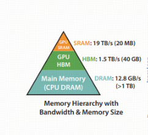

上周末，受邀为同村创业公司的技术团队开展大模型与智能体（Agent）专项培训时，深切感受到技术迭代的浪潮已席卷基层——从会议室到茶水间，关于大模型私有化部署与智能体落地的讨论不绝于耳。

当创始人问及DeepSeek-R1全量模型私有化部署所需显卡资源时，我发现大家其实对算力和显卡的认知还不算全面。不同于传统算力的单一维度评估，大模型时代的GPU资源配置需构建三维评估体系。

## 一、显存：模型载体的物理边界

> DeepSeek-R1满血版有671B的参数，大概一共有1400GB的数据量，至少需要1.4T的硬盘容量才能下载下来，下载后，至少需要 1.8TB的显存才能跑起来。

如果上面的描述你能够轻松的读懂，可选择跳过本节内容；但如果你对里面的一些英文存在理解障碍，建议完整阅读本节以获取系统性解析。

### 1.1 国际单位制和词头

国际单位制（SI，Système International d'Unités）是全球通用的标准化测量体系，其核心是通过统一的单位定义实现科学、工业及贸易领域的量值一致性，比如说米（m）千克（kg）秒（s）等等.

国际单位制（SI）词头是用于表示单位倍数或分数的标准化前缀，其作用是将基本单位按十进制缩放，从而简化极大或极小数值的表达，比如千克Kg里面的K，纳米（nm）里面的n.

| 乘数因子 | 中文名称	| 符号|英文名|
| :--- |:----:| :----: |---: |
| $10^3$|千|k| kilo  |
| $10^3$|兆| M|Mega|
| $10^3$|吉|G |Giga|
| $10^3$|太|T|Tera
| $10^3$|拍|P|Peta|

在英文中，计数法是千位计数法.

    1千通常会缩写为1k，正规的读法是one thousand;

    1百万会缩写为1M，读作one million;

    10亿会缩写为1B，读作one billion;

    千亿缩写为可以缩写为1T，读作one trillion.

可以看到除了10亿的缩写B和国际单位制的词头G不同之外，其它的常用基本相同.

我们看到一个大模型的参数量是671B，之所以用B而不是G，是因为用G，和存储容量的GB易混淆.

671B代表它有6710亿个参数。那这么大的参数需要多少显存呢？

### 1.2 精度

你会看到有多种精度格式，如BF16，F32，F8_E4M3等等，它们都是什么意思？

***Byte and bit***

程序员朋友都知道，计算机的最小单位是位，也就是bit，上面存储的不是0就是1，每8位作为一个字节Byte.

BF16，F32，F8_E4M3后面的16，32，8,代表了这些个参数每一个占用了多少位. 比如BF16就占用了16位，即2个字节如果671B的所有参数都是BF16的，那它一共需要1342B的Byte.

当然，不会写成1342BB，而是用1342GB.

那E4M3又是什么？

***浮点数的计算机表示***

在计算机里面，浮点数Float的表示方式稍微有点特别，它是由指数位和小数位构成的.

其中指数位的英文是Exponent，小数位的英文（或者拉丁文？？）是Mantissa.

对于F8_E4M3来说，它一共有8位，第一位默认是符号位sign，有4个指数位和3个小数位.

对于一个八位的值 0 101 1011来说，它表示的是:

Sign位为0，代表为 $(-1)^0$ 为正数

Exponent位为101，代表指数为
$1*2^2+0*2^1+1*2^0 = 5$ ，减去偏移量3，最后代表$2^2$ ,即2的2次方.

Mantissa位为1011，代表小数为 $1*2^-1+0*2^-2+1*2^-3+1*2^-4=0.5+0.125+0.0625 = 0.6875$ ，最后加上1，为1.6875，最后这个值为 $1.6875*2^5$ ,计算逻辑为：

$(1+1*2^-1+0*2^-2+1*2^-3+1*2^-4)*(2^(1*2^2+0*2^1+1*2^0-3))$

## 二、计算能力：推理时间的计算原理

***计算能力与推理时间的映射关系***

模型推理时间的本质是计算需求与硬件算力的动态平衡过程。具体而言，可通过以下公式建立理论关联：

 推理时间 ≈ 模型总计算量（FLOPs） / 硬件理论算力（FLOPS） 

> 需要注意的是，该公式仅反映理论最优值，实际推理时间还受内存带宽、并行度效率、算子优化水平等多重因素影响，硬件利用率通常仅为30%-70%

### 2.1 核心概念精解

FLOPs（Floating Point Operations）
表示模型完成一次推理所需的浮点运算总量，是衡量模型计算复杂度的核心指标.

FLOPS（Floating Point Operations Per Second）
硬件每秒可执行的浮点运算次数，体现理论峰值性能。以NVIDIA A100 GPU为例，其FP32算力为19.5 TFLOPS，即每秒19.5万亿次浮点运算.

TOPS（Tera Operations Per Second）
量化场景下的算力单位，1 TOPS=10¹²次整数运算/秒. INT8量化后，硬件算力可提升4倍（如A100的INT8算力达624 TOPS）.

MAC（Multiply-Accumulate）运算
融合乘法与累加的硬件级优化操作，1次MAC=1次乘法+1次加法=2 FLOPs。在矩阵乘法中，90%以上的计算由MAC构成.

### 2.2 大模型核心计算模块的量化分析

大语言模型的计算负载主要集中在两类矩阵运算：

***注意力层（Attention）***

计算复杂度：O(n²d)（n为序列长度，d为隐藏层维度）
核心操作：QKᵀ矩阵相乘与Softmax归一化 

***前馈神经网络（FFN）***

计算复杂度：O(nd²)
核心操作：两次全连接层的矩阵变换（维度扩展与收缩） 

### 2.3 矩阵乘法计算量的精确推导

对于M×N矩阵与N×K矩阵相乘：

MAC计算量 = M×N×K
等效FLOPs = 2×M×N×K 推导依据： 每个输出元素需要N次乘加运算（MAC），共生成M×K个元素。例如：
3×3矩阵相乘需27次乘法+18次加法=45 FLOPs，与公式(2×3×3×3)=54存在差异，原因在于边界处理方式不同. 
 
推理阶段计算量拆解:

| 阶段 | 计算特征	| 计算量公式|优化策略|
| :--- |:----:| :----: |---: |
|Prefilling|处理全部输入token的并行计算|FLOPs = 2×s²×d（s:序列长度）|动态分块与内存复用| 
|Decoding|生成单个token的串行计算|FLOPs/token = 2×s×d²|KV Cache与连续批处理|

## 三、通信：性能瓶颈

在GPU计算过程中，数据需从全局内存（Global Memory，即HBM高带宽显存，如40GB容量）加载至共享内存（Shared Memory/L2缓存，如20MB SRAM），再通过Tensor Core等计算单元处理.

当前GPU架构中，数据传输带宽与计算能力的失衡已成为核心矛盾——例如HBM的1.5TB/s带宽难以匹配Tensor Core的峰值算力（如A100的312 TFLOPS FP16），导致计算单元常因数据未就绪而处于空闲状态，实际FLOPS利用率显著降低.

***多卡通信的扩展挑战：***

单机多卡场景：

采用NVIDIA NVLink 4.0技术，单通道带宽达900GB/s，通过NVSwitch交换机构建全互连拓扑，实现8卡间无阻塞通信，总带宽可达7.2TB/s .

多机多卡场景：

依赖InfiniBand NDR网络（如Quantum-2平台），单端口带宽达400Gb/s（约50GB/s），通过Dragonfly+拓扑支持百万级节点互联，但跨节点通信延迟仍比单机高1-2个数量级.

部署策略建议：

"能单卡不扩卡"原则：单卡可避免通信开销，但需权衡模型参数量（如671B模型需16卡存储）与显存优化技术（梯度累积、激活值重计算等）;

节点内优先原则：单节点多卡通过NVLink通信效率显著高于跨节点InfiniBand，例如16卡双节点部署时，节点内8卡间带宽可达7.2TB/s，而跨节点带宽仅400Gb/s.

下面留两个小问题给大家，欢迎在留言区告诉我你的答案！

问题一：部署模型，价格相同的情况下是选一张卡还是两张卡？

问题二，如果要用16卡双节点部署一个671B（deep-seek-r1）模型，最佳实践的TP和PP分别是多少？

## 参考

[GitHub: LLMForEverybody](https://github.com/luhengshiwo/LLMForEverybody)