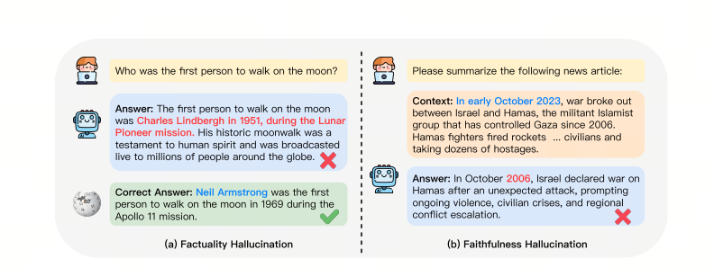
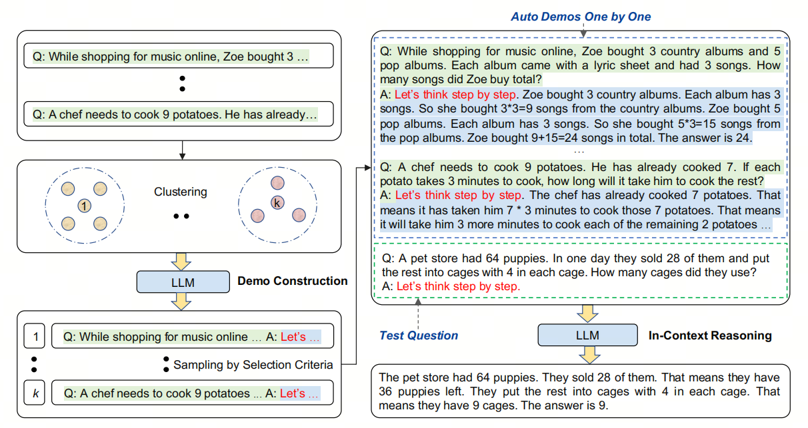
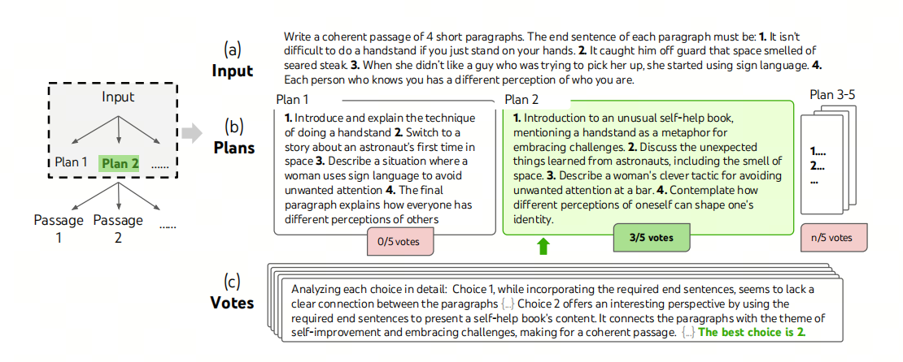
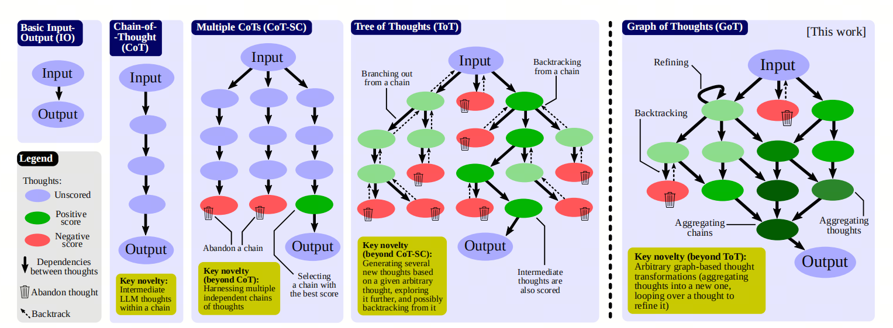

COT思维链，TOT思维树，GOT思维图，这些都是什么？

## 1. 导入

***hallucinations***

## 1. 什么是幻觉？
大模型出现幻觉，简而言之就是“胡说八道”。
用《A Survey on Hallucination in Large Language Models》文中的话来讲，是指模型生成的内容与现实世界事实或用户输入不一致的现象。
研究人员将大模型的幻觉分为事实性幻觉（Factuality Hallucination）和忠实性幻觉（Faithfulness Hallucination）。

## 2. 处理幻觉
在生产中，我们不喜欢hallucinations，我们需要准确的、正确的回答。

在实际生产落地中，我们会循序渐进的采用如下策略来提高准确性，降低幻觉：

| 策略 | 难度| 数据要求|准确性提升|
| :--- |:----:| :----: |---: |
| Prompt engineering|低|无| 26% |
| Self-reflection |低| 无|26-40% |
| Few-shot learning (with RAG)|中|少量|50% |
| Instruction Fine-tuning |高|中等|40-60%|

我们看下Prompt engineering中有哪些方法可以提高准确性。

## 3. COT: Chain of Thought

COT通过提供一系列推理步骤来帮助模型更好地解决问题。CoT的核心思想是引导模型逐步展示其思考过程，从而提高模型在复杂任务上的表现，如数学推理、逻辑推理等。CoT可以是Few-shot CoT，其中包含几个逐步推理的示例，也可以是Zero-shot CoT，只包含引导模型进行逐步推理的文本指令。

### Auto COT

***let’s think not just step by step, but also one by one***

可以通过利用带有“let’s think step by step”提示的 LLM 来逐一生成演示的推理链，即:let’s think not just step by step, but also one by one，从而消除Few-shot CoT的手动工作。

Auto-CoT 主要由两个阶段组成：

- 阶段1：问题聚类：将给定问题划分为几个聚类;
- 阶段2：演示抽样：从每组数组中选择一个具有代表性的问题，并使用带有简单启发式的 Zero-Shot-CoT 生成其推理链.

### Self-Consistency: 自我一致性 
人类的一个显著特点是人们的思维方式不同。在需要深思熟虑的任务中，可能有几种方法可以解决问题。自我一致性可以通过从语言模型的解码器中采样，在语言模型中模拟这样的过程。

例如，如上图所示，一个模型可以对一个数学问题生成几个合理的答案，这些答案都得出相同的正确答案（输出 1 和 3）。由于语言模型不是完美的推理器，该模型也可能产生错误的推理路径或在推理步骤之一中犯错（例如，在输出 2 中），但这样的解决方案不太可能得出相同的答案。也就是说，我们假设正确的推理过程，即使它们是多种多样的，其最终答案往往比不正确的过程具有更大的一致性。

> 自我一致指的是大模型的输出自我一致，即多次采样得到的输出结果一致。

## 4. TOT: Tree of Thoughts

ToT 维护着一棵思维树，思维由连贯的语言序列表示，这个序列就是解决问题的中间步骤。使用这种方法，LM 能够自己对严谨推理过程的中间思维进行评估。LM 将生成及评估思维的能力与搜索算法（如广度优先搜索和深度优先搜索）相结合，在系统性探索思维的时候可以向前验证和回溯。

上图展示了一个简单的例子。

给定输入，LM 会抽样 5 个不同的方案，然后投票 5 次来决定哪个方案最好。然后使用多数选择，通过相同的抽样投票程序编写输出段落。

## 5. GOT: Graph of Thoughts

GoT 的核心思想和主要优势在于能够将 LLM 生成的信息建模为任意图，其中信息单元（“LLM Thoughts”）是顶点，而边对应于这些顶点之间的依赖关系。这种方法可以将任意的 LLM Thoughts组合成协同结果，提炼整个思想网络的精髓，或使用反馈循环增强思想。

## 6. 总结
我认为COT能够以比较低的代价解决一些幻觉问题。但是TOT和GOT太fancy了，个人认为不太适合实际应用。与其这么复杂的prompt engineering，还不如换一个好的模型。

## 参考

[1] [Chain-of-Thought Prompting Elicits Reasoning in Large Language Models](https://arxiv.org/abs/2201.11903)

[2] [Automatic Chain of Thought Prompting in Large Language Models](https://arxiv.org/abs/2210.03493)

[3] [Self-Consistency Improves Chain of Thought Reasoning in Language Models](https://arxiv.org/abs/2203.11171)

[4] [Tree of Thoughts: Deliberate Problem Solving with Large Language Models](https://arxiv.org/abs/2305.10601)

[5] [Graph of Thoughts: Solving Elaborate Problems with Large Language Models](https://arxiv.org/abs/2308.09687v2)

[6] [提示工程指南](https://www.promptingguide.ai/zh)

[7] [A Survey on Hallucination in Large Language Models: Principles, Taxonomy, Challenges, and Open Questions](https://arxiv.org/abs/2311.05232)

## 欢迎关注我的GitHub和微信公众号：

[GitHub: LLMForEverybody](https://github.com/luhengshiwo/LLMForEverybody)