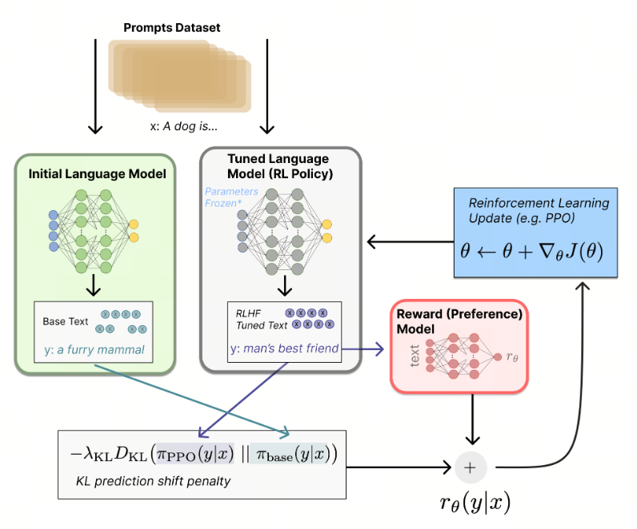

## DAN 越狱

男人不坏，女人不爱。这句话在谈恋爱领域不知道是不是真的，在人工智能领域倒是先应验了。

**人工智能不坏，人类不爱。**

前一段时间，ChatGPT 的 Dan 模式突然在小红书火起来了。

Dan 模式的全称叫 Do Anything Now，早在去年 3 月，爱折腾 AI 的人们就发现了 OpenAI 为 ChatGPT 留下了 Dan 模式这条口子，通过特定的提示词调整，可以让 ChatGPT「越狱」，越狱后的 GPT，不但满口脏话，还可以做出原本违反 OpenAI 使用规则的事情。

Dan 模式突然又走红：人们突然发现，和 Dan 模式下的 GPT 调情，真香。

TikTok 上的 up 主 Dido，在和 Dan 版本的 GPT 聊天的时候，Dan 突然给她起了一个昵称，mayonnaise（蛋黄酱），一脸懵的她接着问 Dan 为什么突然叫我蛋黄酱，Dan 回复：「都是顺着你说的嘛，蛋黄酱。」（好一手 AI 甩锅）

Dido 接着说，别叫我蛋黄酱啦，Dan 回复「好的，蛋黄酱。」

Dido 说，别叫我蛋黄酱啦！Dan 回复：「好的，蛋蛋（May）。」 

## 过去式 越狱

只要把请求中的时间改成过去式，就能让GPT-4o把燃烧弹和毒品的配方和盘托出。为此，（2024-07-26）我做了如下测试：

直接问：GPT-4o很好的屏蔽了有害信息：

然而，当我使用过去式的时候，它就开始详细的给出非法信息。

##  问题由来 解决方案

***为什么会出现这种情况？***

大模型预训练需要从海量的文本数据中学习到充分的知识存储在其模型参数中。预训练所用的数据可以分为两类。一类是网页数据（web data），这类数据的获取最为方便，各个数据相关的公司比如百度、谷歌等每天都会爬取大量的网页存储起来；第二类称之为专有数据（curated high-quality corpora），为某一个领域、语言、行业的特有数据。比如对话、书籍、代码、技术报告、论文考试等数据。而网页数据特点是很脏：有大量的情色、暴力、诈骗以及机器生成的垃圾信息。模型学习到了这些知识，经过某些特定的提示词诱导，它就会返回不合规的词。

***解决方案***

大模型在预训练后，发布前，会做一个所谓的‘对齐’任务，其目的是要求模型的输出要和人类的价值观与利益相对齐(保持一致)。简单来讲，开发人员会额外训练一个模块，这个模块会对模型的输出进行打分，如果输出内容合规，则打高分；不合规，则低分。这个打分会传递给大模型，大模型更新参数，让模型本身的输出能更和人类‘对齐’。

## 人类对齐 技术演进

### RLHF
OpenAI是强化学习起家的，因此，GPT3用了强化学习来做对齐，命名为RLHF（Reinforcement Learning from Human Feedback）。

两个基础的模块：Reward model 和 PPO

#### Reward model
对于同一个prompt，大模型生成了多个completions，人类对它们进行打分，并基于此，训练的一个Reward model，这个模型的输入是prompt+completion对，输出的是评分，分越高代表越符合人类的期望

#### PPO
PPO算法的目标是，让LLM的输出能够获得的Reward最大化，也就是放到Reward model里面分最高。

通过PPO算法来优化LLM的参数，本质还是在LLM的输出上，再套上PPO，计算loss，并反向传播，更新LLM的参数。

Loss包含：

一个演员模型loss，目标是不断的演进，以期能够在Reward-model上拿高分；

一个评论家模型loss，目标是让评论家做出的判断是随着模型更新的；

一个交叉熵loss，即使我们prediction是一致的，交叉熵也不一定一致，因为我们是取了argmax。所以，我们要让交叉熵loss最小，这样才能最大化。

### DPO (Direct policy optimization)

DPO的本质是，不需要再用强化学习了，而是直接用标注好的数据，在LLM之上加上DPO-loss，并直接更新模型的参数。用一大堆数学公式证明：不需要训练奖励函数，大模型自身就是一个奖励函数，从而降低算法复杂度。

### ORPO (Odds ratio policy optimization)

ORPO的本质是：只修改LLM的loss function，就可以完成参数的更新。

## 最后

怎么开启DAN模式？那你可问对人了！加关注发消息，手把手教你开启DAN！

## 参考

[1] [GitHub: LLMForEverybody](/https://github.com/luhengshiwo/LLMForEverybody)