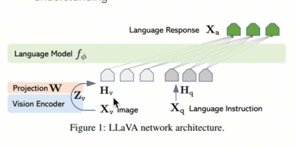
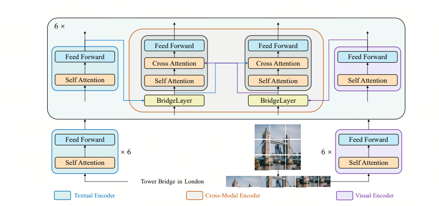

只会对文档进行RAG？10分钟了解如何进行多模态RAG

- 阅读提示：阅读本文需要对RAG技术有基本的了解，如果你不清楚RAG，欢迎参考我之前的文章：

很多RAG是建立在文本的基础上的，但是现实的情况下，我们有很多图片甚至视频数据，我们有时候也会想搭建图片/视频的多模态RAG，让我们可以基于图片/视频进行问答。

## 1.架构

视频可以看作很多帧图片的集合，所以我们可以从图片开始。

注意到上图，紫色的是构建Vector DB的过程，天蓝色的是inference的过程。整个多模态的架构如下
1. 处理多模态数据：得到image-text pair；
2. 将image-text pair数据转化为embedding，存入Vector DB；
3. 将一个query转化为embedding，并在Vector DB中Retrieval；
4. 将返回的image-text pair，和query结合起来，用LVLM模型得到回答。

可以看到这个架构和传统的RAG架构几乎一致，只是每一步的输入输出不一样

## 2. 数据处理
我们需要将数据处理为 图片-文字 对，以方便输入到后续的Embedding model里。

对于视频，我们可能遇见3种情况：

- case1：视频有字幕
- case2：视频无字幕
- case3： 视频无字幕，且无法生成字幕，例如默片或者只有背景音乐的视频

对于图片，我们可能遇见两种情况：

- 图片带解释性文字
- 图片无解释性文字

视频处理的方法：
1. case1：我们使用某些工具，比如CV2，将视频按时间切片，选取合适的图片，并将字幕配到合适的图片上
2. case2：我们先用语音转文字的工具，如whisper，生成字幕，再用case1的方案
3. case3：使用case1的方式生成图片，再使用Large Vision-Language Model（LVLM）来生成字幕

图片处理的方法：

1. case1：无需操作
2. case2：使用 Large Vision-Language Model（LVLM）来生成描述

## 3. Embedding

我们可以将上述的图片-文字对，输入到一个特殊的embedding模型，如Bridge tower 模型，这样可以得到这个pair的embedding，便于后续retrieval. 更多Bridge tower 模型的信息，参见这篇论文： [bridge tower](https://arxiv.org/abs/2206.08657)

## 4. 4. Retrieval，Prompt process & Response

将用户的query进行retrieval后，我们会得到image-text pair， 我们将query，text，image处理好，输入上文提到的LVLM中，得到response。

LLaVA是常用的LVLM，参见https://arxiv.org/pdf/2304.08485.

可以看到：多模态的RAG是想办法往传统的RAG上靠，只是embedding和生成回答的LM用了多模态的而已。

## 参考

[1] [bridge tower](https://arxiv.org/abs/2206.08657 )

[2] [LlaVA](https://arxiv.org/pdf/2304.08485 )

## 欢迎关注我的GitHub和微信公众号[真-忒修斯之船]，来不及解释了，快上船！

[GitHub: LLMForEverybody](https://github.com/luhengshiwo/LLMForEverybody)

仓库上有原始的Markdown文件，完全开源，欢迎大家Star和Fork！