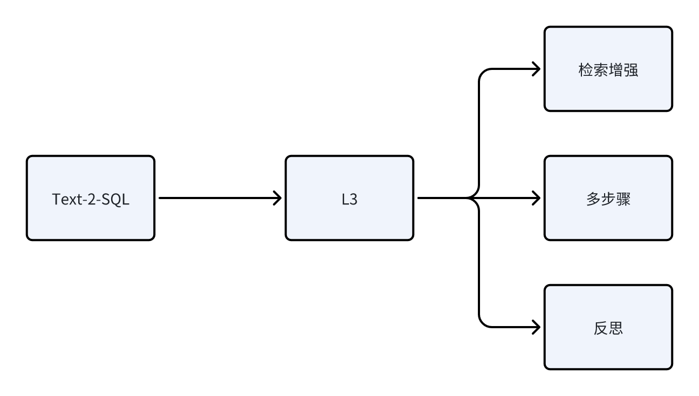
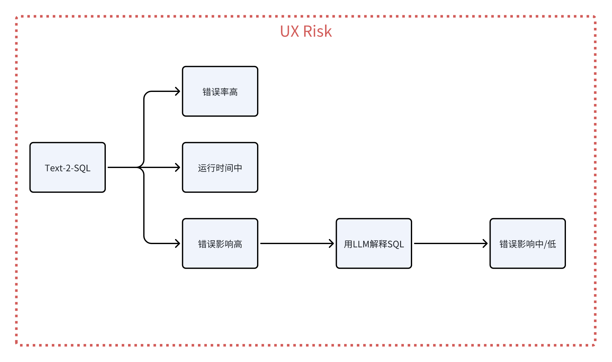
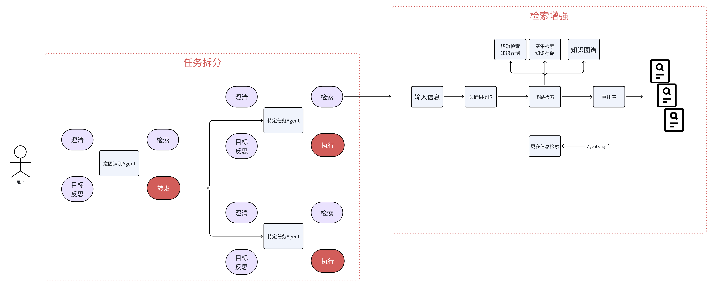
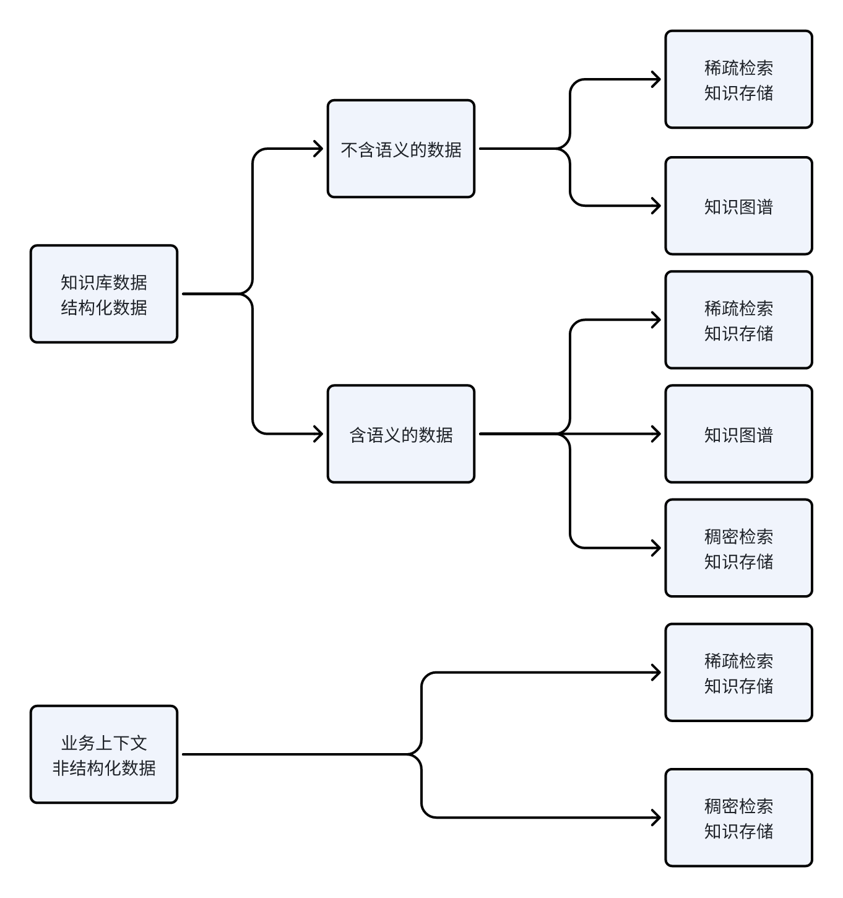

从Text-2-SQL的落地出发，梳理Text-2-SQL的应用构建流程

## 一、梳理需求和痛点

第一步是做用户访谈和调研，收集用户的需求和痛点

## 二、应用类型

接下来就是分析应用类型，Text-to-SQL则属于任务型

## 三、应用的复杂度
Text-to-SQL涉及到了大量的业务、概念，数据也很复杂，定制的规则也很多，所以定在了L3级别

## 四、用户体验风险

Text-to-SQL的错误影响很高，由于这是面向非数据开发的，他们看不懂SQL。如果SQL错了，且返回了一个差不多数量级的值，他们就会产生错误的判断，对业务影响比较大。

### 4.1 降低错误影响

- 能想到的一个解决方案就是让LLM来解释生成的SQL，现有的LLM对于解释SQL还是比较在行的。这样就把整体的错误影响降低到了中，甚至是低。只有在解释SQL的LLM出问题的时候，才会产生比较高的错误影响

### 4.2 降低错误率

Text-to-SQL错误率会很高，原因就是前面提到的那些复杂性。所以重点落在降低错误率。除了通过上一节提到的手段来降低错误率，还可以使用一些工程手段来降低。比如：
- 将数据合成一张大宽表来代替模型做过多的join；
- 将枚举值都换成中文，来避免模型进行枚举值转换的时候出现幻觉；
- 将一些很复杂的指标计算提前计算好；
- 等等

## 五、Text-2-SQL架构

### 5.1 通用架构

### 5.2 Text-2-SQL L3架构

### 5.3  架构梳理

- 意图识别Agent
  - 由于我们是一个会话型应用，肯定需要一个意图识别的Agent
    - 识别用户的意图并做路由
    - 同时它需要去澄清一些用户带有歧义的问题
      - 例子：帮我查询一下购买了A产品和B产品的客户，这句话本身就有两种解释，一种是交集，就是同时购买了A产品和B产品的客户；另外一种是并集，就是购买了A产品或购买了B产品的客户。这就需要Agent帮我们去澄清
  - 意图识别Agent的RAG
    - 通过检索增强的方式，将具体的数据检索回来辅助Agent判断属于哪个意图。当检索回来的内容显示两种意图都可能出现时，就需要抛问题给用户做澄清

- Text-2-SQL Agent
  - 澄清
    - 澄清的内容是任务相关的
      - 例子：用户想查询肯德基XXX店的销量，但是叫作XXX店的可能有XXX一店、XXX二店。那就需要让用户澄清一下，具体查的是哪个店
      - 这里的澄清，是只有在我们知道是Text-to-SQL任务，然后通过数据库的值进行召回，发现存在歧义后才可能澄清的

  - Schema-Linking
    - 选表、选列、补充描述、补充数据库的候选值供where/having/case when等语句使用

  - SQL生成
    - self-consistency：自我一致性降低错误率
    - Revise：自我验证修正语法错误

  - SQL翻译
    - 让Agent对SQL进行自然语言翻译，并跟随SQL执行结果一并返回
## 六、知识工程

Text-2-SQL应用的数据主要分成：

- 业务上下文
  - 表、列的描述
  - 默认的查询规则

- 数据库的值
  - 枚举值
## 七、建立评估指标

[text](LLM应用落地之Text-2-SQL（三）.md)

注：本文除了一些图是重绘之外，内容基本复制于参考1-thoughtworks的一篇公众号

## 参考

[1][LLM应用落地实施手册](https://mp.weixin.qq.com/s/t-uYwd9NOxJIAIMAYWEqhg)

