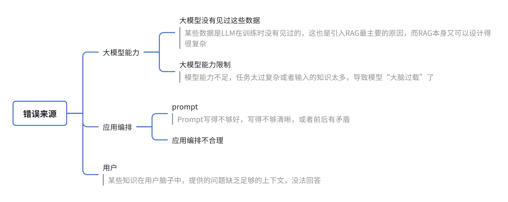
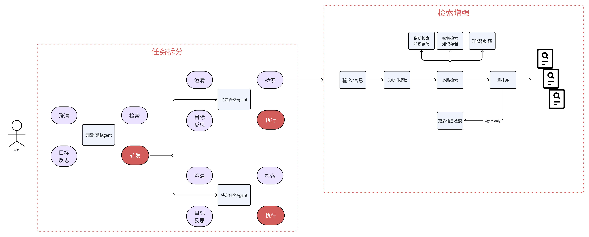
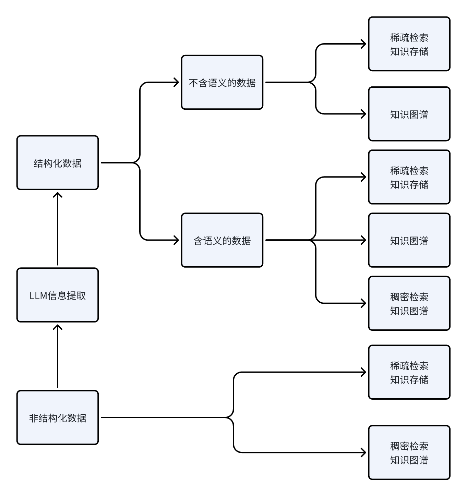
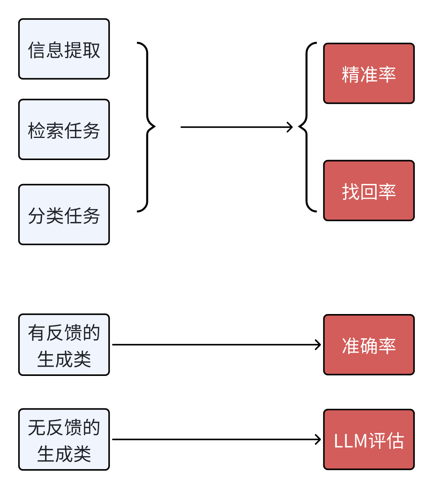

## 一、任务失败概率

### 1.1 常见错误来源

### 1.2 LLM应用的3个能力

LLM应用最重要的3个能力，分别是架构、知识、模型
- 架构
  - 任务拆解：让模型一次执行一小个任务。为什么CoT有效，原因也是大模型并没有见过一次性完成复杂任务的数据，它没在这样的数据上预训练过，但是它见过复杂任务拆分成的小任务的数据，这它是擅长的。进行任务拆解就是在做人为的CoT
  - 检索增强：让检索到的知识足够全，并且尽可能准
- 知识
  - 知识工程：通过多种方式进行知识构建，包括BM25这种稀疏检索知识构建、语义向量检索这种稠密检索知识构建、以及知识图谱构建。同时从多种形式知识中进行混合检索，才能取得最好的效果
- 模型
  - 尽量使用更好的基础模型
  - 对模型进行继续训练，注入垂直领域知识、按照任务的具体格式进行微调；
  - 优化prompt

## 二、LLM应用的架构思路

LLM应用架构主要做任务的拆解和检索增强

### 2.1 架构图

### 2.2 任务拆解

在任务拆解部分，一般会分成多个Agent

- 入口处一般是一个意图识别Agent
  - 澄清用户问题中的歧义，或信息缺失；
  - 通过检索获取相关的信息，来辅助意图识别的判断；
  - 将具体任务路由给具体的Agent

- 后续的Agent则更关注具体的任务
  - 做任务级别的澄清；
  - 通过检索获取到执行任务所相关的信息；
  - 进行进一步的任务拆解，这时候每个任务可以只是一个函数/工具，如果变得很复杂了，也可以是一个其他的Agent

## 三、LLM应用的知识工程

从数据原始的结构形式出发

### 3.3 结构化数据

- 对不含语义信息的数据，可以：
  - 构建MinHash LSH；
  - 构建知识图谱
- 对于含语义信息的数据，可以额外多构建向量数据库

### 3.4 非结构化数据

- 构建倒排索引支持BM25等方法的搜索
- 构建语义相似向量的向量数据库
- 通过LLM进行信息提取，转成结构化数据，然后进行结构化数据的知识工程。

## 四、LLM应用的模型优化

### 4.1 prompt优化

- Prompt要明确、具体，不要自带歧义
- 结构化Prompt
- 对需要推理才能获得更好性能的任务进行CoT
- 当追求极致性能的时候，使用Self Consistency

### 4.2 模型微调

- 想要给模型注入知识，还是得做CT（继续训练），SFT（监督微调）还是很难注入知识
- 对于一些具体的小任务，拿小点的模型进行SFT效果还是很好的，甚至有些任务可以使用更小的BERT

## 五、LLM应用的迭代优化过程

### 5.1 评估指标

- 对于有反馈的生成类任务：主要指的是Text-to-SQL和Text-to-Code这种，我们可以通过编写标准的SQL，或者编写单元测试来测试任务的准确率。
- 对于无反馈的生成类任务：就只能借助大模型来评估了。有人可能会觉得这样大模型自己又当运动员又当裁判不好，先不说我们可以通过微调来优化模型评估的能力，当Prompt变化时，模型的能力偏向也会变化的，所以该方法还是可行的。当然肯定也会存在一定的局限性，这个时候，就可以尝试微调了（见4.2）

### 5.2 试验记录
和传统的机器学习、深度学习一样，LLM应用也是需要将每次运行的实验都记录在案的，MLflow就是一个很不错的工具，可以帮助我们把Prompt、Temperature、Top P等参数以及实验运行的结果都记录下来。下图就是MLflow某个实验的多次运行结果的截图，每次运行的参数、要监控的指标都可以在总览中很直观的看到，每次运行时的测试数据和Prompt在详情页中也会记录

注：本文除了一些图是重绘之外，内容基本复制于参考1-thoughtworks的一篇公众号

## 参考

[1][LLM应用落地实施手册](https://mp.weixin.qq.com/s/t-uYwd9NOxJIAIMAYWEqhg)
