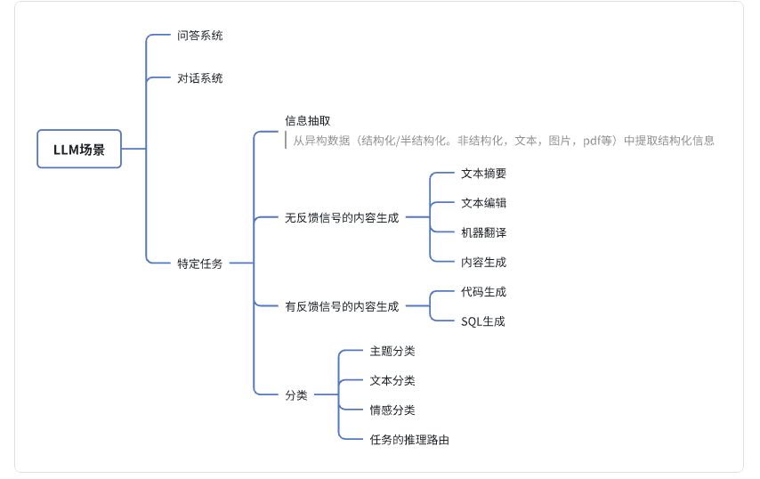
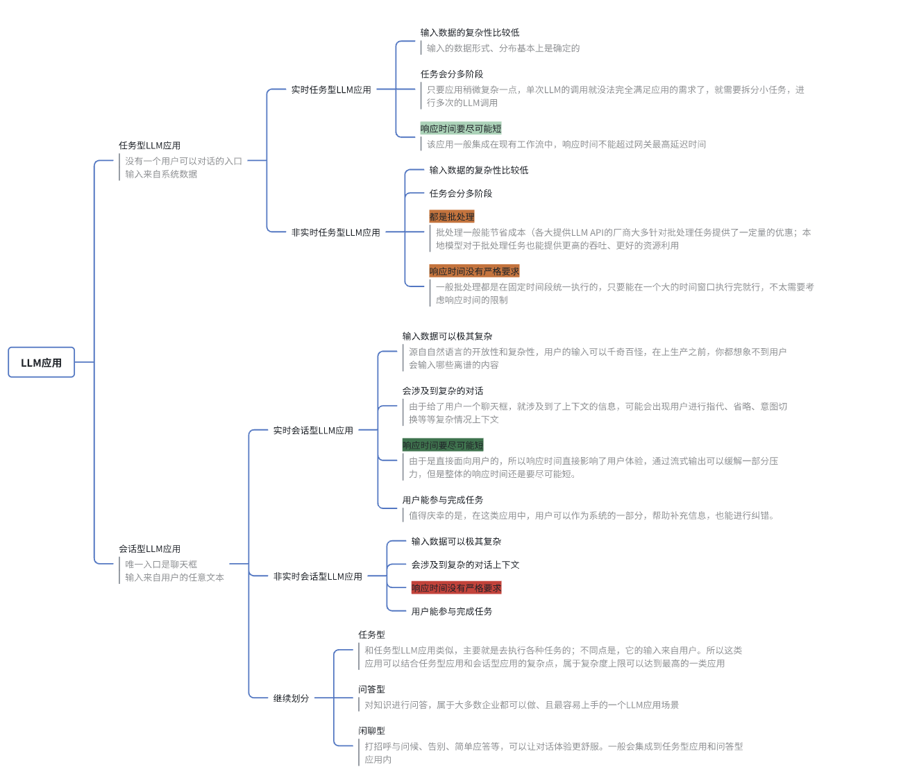
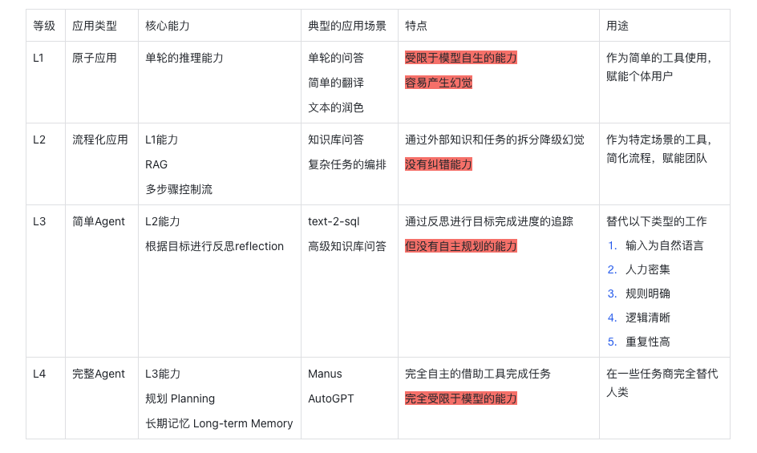
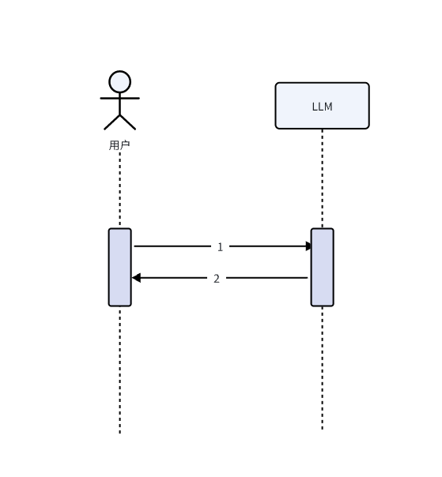
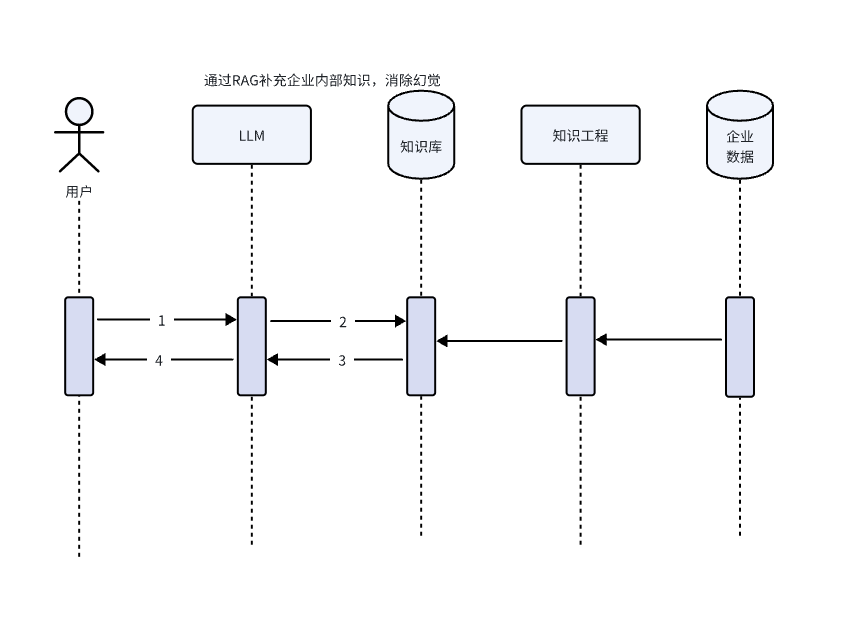
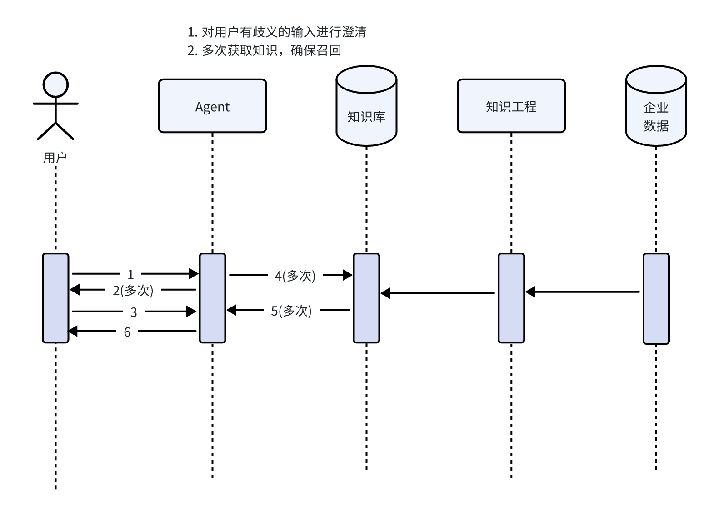
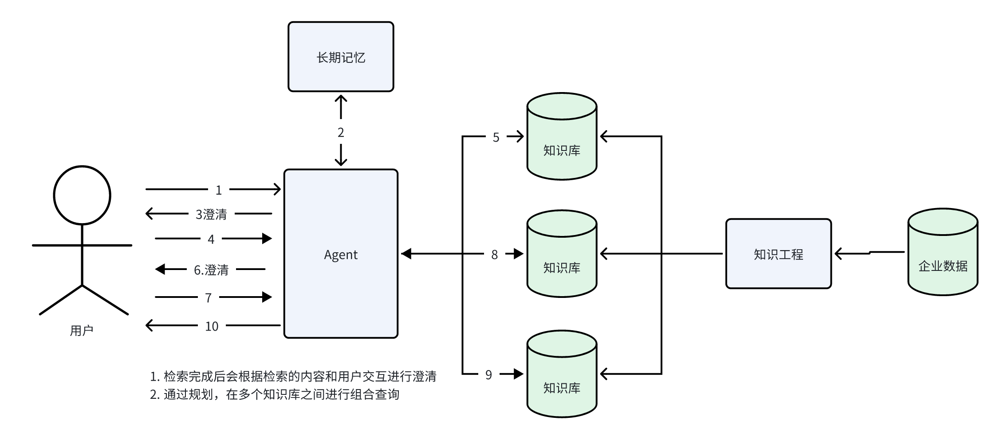
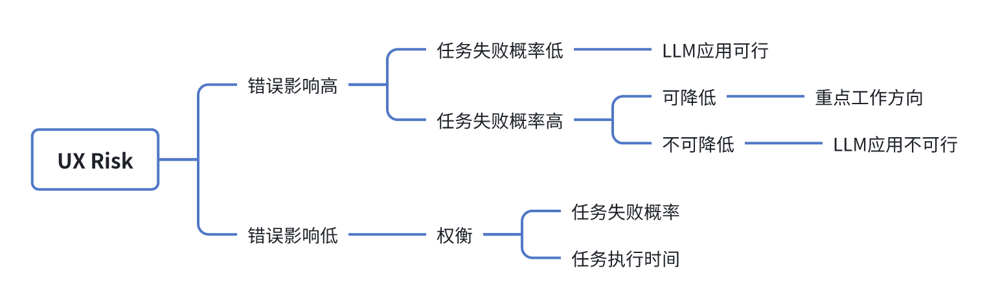
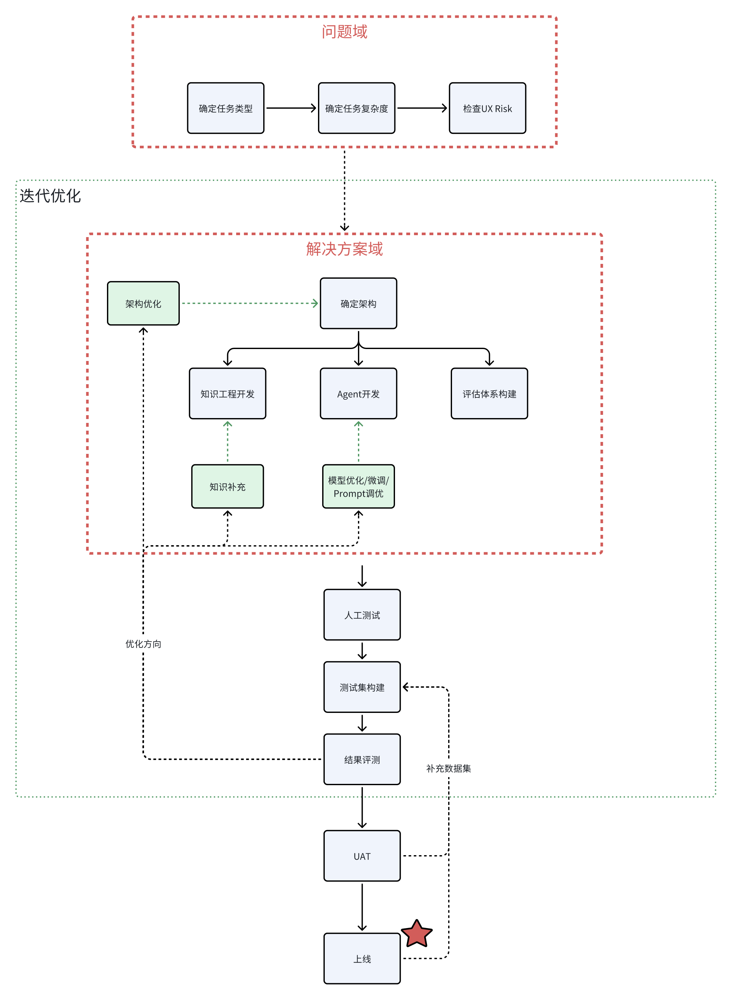

## 1. 应用的分类

### 1.1 LLM应用的场景

### 1.2 LLM应用的分类

## 二、复杂度评估

### 2.1 复杂度等级

- L1应用：依靠LLM的自身的能力，进行单轮LLM的调用，让LLM直接进行输出；
- L2应用：考虑到LLM自身能力的不足，开始对任务进行拆解，最原始的RAG应用就是这个级别最典型的场景，通过检索来补足LLM的知识欠缺；
- L3应用：引入反思这个Agent的属性。反思是Agent一个很重要的能力，它能对环境信息进行反应，检查目标是否已经完成，并进行任务的重试。有一点很重要：此时Agent的能力是通过编码引入的；
- L4应用：完整的Agent，需要给它提供工具，让它自主地规划，根据工具能自主地完成任何相关的任务或问答

### 2.2 复杂度评估：以知识问答为例

以一个知识问答场景为例，分析下L1-L4的应用

**L1：简单知识问答**   
- 不提供任何额外的知识，纯依靠模型自身的能力进行问答；
- 模型有可能进行过垂直领域的微调

**L2：基于RAG的知识问答**   
- 引入了RAG，通过知识库补足模型的知识欠缺，避免幻觉

**L3：简单Agent的知识问答**   
- 引入了根据目标进行反思的能力，在RAG中，需要Agent判断用户的问题是否清楚，否则需要进行澄清；
- 也需要判断RAG的检索是否找到能回答的知识，否则再次进行检索

**L4：完整Agent的知识问答**   
- 引入长期的记忆，可以根据用户的习惯，判断其想表达的意思来主动消除用户问题中的歧义；
- 引入规划，能在多个知识库之间规划先去哪个知识库找数据，再根据找到的数据从哪些知识库找详情数据，如此循环迭代

## 三、用户体验UX 风险

### 3.1 大模型用户体验风险公式

### 3.2 基于错误影响的工作重点评估

四、常见（L3）LLM应用的构建方式

注：本文除了一些图是重绘之外，内容基本复制于参考1thoughtworks的一篇公众号】【】【

## 参考

[1][LLM应用落地实施手册](https://mp.weixin.qq.com/s/t-uYwd9NOxJIAIMAYWEqhg)