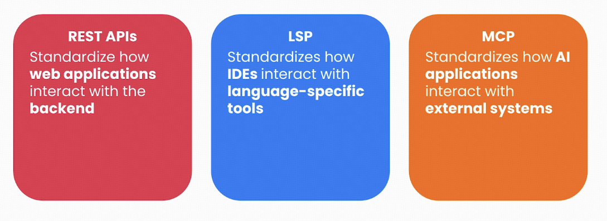
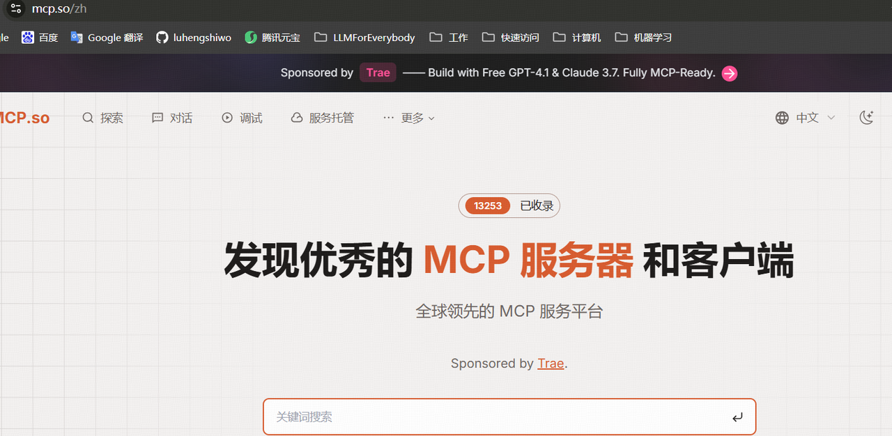
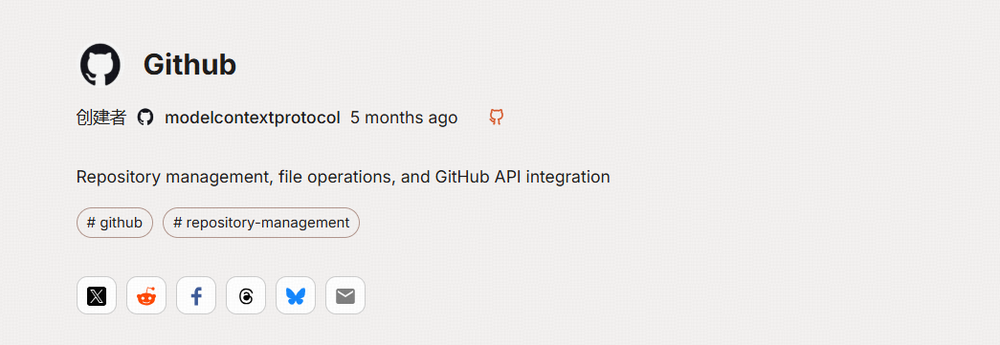
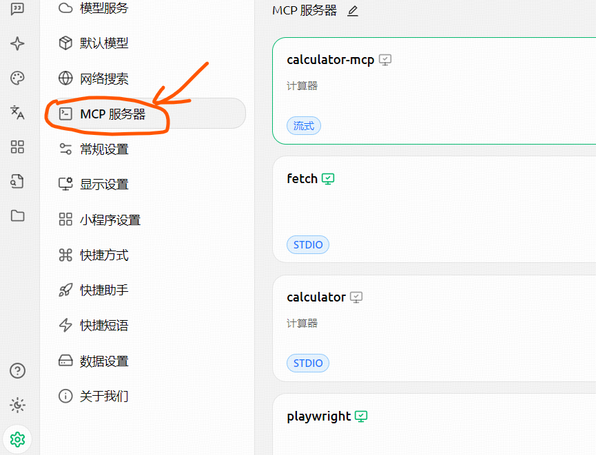
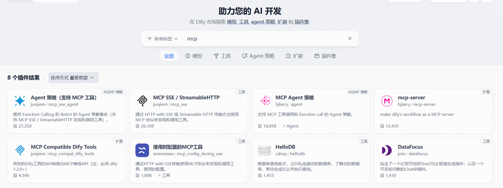
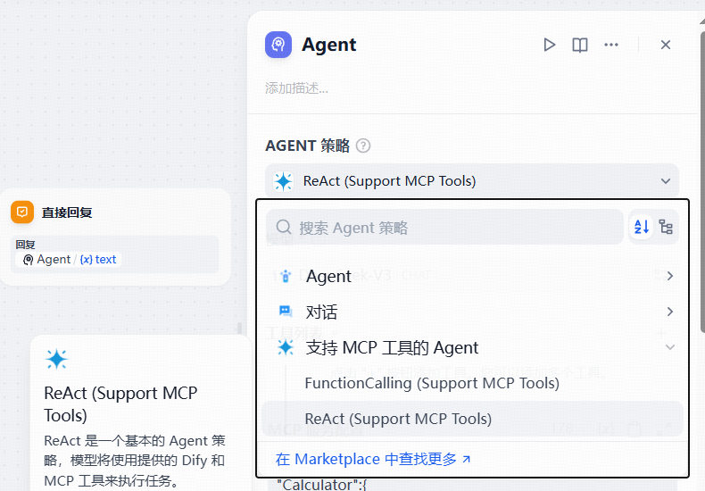
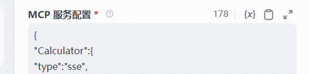
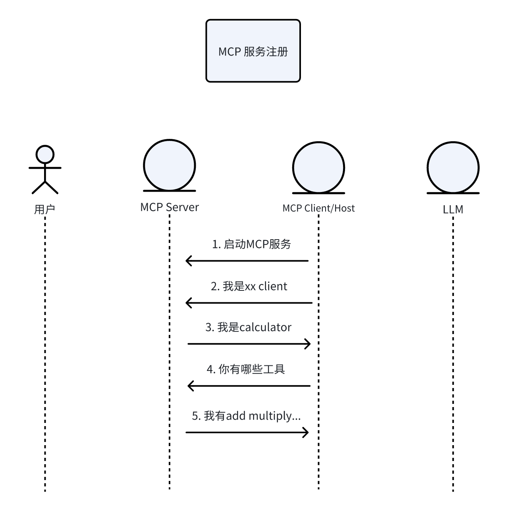
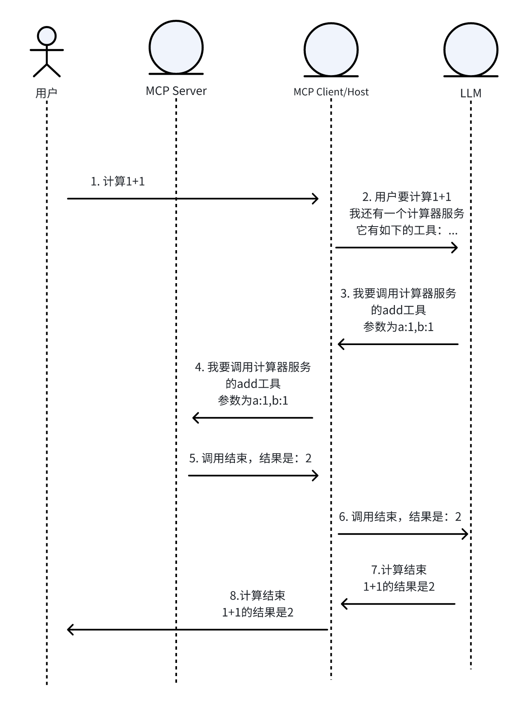

当Claude桌面助手自动整理会议纪要、Midjourney插件实时读取本地设计稿时，你是否好奇这些AI工具如何突破"数字牢笼"实现人机协作？

这背后离不开一项革命性协议——模型上下文协议（Model Context Protocol，MCP）。作为AI领域的"万能适配器"，MCP正在重塑大模型与现实世界的连接方式。

本文主要分三个部分:

第一部分，简单介绍一下mcp的基本概念

第二部分，手把手教学从"使用现成工具"到"开发专属MCP服务器"

第三部分，通过动态时序图揭秘Anthropic等顶尖实验室的协议设计哲学，看懂下一代AI交互标准


## 一、基础概念

MCP 是由 Anthropic 于 2024 年推出的开放协议，旨在标准化大型语言模型（LLM）与外部数据源、工具之间的通信，解决传统 AI 因数据孤岛限制而无法充分交互的问题。它类似于 AI 领域的“通用插头”，允许模型通过统一接口安全访问本地或远程资源（如数据库、API、文件系统等），实现动态获取上下文信息并执行操作.



MCP 采用 客户端-服务器架构，包含以下核心组件：

1. MCP 主机（Host）​​：如 Claude Desktop 或 Cursor IDE，提供用户交互界面。
2. MCP 客户端（Client）​​：嵌入在主机内，负责协议解析与通信。
3. MCP 服务器（Server）​​：轻量级服务节点，提供三类功能：
- 资源（Resources）​​：静态数据（文件、数据库记录）。
- 工具（Tools）​​：可执行函数（API 调用、数据分析）。
- 提示（Prompts）​​：预定义交互模板

注：mcp的基本概念不是本文关注的重点，但为了不失完备性，还是放了这个章节，如果你想知道MCP的基础概念，建议阅读下面两篇文章：

https://mp.weixin.qq.com/s/5XbO76qCCYrRVaYjTd3BIA

https://mp.weixin.qq.com/s/G2V5VmsjMWs08rUAE8zCuQ


## 二、使用MCP的方法

### 2.0 MCP Server

***已发布的MCP server***

目前，公开发布MCP server非常多，也逐渐形成了多个社区：

https://mcpmarket.com/

https://smithery.ai/

https://mcp.so/

https://modelscope.cn/mcp

https://actions.zapier.com/mcp

开发者可以很方便的在上述的网站中查找对自己有用的MCP 服务；

下面，我们以mcp.so为例，教大家如何准备自己的MCP 服务。





我们可以看到github这个服务器配置为：

```json
{
  "mcpServers": {
    "github": {
      "command": "npx",
      "args": [
        "-y",
        "@modelcontextprotocol/server-github"
      ],
      "env": {
        "GITHUB_PERSONAL_ACCESS_TOKEN": "<YOUR_TOKEN>"
      }
    }
  }
}
```

这边，就约定了这个github mcp 服务的启动方式了。如果我们需要，就把这段配置拷贝，放到我们选择的某个host里即可。如果你现在不知道怎么配置，没关系，接下来的章节我会手把手的教你。

***自建server***

我们也可以自己创建一个mcp server，这一部分可以直接参考anthropic的官方示例：https://modelcontextprotocol.io/quickstart/server

此时，你就有了一个自己的服务器，配置为：

```json
{
    "mcpServers": {
        "weather": {
            "command": "uv",
            "args": [
                "--directory",
                "/ABSOLUTE/PATH/TO/PARENT/FOLDER/weather",
                "run",
                "weather.py"
            ]
        }
    }
}
```

接下来，我们要做的就是把这些个server，配置到我们的host里面。在本文里，我分别选用了cherry studio客户端，LangGraph 开发框架和Dify这样的LLMOps平台，介绍如何将MCP Server配置进去。

### 2.1 Cherry studio使用MCP Server

如何安装cherry studio不在本文讨论范围之内，安装完毕后，可以找到设置里的MCP 服务器，将上文中的配置拷贝进去即可。



### 2.2 LangGraph使用MCP Server

在Langgraph里面使用MCP 服务也很简单，参考官方示例：https://langchain-ai.github.io/langgraph/agents/mcp/#use-mcp-tools，只需要在代码中将上文中的配置拷贝进去即可

```python
from langchain_mcp_adapters.client import MultiServerMCPClient
from langgraph.prebuilt import create_react_agent

client = MultiServerMCPClient(
    {
        "math": {
            "command": "python",
            # Replace with absolute path to your math_server.py file
            "args": ["/path/to/math_server.py"],
            "transport": "stdio",
        },
        "weather": {
            # Ensure your start your weather server on port 8000
            "url": "http://localhost:8000/mcp",
            "transport": "streamable_http",
        }
    }
)
## 在上面的方法里拷贝上文中的配置

tools = await client.get_tools()
agent = create_react_agent(
    "anthropic:claude-3-7-sonnet-latest",
    tools
)
math_response = await agent.ainvoke(
    {"messages": [{"role": "user", "content": "what's (3 + 5) x 12?"}]}
)
weather_response = await agent.ainvoke(
    {"messages": [{"role": "user", "content": "what is the weather in nyc?"}]}
)
```

### 2.3  Dify使用MCP Server

在Dify中，暂时只支持SSE的MCP 服务，首先确保你的dify是1.2.0以上的版本,在插件市场搜索mcp，选择Agent策略(支持MCP 工具)，并安装。注：其它的插件也可以，可以自行测试。



在Agent里选择ReAct(Support MCP Tool),并在mcp服务配置里面，将上文的配置拷贝进去即可。





## 三、MCP的运行原理

想要弄懂MCP到底做了什么，我们可以用时序图来分别看下在server注册和用户使用时，数据的交互是怎样的。

### 3.1 server注册时序图



下述步骤的序号和时序图一一对应

以cherry studio 为例，当我们在上面注册了自己写的calculator这个mcp 服务，在注册成功之前，server 和 client其实已经交互了多轮：

1. 首先，客户端会启动mcp server，我们的mcp服务是stdio方式，所以这一步相当于cherry studio运行了如下的命令：

```bash
uv run calculator.py
```

2. Client 向 server 传输信息：我是xx 客户端

```bash
{"method":"initialize","params":{"protocolVersion":"2024-11-05","capabilities":{},"clientInfo":{"name":"Cline","version":"3.12.3"}},"jsonrpc":"2.0","id":0}
```

3. Server 会回复：我是calculator 服务

```bash
{"jsonrpc":"2.0","id":0,"result":{"protocolVersion":"2024-11-05","capabilities":{"experimental":{},"prompts":{"listChanged":false},"resources":{"subscribe":false,"listChanged":false},"tools":{"listChanged":false}},"serverInfo":{"name":"CalculatorService","version":"1.8.1"}}}
```

4. Client 会初始化该服务，并接着询问 server 的有哪些工具

```bash
{"method":"notifications/initialized","jsonrpc":"2.0"}
{"method":"tools/list","jsonrpc":"2.0","id":1}
```

5. 服务会回复服务中工具的信息：包含工具的描述，工具的出入参，

```bash
{
        "jsonrpc": "2.0",
        "id": 1,
        "result": {
                "tools": [{
                        "name": "add",
                        "description": "执行浮点数加法运算",
                        "inputSchema": {
                                "properties": {
                                        "a": {
                                                "title": "A",
                                                "type": "number"
                                        },
                                        "b": {
                                                "title": "B",
                                                "type": "number"
                                        }
                                },
                                "required": ["a", "b"],
                                "title": "addArguments",
                                "type": "object"
                        }
                },
                {
                        "name": "subtract",
                        "description": "执行浮点数减法运算",
                        "inputSchema": {
                                "properties": {
                                        "a": {
                                                "title": "A",
                                                "type": "number"
                                        },
                                        "b": {
                                                "title": "B",
                                                "type": "number"
                                        }
                                },
                                "required": ["a", "b"],
                                "title": "subtractArguments",
                                "type": "object"
                        }
                },
                {
                        "name": "multiply",
                        "description": "执行浮点数乘法运算",
                        "inputSchema": {
                                "properties": {
                                        "a": {
                                                "title": "A",
                                                "type": "number"
                                        },
                                        "b": {
                                                "title": "B",
                                                "type": "number"
                                        }
                                },
                                "required": ["a", "b"],
                                "title": "multiplyArguments",
                                "type": "object"
                        }
                },
                {
                        "name": "divide",
                        "description": "执行浮点数除法运算\n    Args:\n        b: 除数（必须非零）\n    ",
                        "inputSchema": {
                                "properties": {
                                        "a": {
                                                "title": "A",
                                                "type": "number"
                                        },
                                        "b": {
                                                "title": "B",
                                                "type": "number"
                                        }
                                },
                                "required": ["a", "b"],
                                "title": "divideArguments",
                                "type": "object"
                        }
                },
                {
                        "name": "power",
                        "description": "计算幂运算",
                        "inputSchema": {
                                "properties": {
                                        "base": {
                                                "title": "Base",
                                                "type": "number"
                                        },
                                        "exponent": {
                                                "title": "Exponent",
                                                "type": "number"
                                        }
                                },
                                "required": ["base", "exponent"],
                                "title": "powerArguments",
                                "type": "object"
                        }
                },
                {
                        "name": "sqrt",
                        "description": "计算平方根",
                        "inputSchema": {
                                "properties": {
                                        "number": {
                                                "title": "Number",
                                                "type": "number"
                                        }
                                },
                                "required": ["number"],
                                "title": "sqrtArguments",
                                "type": "object"
                        }
                },
                {
                        "name": "factorial",
                        "description": "计算整数阶乘",
                        "inputSchema": {
                                "properties": {
                                        "n": {
                                                "title": "N",
                                                "type": "integer"
                                        }
                                },
                                "required": ["n"],
                                "title": "factorialArguments",
                                "type": "object"
                        }
                }]
        }
}
```

此时，一个server的注册就完成了。


### 3.2 用户使用时序图



下述步骤的序号和时序图一一对应

1. 用户在host上提交请求，计算1+1，比如，用户在cherry studio上输入计算1+1，并回车

2. Cherry studio 会将该请求，连同我们配置的MCP server的信息，以prompt/function call的形式，传输给LLM，该prompt约定了如果需要调用mcp server，该使用的格式

3. 大模型经过思考，发现需要调用计算器这个MCP server的add 工具，并根据约定，按照MCP范式，给出调用的方法，在这边是如下的返回

```bash
{"method":"tools/call","params":{"name":"add","arguments":{"a":1.0,"b":1.0}},"jsonrpc":"2.0","id":4}
```

4. Client 转发并调用 server

5. Server返回结果

```bash
{"jsonrpc":"2.0","id":4,"result":{"content":[{"type":"text","text":"2.0"}],"isError":false}}
```

6. Client转发给（携带历史信息）LLM

7. 大模型获取结果并进行总结，将最终的结果返回给client

8. client拿到结果，并发送给用户

### 3.3  模型上下文协议

对于模型上下文协议这个名词，我们要注意的是该协议只规定了client和server之间的交互协议（方式），没有规定client和LLM之间如何交互，不同的的client会实现自己的方式。
对于大模型来说，上下文就是环境，模型的上下文，就是模型的所处的环境是什么，即模型可以拿到的工具是什么。

MCP本质上就是让模型感知外部环境的协议。


## 参考

<div id="refer-anchor-1"></div>

[1]https://mp.weixin.qq.com/s/5XbO76qCCYrRVaYjTd3BIA

https://mp.weixin.qq.com/s/G2V5VmsjMWs08rUAE8zCuQ

https://mcpmarket.com/

https://smithery.ai/

https://mcp.so/

https://modelscope.cn/mcp

https://actions.zapier.com/mcp

https://modelcontextprotocol.io/quickstart/server

https://langchain-ai.github.io/langgraph/agents/mcp/#use-mcp-tools

https://www.deeplearning.ai/short-courses/mcp-build-rich-context-ai-apps-with-anthropic/?utm_campaign=anthropicC2-launch&utm_medium=headband&utm_source=deeplearning-ai
