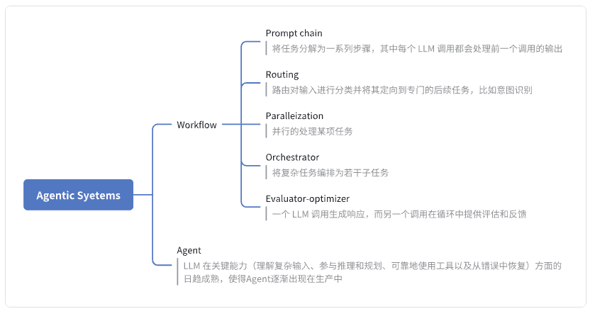
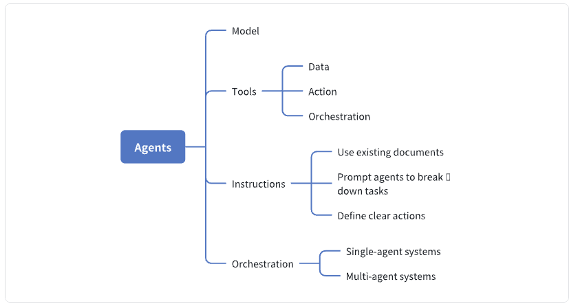
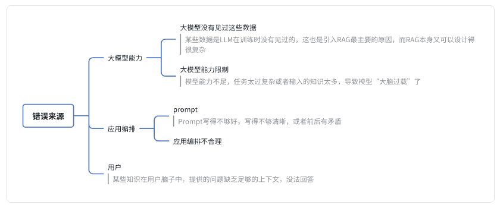
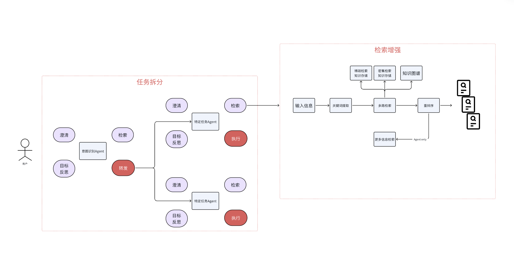
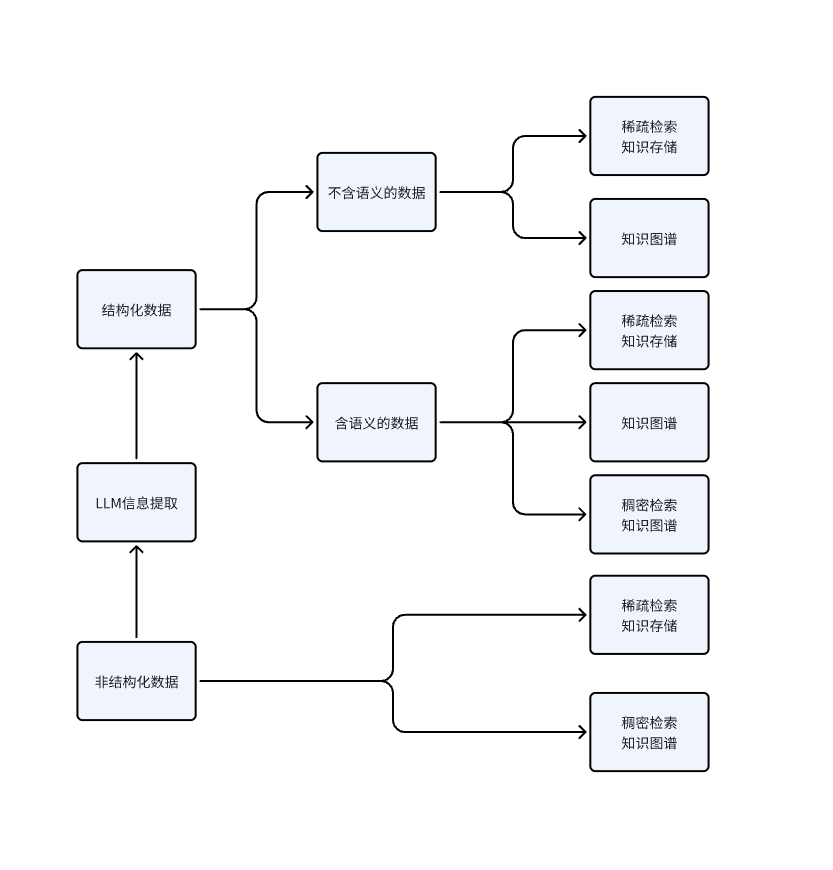
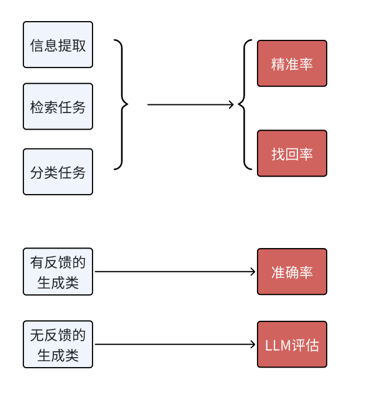

## 1. 痛苦的教训

在开发大模型相关应用的过程中，人们逐渐意识到一个痛苦的教训：通过数百个工时精心打造的流程架构与人工优化措施，往往会在模型版本迭代时化为乌有。

在早期（2023-2024）采用GLM-6B等开源模型框架的技术实践中，开发者普遍面临基础模型性能局限带来的困境：受限于有限上下文处理能力和基础推理能力不足，工程师不得不实施大量人工编码干预来保障系统可靠性。然而随着模型智能水平的指数级提升，这些曾经的关键适配模块又被迫进入系统性解耦阶段。这种技术路线反复调整的循环困境，正演变为AI工程领域必须承受的痛苦教训——每当模型迭代周期来临，整个技术栈都面临着从"过度工程化"到"去冗余重构"的痛苦蜕变。

在传统软件架构演进历程中，客户端-服务器交互范式长期占据主导地位：用户端发起数据交互请求，服务端执行数据操作事务，经预定义逻辑处理后返回响应结果。这种线性交互模型历经数十年技术迭代，奠定了现代系统的基础架构形态。即便在自动化工具链与低代码平台蓬勃发展的当下，系统核心逻辑仍高度依赖工程师在开发阶段实施的人工代码优化——当软件部署进入生产环境，整个系统即转入静态预编译计算流程，执行路径完全遵循预设的确定性规则。

在当代系统架构演进中，概率计算范式正逐步取代传统确定性范式：基于深度学习的实时动态推理机制开始主导应用构建范式。以OpenAI生态为例，全球数万级智能应用通过API集成其AI推理服务，每次服务调用均涉及复杂的神经网络决策流程而非简单数据操作。这种技术范式的根本性转变标志着：软件系统的行为决策权已从静态代码库移交至持续进化的模型本体。更具有革命性意义的是，应用系统获得了模型持续进化带来的外延式增强效应——即使本地业务逻辑保持不变，底层AI能力的迭代升级仍能自动驱动应用智能水平的渐进式提升。

在人工智能技术演进曲线中，大模型迭代速率已突破传统认知阈值：其智能决策系统在规避传统工作流架构复杂性的前提下，展现出超越人工干预的动态适应能力。这种技术演进轨迹揭示出AI工程领域的范式转移：相较于传统人机协同范式中"人工精细化管控+模型执行层响应"的线性协作模式，基于自主推理引擎的动态决策系统正形成指数级优势——当模型持续突破认知边界时，配套系统自然获得智能涌现带来的内生进化动能。

在技术路线抉择的十字路口，我们正面临范式竞争的终极考验：是延续依赖人工架构设计的静态流程编排体系，将智能体约束于预设框架内运作；还是顺应大模型自主推理能力的指数级增长，构建具备环境自适应特质的通用型智能决策架构。这种技术范式的抉择，本质上是判断智能系统进化路径的转折点——当模型内生智能超越人工设计边界时，动态演化的自主决策系统将成为技术演进的主导范式。

## 2. Anthropic的理解

2024年12月19日，Anthropic发表了一篇名为《Building effective agents》的博客，向世人宣告其对Agent的理解，并隐隐的拉开了2025年智能体元年的序幕。

在这篇文章中，Anthropic把人们谈论的Agent称为agentic systems，并给出了两种不同的架构：workflow和agent。

>如果你用过dify之类的低代码devops平台，你会发现这些平台事实上已经采用了这种分类

工作流是通过预定义代码路径协调 LLM 和工具的系统；

Agent是LLM动态指导自身流程和工具使用的系统，从而保持对任务完成方式的控制。

同时Anthropic还给出了这两种Agentic sysytems的设计模式，如果你已经做了很长时间的大模型应用，你会发现下图很容易理解。

## 3. OpenAI的理解

作为老大哥，在被Anthropic的MCP夺走Function Call的主导地位后，OpenAI想在Agent的行业标准上插上一脚，为此，他们在2025年4月发表了一篇名为《A practical guide to building agents》的文章。

但由于Anthropic珠玉在前，OpenAI的这篇文章一经问世便招到了攻讦，冲在最前的就是我们开发者耳熟能详的Harrison Chase，LangChain的创始人。他发表了《How to think about agent frameworks》来回怼了OpenAI.

>作为吃瓜群众，我认为一个可能的原因是Anthropic在他们的博客里推荐了LangGraph，但OpenAI在文章里提到了声明式和非声明式图的区别(这一点是LangGraph和LangChain经常被攻击的点)，并暗指了LangGraph的缺点.

我们来看下Open AI的核心思想:

延续了Anthropic对Agentic system的定义，OpenAI也认为Agent会有workflow这种状态，不过他们把一种情况排除在外：
虽然集成了LLM，但是LLM没有用来控制workflow的应用，不属于与Agent。

> 原文是：Applications that integrate LLMs but don’t use them to control workflow execution—think simple chatbots, single-turn LLMs, or sentiment classifiers—are not agents.  
我个人认为其实不用严格考虑应用属不属于Agent

OpenAI在他的文章里，给出了四个关键词：model，tool，instruction，orchestration，其中，orchestration也可以是tool的一部分.

同时，作为老大哥，OpenAI等大厂需要比其它小公司更关注安全方面的事情，为此他们单独开辟了一章来讲Guardrails

如果你看这篇文章，你会发现其对Agent的理解更多的就是Anthropic文章中的Agent，而不是Agentic Systems.

## 4.一种常见的架构设计

我认为两家公司对Agent的理解各有侧重，但是对于开发者来讲，没有必要站队，而是可以博采众长来炼化属于自己的设计范式，以下是来源于Thoughtworks的一种常见的架构设计

### 4.1、任务失败概率

#### 4.1.1 常见错误来源

#### 4.1.2 LLM应用的3个能力

LLM应用最重要的3个能力，分别是架构、知识、模型

**架构**

  任务拆解：让模型一次执行一小个任务。为什么CoT有效，原因也是大模型并没有见过一次性完成复杂任务的数据，它没在这样的数据上预训练过，但是它见过复杂任务拆分成的小任务的数据，这它是擅长的。进行任务拆解就是在做人为的CoT

  检索增强：让检索到的知识足够全，并且尽可能准

**知识**
  知识工程：通过多种方式进行知识构建，包括BM25这种稀疏检索知识构建、语义向量检索这种稠密检索知识构建、以及知识图谱构建。同时从多种形式知识中进行混合检索，才能取得最好的效果

**模型**

  尽量使用更好的基础模型;

  对模型进行继续训练，注入垂直领域知识、按照任务的具体格式进行微调；

  优化prompt

### 4.2 LLM应用的架构思路

LLM应用架构主要做任务的拆解和检索增强

#### 4.2.1 架构图

#### 4.2.2 任务拆解

在任务拆解部分，一般会分成多个Agent

***入口处一般是一个意图识别Agent***

  澄清用户问题中的歧义，或信息缺失；

  通过检索获取相关的信息，来辅助意图识别的判断；

  将具体任务路由给具体的Agent

***后续的Agent则更关注具体的任务***

  做任务级别的澄清；

  通过检索获取到执行任务所相关的信息；

  进行进一步的任务拆解，这时候每个任务可以只是一个函数/工具，如果变得很复杂了，也可以是一个其他的Agent

### 4.3、LLM应用的知识工程

从数据原始的结构形式出发

#### 4.3.3 结构化数据

对不含语义信息的数据，可以：

  构建MinHash LSH；

  构建知识图谱

对于含语义信息的数据，可以额外多构建向量数据库

#### 4.3.4 非结构化数据

构建倒排索引支持BM25等方法的搜索

构建语义相似向量的向量数据库

通过LLM进行信息提取，转成结构化数据，然后进行结构化数据的知识工程。

### 4.4、LLM应用的模型优化

#### 4.4.1 prompt优化

Prompt要明确、具体，不要自带歧义

结构化Prompt

对需要推理才能获得更好性能的任务进行CoT

当追求极致性能的时候，使用Self Consistency

#### 4.4.2 模型微调

想要给模型注入知识，还是得做CT（继续训练），SFT（监督微调）还是很难注入知识

对于一些具体的小任务，拿小点的模型进行SFT效果还是很好的，甚至有些任务可以使用更小的BERT

### 4.5、LLM应用的迭代优化过程

#### 4.5.1 评估指标

**对于有反馈的生成类任务**：主要指的是Text-to-SQL和Text-to-Code这种，我们可以通过编写标准的SQL，或者编写单元测试来测试任务的准确率。

**对于无反馈的生成类任务**：就只能借助大模型来评估了。有人可能会觉得这样大模型自己又当运动员又当裁判不好，先不说我们可以通过微调来优化模型评估的能力，当Prompt变化时，模型的能力偏向也会变化的，所以该方法还是可行的。当然肯定也会存在一定的局限性，这个时候，就可以尝试微调了（见4.2）

#### 4.5.2 试验记录

和传统的机器学习、深度学习一样，LLM应用也是需要将每次运行的实验都记录在案的，MLflow等MLOps框架是很不错的工具，可以帮助我们把Prompt、Temperature、Top P等参数以及实验运行的结果都记录下来。

## 参考

[1][OpenAI“Agent 圣经”翻车？LangChain 创始人怒怼“全是坑”！](https://mp.weixin.qq.com/s/ME29kbyLXotc3s22zwBPkA)

[2][A practical guide to building agents](https://cdn.openai.com/business-guides-and-resources/a-practical-guide-to-building-agents.pdf)

[3][How to think about agent frameworks](https://blog.langchain.dev/how-to-think-about-agent-frameworks/)

[4][Building effective agents](https://www.anthropic.com/engineering/building-effective-agents?ref=blog.langchain.dev)

[5][LLM应用落地实施手册](https://mp.weixin.qq.com/s/t-uYwd9NOxJIAIMAYWEqhg)