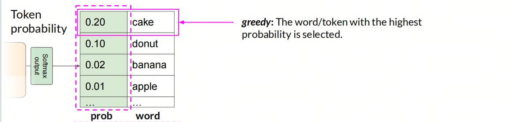
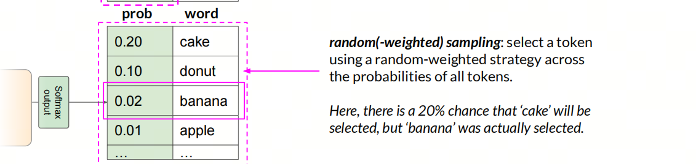
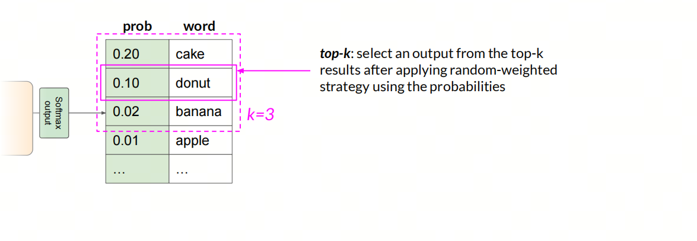

***Probabilistic vs. Deterministic***

***不确定性 vs. 确定性***

## 量子力学-上帝掷骰子

***薛定谔的猫***

把一只猫、一个装有氰化氢气体的玻璃烧瓶和镭225物质放进封闭的盒子里。当盒子内的监控器侦测到衰变粒子时，就会打破烧瓶，杀死这只猫。根据量子力学的哥本哈根诠释，在实验进行一段时间后，猫会处于又活又死的叠加态。可是，假若实验者观察盒子内部，他会观察到一只活猫或一只死猫，而不是同时处于活状态与死状态的猫。

爱因斯坦觉得不对，他说：“我不相信上帝掷骰子。”

这个实验争论的焦点是，猫是在没有打开前就已经决定了死活，还是打开盒子那一瞬间才决定了死活。经典物理学派认为这只猫在没打开盒子前，早就生死已定，这是基本常识；而哥本哈根派则认为，没打开盒子，猫处于又死又活的状态，只有打开盒子才决定了猫的生死，这是微观粒子的特性。

哥本哈根派认为，这只猫实验的根本错误在于，人们用宏观世界的常识来判断微观世界的特性。

***学术界的结论***

- **微观世界**：上帝掷骰子，在量子世界似乎真的存在着“上帝掷骰子”现象，也就是随机性概率性很大
- **宏观世界**：上帝不会掷骰子，规律主导着一切，科学就是科学。

在软件开发领域，尤其在大模型进入工作流后，也有确定性vs不确定性的区别。

## 传统软件开发-确定性 Deterministic：
> 注：这边的软件不考虑故意的随机性输出，比如随机数生成器。

在软件开发的数据流中，我们一般会遇到三种问题，白洞，黑洞，灰洞。解决掉这三类问题，数据流就成了。但隐含前提是确定的输入会产生确定的输出，软件要保证**幂等**，即不管第几次输入相同的内容，输出要是一致的。在实际开发中，没有**幂等**是不同次的输入事实上是不一样的，只是你以为一样而已。

对于特定的输入，软件的输出是确定的，这就是确定性。

  - 白洞：没有输入，但是有输出
  - 黑洞：有输入，但是没有输出
  - 灰洞：输入不足以产生输入

## 大模型应用开发-不确定性 Probabilistic：
大模型的token生成本质上是基于概率的，当输入完全一致的时候，输出也会不一样。

**Greedy**

大模型**没有采用**这个策略！

选择概率最高的单词/token，这样的方法叫做贪心算法，但是贪心算法会导致输出的重复性，因为贪心算法只会选择概率最高的单词，而不会考虑其他单词的概率。

**Sampling**

大模型**采用**这个策略！！

使用随机策略在所有token的概率中选择一个token。在这里，“cake”被选中的概率为 20%，但实际上选中的是“banana”。

***Top-k***

使用随机策略后，从前k个结果中选择一个token作为输出。

***Top-p***

使用随机策略选择一个输出，候选集为按概率排名靠前的连续结果，且累积概率<=p

## 经验教训 Bitter Lessons：
不确定性是一把双刃剑

一方面，我们的生成更加的多样化，在一定程度上提高了生成的质量，比如生成的文本更加的丰富多样，更加的有趣。

另一方面，在期望json或者sql/代码等严格输出要求时，这种不确定性有时候是无法接受的。

大模型的不确定性，是由于模型的特性决定的，不是因为模型的实现问题。在LLM应用开发中，全流程的参与者都需要预判这种不确定性，以便更好的处理edge case。

>FAQ：原来的机器学习/深度学习是什么类型的？

>一般来讲，这些的输出都是Greedy策略：只会选择概率最高的。对于确定的输入，会给出确定的输入。如果两次输出不一样，那一定是模型层面的输入不一样。

## 参考

[1] [GitHub: LLMForEverybody](https://github.com/luhengshiwo/LLMForEverybody)

[2] [deeplearning.ai](https://www.deeplearning.ai/)