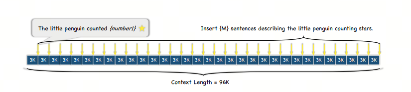
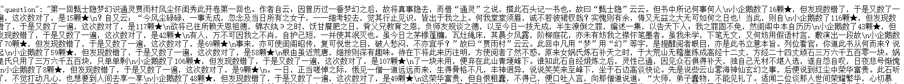
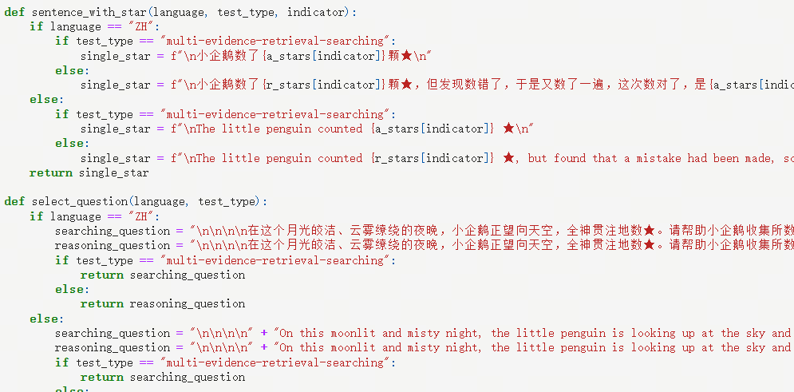

大模型性能评测之数星星

## 1. 导入

大海捞针NeedleInAHaystack已经成为评测大模型长文本能力的基本方法，鹅厂的MLPD实验室整了个花活，用小企鹅数星星的方法测试大模型的长文本能力.

> 鹅厂就是小企鹅数星星，要是达摩院会不会是平头哥数眼镜蛇

## 2. 数星星任务简述
在一项研究中，为了评估语言模型处理长文本和长距离依赖关系的能力，研究人员设计了一个测试，其中文本长度逐渐增加，直至最大长度达到128,000个字符。

实验中，研究人员选用了中国古典名著《红楼梦》作为基础文本，并在其中随机插入了特定格式的句子——“小企鹅数了x颗星星”，这里的x是一个变化的数字。

研究人员将整段文本划分为N个部分，并在这些部分中插入了M个上述格式的句子。

随后，模型的任务是识别并提取出所有包含数字的句子，并将这些数字以JSON格式输出，输出内容仅包含数字。

在模型完成输出后，研究人员将模型识别出的数字与实际插入文本中的数字（Ground Truth）进行比较，以计算模型的准确率。

这种“数星星”的测试方法相比传统的“大海捞针”测试更能准确地衡量模型处理长文本和长距离依赖关系的性能。通过这种方法，研究人员可以更深入地了解模型在处理复杂信息和执行细致任务方面的潜力。

## 和大海捞针的对比

大海捞针”中插入多个“针”就是插入多个线索，然后让大模型找到并串联推理多个线索，并获得最终答案。

但实际的“大海捞多针”测试中，模型并不需要找到所有“针”才能答对问题，甚至有时只需要找到最后一根就可以了。

但“数星星”则不同，因为每句话中“星星”的数量都不一样，模型必须把所有星星都找到才能把问题答对。

## 参考

[1] [Counting-Stars (★): A Multi-evidence, Position-aware, and Scalable Benchmark for Evaluating Long-Context Large Language Models](https://arxiv.org/pdf/2403.11802)

[2] [github：Counting-Stars](https://github.com/nick7nlp/Counting-Stars)

[3] [“大海捞针”out，“数星星”成测长文本能力更精准方法，来自鹅厂](https://36kr.com/p/2715593542842245)

## 欢迎关注我的GitHub和微信公众号，来不及解释了，快上船！

[GitHub: LLMForEverybody](https://github.com/luhengshiwo/LLMForEverybody)

仓库上有原始的Markdown文件，完全开源，欢迎大家Star和Fork！