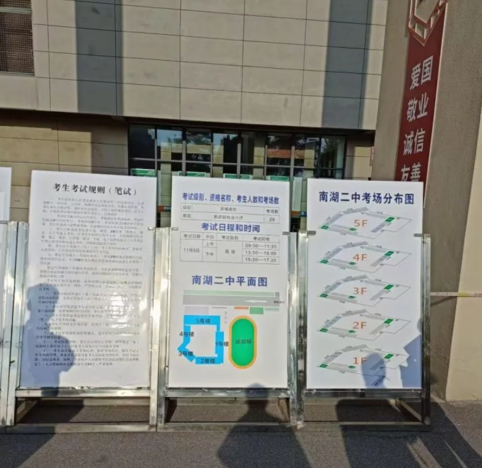

我是怎么通过2022下半年软考高级：系统架构设计师考试的

## 1. 动机
2021年，我老婆准备出国留学一年，年初的时候我就在想这一年的晚上我要如何度过。在查阅了很多资料后，我准备参加软考架构师考试，以考促学。

一方面架构师这个岗位和我现在的工作相关程度比较高；另一方面，我也想系统化梳理相关知识。但后来由于老婆怀孕了，加上预产期差不多就是11月初，我便放弃了复习，安心迎接小生命的到来。

2022年5月份，我再次开始准备考试，这一次我有5个月的时间来好好学习。

## 2. 复习
在开始复习的时候，我发现很多知识点是我根本没有接触过的。我本科和研究生学的都是数学，很多计算机基础理论没有接触过，虽然现在从事的也是计算机相关工作，但终究基础是不牢靠的。

考试分3门，每一门都有自己的特点，选择题的特点是知识面很广；案例分析题比较聚焦，考的一般都是那几个知识点；论文题由于没有标准答案，所以对自己准备的如何基本没有谱。

我感觉2021年以后的选择题和之前的选择题还是有很大区别的，2020年之前的选择题，做题的时候基本都能拿个60+，但是21年的题只有50多分，22年的考试只有49分。对此，我的感觉是20年之前的很多知识点是有点过时的，反复练习真题搞的很明白，但是现在基本不考了；但是最新的一些前沿的东西，又没有在之前的题里出现，所以光练真题还是不够。

案例分析题基本就是看真题；

论文题我主要准备了一个项目，并从不同角度分析了这个项目，比如DevOps，微服务，数据治理等，我也准备了一下质量属性和架构评估。

## 3. 考试

考试当天，到了考点我才发现原来考这门的有这么多人，我那个考点有29个教室，每个教室30个人，那也就是至少有900来号人报名架构师考试。到了考场教室，发现有一半的人没有来。应该有些人因为疫情原因没能参加考试。

### 3.1 上午
考第一门的时候，题越做越慌，前面的题基本都是没有复习到的，只能排除掉1-2个错误答案，还好后面的题都是复习到的重点题。做完第一遍的时候还剩1个小时，我估计了下，百分百有把握的是40道，20道题能排除2个错误答案，15道题能排出1个错误答案。根据我之前做题的准确率，百分百有把握的题，准确率是90%。我在考场上估计了下我这门成绩的期望：

E=40*0.9+20*0.5+15*0.333 = 51，心里面稍微安定了点。后来对答案的时候成绩也和这个差不多，查分查出来49分，符合我的预期。

检查的差不多了，在监考说可以提前交卷的时候，果断提前交卷。出考场的时候，发现不少人在交流，有些人都直接表示下午就不来了。

### 3.2 中午
中午找了个地方吃饭，吃好了就去星巴克点了杯咖啡，边喝边看知识点，小眯一会儿。这个星巴克里面坐着的基本都是考友，有一些人还在对上午的题目进行交流。

### 3.3 下午
下午的案例分析题基本都是熟悉的题目，都复习到了。考好后去厕所，看到楼道里有人直接走了。

论文题目发下来的时候，有点慌，第一题基于构件的软件开发，没做过；第二题，软件维护的方法，做过但是没有准备；第三题，区块链，之前考过，但是没做过也没准备；第四题，湖仓一体，之前考过数据湖，数据仓库，但是湖仓一体我也没搞过。

心里有点慌张，我在第二题和第四题之间徘徊，最后，因为我本身是做AI的，再加上我之前做过数据湖，数据仓库，也准备过数据治理的论文，我准备将之前准备的东西再改造下，出一篇湖仓一体的论文。

构思论文花了我10分钟的时间，别的考生都刷刷刷的写，我还没有下笔，监考老师过来看我到底在干嘛，还检查了我的准考证。后来我寻思他应该是看我是不是来抄题目的。

写完后时间还剩10分钟左右，又自己通读了下论文。感觉自己写的不是很好，心中比较忐忑。

月亮出来了

## 4.小结

对答案发现选择和案例都过了，但论文依旧没谱，心里有点慌。12月15号下午查分，看到论文54分，心里一块大石头终于落地，连新冠阳了都感觉不是事儿。

## 参考

[1] [GitHub: LLMForEverybody](https://github.com/luhengshiwo/LLMForEverybody)