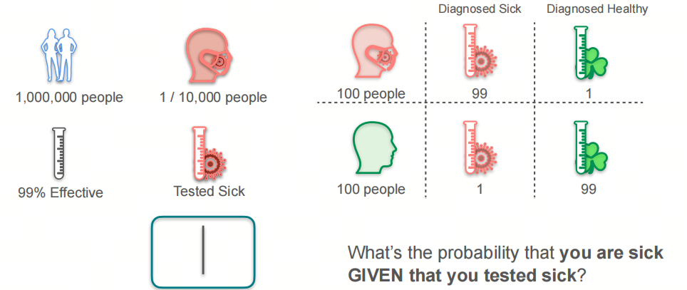
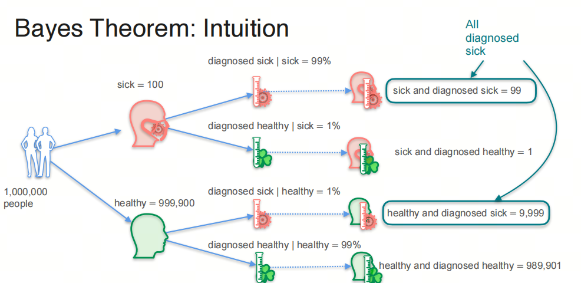

0基础学习AI大模型必备数学知识之概率统计（一）贝叶斯定理和概率分布

## 1. 系列介绍

AI是理科+工科的交叉学科，牢固的数学知识有助于理解算法的本质。

概率统计是AI领域的基础数学知识之一，掌握概率统计知识对于理解深度学习算法和模型至关重要。本系列将介绍AI大模型必备的概率统计知识，帮助大家更好地理解AI大模型的原理和应用。

我们会着重介绍各种基础概念，关键数学名词会加注英文以求更好的理解。我们也会分享一些大学里老师不会教的小知识，目的是帮助大家建立起对概率统计的直觉式认识。

- 概率论 Probability 是描述随机现象发生可能性的数学工具，是一种数学模型，用来描述不确定性的程度；
- 统计学 Statistics 是收集、处理、分析和解释数据的科学，是一种研究数据的方法，用来从数据中提取信息. 

## 1. 贝叶斯 Bayes

### 1.1 贝叶斯定理的直觉理解 

每天都想死，但体检不能出问题！

当你看到体检报告上显示得了某种疾病，你会怎么想？

假设某种疾病的发病率是万分之一，而体检机构的检测准确率是99%，问：当你的体检报告显示得了这种疾病时，你真的得了这种疾病的概率是多少？

***思考下，你的直觉是多少？是高还是低？***

我们可以这样考虑的：

1. 有1000000个人中，其中100人得了病，999900人没得病；
2. 100人中，有99人被检测出得了病，1人没被检测出得了病；
3. 999900人中，有9999人被检测出得了病，989901人没被检测出得了病。

所以，当你的体检报告显示得了这种疾病时，你真的得了这种疾病的概率是：

和你想的一样吗？

### 1.2 先验概率和后验概率 Prior and Posterior Probability

先验概率 Prior Probability：在考虑任何新证据之前，我们对事件的概率的初始判断：

在这个场景下是一个人得病的概率；P(sick) = 0.0001

后验概率 Posterior Probability：在考虑了新证据之后，我们对事件的概率的修正判断：

在这个场景下是体检报告显示有病，那么这个人真的得病的概率。P(sick|diagnosed sick) = 0.0098

### 1.3 贝叶斯定理 Bayes' Theorem

将**假设某种疾病的发病率是万分之一，而体检机构的检测准确率是99%**这个问题用数学公式表示：

$$P(sick) = 0.0001$$

$$P(not\ sick) = 0.9999$$

$$P(diagnosed\ sick|sick) = 0.99$$

$$P(diagnosed\ sick|not sick) = 0.01$$

我们的目标是求解：

$$P(sick|diagnosed\ sick)$$

下面给出贝叶斯定理 Bayes' Theorem：

$$P(sick|diagnosed\ sick) = \frac{P(diagnosed\ sick|sick)P(sick)}{P(diagnosed\ sick)}$$

问题是我们不知道$P(diagnosed\ sick)$，但是我们可以用全概率公式 Total Probability Theorem 来求解：

$$P(diagnosed\ sick) = P(diagnosed\ sick|sick)P(sick) + P(diagnosed\ sick|not\ sick)P(not\ sick)$$

所以：

$$P(sick|diagnosed\ sick) = \frac{P(diagnosed\ sick|sick)P(sick)}{P(diagnosed\ sick|sick)P(sick) + P(diagnosed\ sick|not\ sick)P(not\ sick)}$$

代入数值：

$$P(sick|diagnosed\ sick) = \frac{0.99*0.0001}{0.99*0.0001 + 0.01*0.9999} = 0.0098$$

所以，当你的体检报告显示得了这种疾病时，你真的得了这种疾病的概率是0.0098，不到1%。

### 1.4 朴素贝叶斯 Naive Bayes

贝叶斯定理的一个重要应用是朴素贝叶斯分类器 Naive Bayes Classifier。

朴素贝叶斯分类器是一种基于贝叶斯定理的简单概率分类器，它假设特征之间是相互独立的。

- 部分80后/90后对‘因吹斯汀’和‘图样图森破’应该不陌生，年轻人不要太Naive！

之所以叫朴素贝叶斯，是因为它假设特征之间是相互独立的(太天真了),这个假设在实际应用中往往不成立, 但是朴素贝叶斯分类器在实际应用中表现良好。

## 2. 离散概率分布 Discrete Probability Distribution

### 2.1 二项分布 Binomial Distribution
二项分布是统计学中的一种离散概率分布，它描述了在固定次数的独立实验中，每次实验只有两种可能结果（成功或失败），且每次实验成功的概率相同的情况下，成功次数的概率分布。

二项分布的公式为：

$P(X = k) = \binom{n}{k} p^k (1-p)^{n-k}$

其中：
- $n$ 是实验的总次数。
- $k$ 是成功的次数。
- $p$ 是每次实验成功的概率。
- $\binom{n}{k}$ 是组合数，表示从 $n$ 个实验中选择 $k$ 个成功的组合数，计算公式为 $\binom{n}{k} = \frac{n!}{k!(n-k)!}$。

二项分布的期望值 $E(X)$ 和方差 $Var(X)$ 分别为：

$E(X) = np$
$Var(X) = np(1-p)$

二项分布的图形是一个离散的、非对称的分布，当 $p = 0.5$ 时，分布是对称的。当 $n$ 较大时，二项分布可以近似为正态分布。

### 2.2 伯努利分布 Bernoulli Distribution

伯努利分布是二项分布的特例，当 $n = 1$ 时，二项分布就是伯努利分布。

伯努利分布的公式为：

$P(X = k) = p^k (1-p)^{1-k}$

其中：

- $k = 0$ 或 $k = 1$。

伯努利分布的期望值 $E(X)$ 和方差 $Var(X)$ 分别为：

$E(X) = p$

$Var(X) = p(1-p)$

- 我们可能在不同的领域听到伯努利的名字，比如流体力学中的伯努利定律等，这些都是伯努利做的吗？事实上，这些都是伯努利家族的成员，他们是一家人，但是不是同一个人。提出伯努利分布的是瑞士数学家雅各布·伯努利（Jacob Bernoulli），他的弟弟约翰·伯努利（Johann Bernoulli）也是一位著名的数学家，是欧拉的老师。而流体力学中的伯努利定律是丹尼尔·伯努利（Daniel Bernoulli）提出的，他是约翰·伯努利的儿子.

## 3. 连续概率分布 Continuous Probability Distribution

### 3.1 概率密度函数 Probability Density Function

概率密度函数（Probability Density Function，简称PDF）是连续型随机变量的概率分布的描述。对于连续型随机变量，我们不能像离散型随机变量那样直接给出每个值的概率，因为连续型随机变量可以取无限多个值，每个值的概率通常是0。因此，我们使用概率密度函数来描述连续型随机变量在某个区间内取值的概率。

概率密度函数 $f(x)$ 具有以下性质：

1. 非负性：对于所有的 $x$，有 $f(x) \geq 0$;
2. 归一化：概率密度函数在整个定义域上的积分等于1，即 $\int_{-\infty}^{\infty} f(x) \, dx = 1$;
3. 概率计算：连续型随机变量 $X$ 落在区间 $[a, b]$ 内的概率由概率密度函数在该区间上的积分给出，即 $P(a \leq X \leq b) = \int_{a}^{b} f(x) \, dx$.

### 3.2 累积分布函数 Cumulative Distribution Function

累积分布函数（Cumulative Distribution Function，简称CDF）是描述随机变量概率分布的函数，它给出了随机变量取值小于或等于某个值的概率。对于任意的实数 $x$，累积分布函数 $F(x)$ 定义为：

$F(x) = P(X \leq x)$

其中 $X$ 是随机变量。

累积分布函数具有以下性质：

1. **非减性**：$F(x)$ 是一个非减函数，即如果 $x_1 < x_2$，则 $F(x_1) \leq F(x_2)$;
2. **右连续性**：$F(x)$ 是右连续的，即 $\lim_{y \to x^+} F(y) = F(x)$;
3. **极限性质**：
   - 当 $x$ 趋向于负无穷大时，$F(x)$ 趋向于0，即 $\lim_{x \to -\infty} F(x) = 0$;
   - 当 $x$ 趋向于正无穷大时，$F(x)$ 趋向于1，即 $\lim_{x \to \infty} F(x) = 1$.

对于离散型随机变量，累积分布函数是阶梯函数，它在随机变量的每个可能取值处跳跃，跳跃的高度等于该值的概率。

对于连续型随机变量，累积分布函数是连续的，它可以通过概率密度函数 $f(x)$ 积分得到：

$F(x) = \int_{-\infty}^{x} f(t) \, dt$

累积分布函数在统计学中非常重要，它用于计算随机变量落在某个区间内的概率，以及进行概率分布的比较和分析。通过累积分布函数，我们可以得到随机变量的中位数、分位数、期望值和方差等统计量。

### 3.3 均匀分布 Uniform Distribution

均匀分布（Uniform Distribution）是一种简单的连续概率分布，它的概率密度函数 $f(x)$ 在一个区间内是常数，区间外是0。均匀分布的概率密度函数为：

$$f(x) = \begin{cases} \frac{1}{b-a}, & a \leq x \leq b \\ 0, & x < a \text{ 或 } x > b \end{cases}$$

### 3.4 正态分布 Normal Distribution

正态分布（Normal Distribution）是统计学中最重要的连续概率分布之一，它具有许多重要的性质，被广泛应用于自然科学、社会科学和工程技术等领域。

正态分布的概率密度函数 $f(x)$ 为：

$$f(x) = \frac{1}{\sqrt{2\pi}\sigma} e^{-\frac{(x-\mu)^2}{2\sigma^2}}$$

其中 $\mu$ 是均值，$\sigma$ 是标准差。

正态分布的期望值 $E(X)$ 和方差 $Var(X)$ 分别为：

$$E(X) = \mu$$

$$Var(X) = \sigma^2$$

正态分布有一个重要的性质，就是68-95-99.7法则，即在正态分布中，68%的数据落在均值的一个标准差范围内，95%的数据落在两个标准差范围内，99.7%的数据落在三个标准差范围内。

- 正态分布又叫高斯分布，是由德国数学家高斯（Gauss）在19世纪提出的，高斯是数学家中的数学家，他的成就非常多，不仅在数学领域有很多重要的发现，而且在物理学、天文学、统计学等领域也有很多重要的贡献。高斯分布是自然界中最常见的分布，许多自然现象都可以用高斯分布来描述，比如人的身高、体重、智商等。

**你是否考虑过：为什么正态分布是自然界中最常见的分布？** 关注我后面继续分享：中心极限定理 Central Limit Theorem.

## 参考

[1] [robability-and-statistics](https://www.coursera.org/learn/machine-learning-probability-and-statistics/home/week/1)

[2] [伯努利家族](https://zh.wikipedia.org/wiki/%E4%BC%AF%E5%8A%AA%E5%88%A9%E5%AE%B6%E6%97%8F)

[3] [伯努利定律](https://zh.wikipedia.org/wiki/%E4%BC%AF%E5%8A%AA%E5%88%A9%E5%AE%9A%E5%BE%8B)

## 欢迎关注我的GitHub和微信公众号[真-忒修斯之船]，来不及解释了，快上船！

[GitHub: LLMForEverybody](https://github.com/luhengshiwo/LLMForEverybody)

仓库上有原始的Markdown文件，完全开源，欢迎大家Star和Fork！