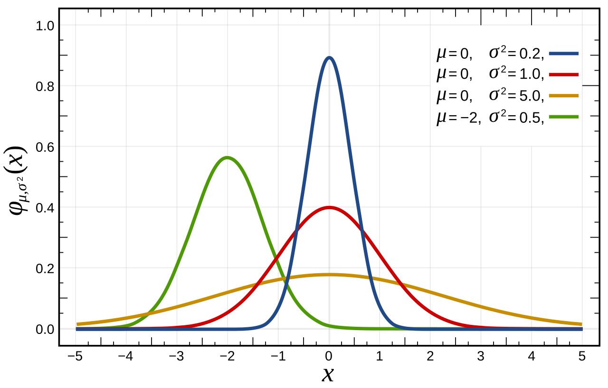
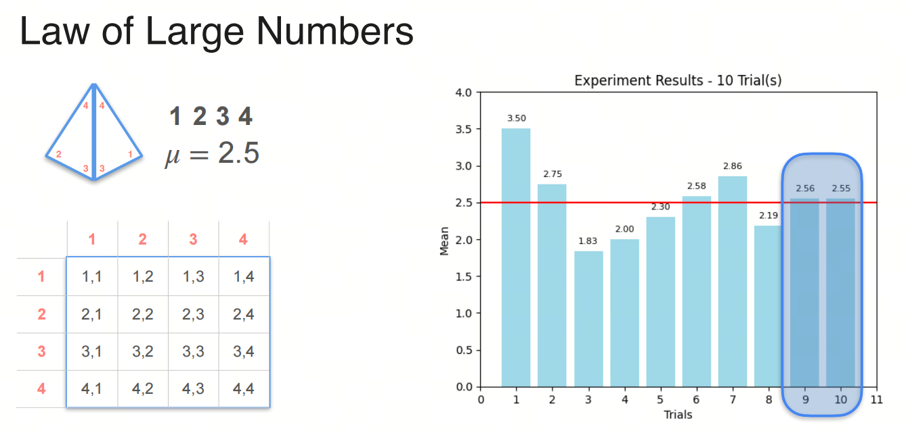
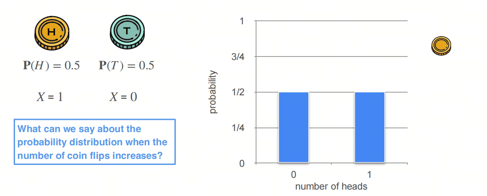
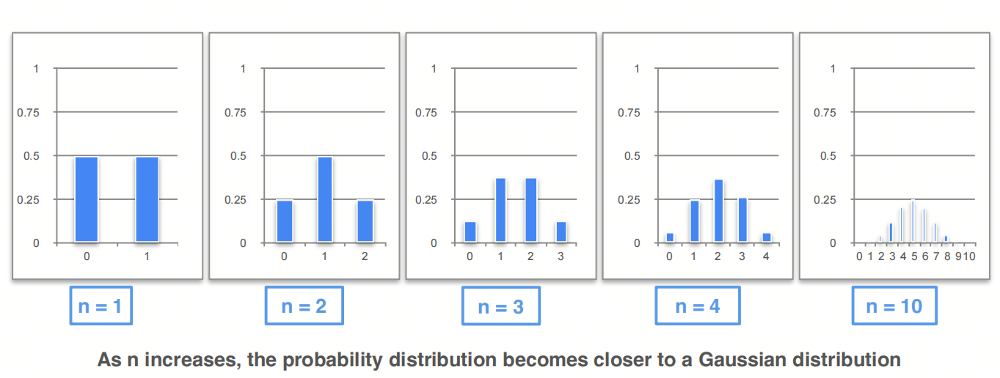
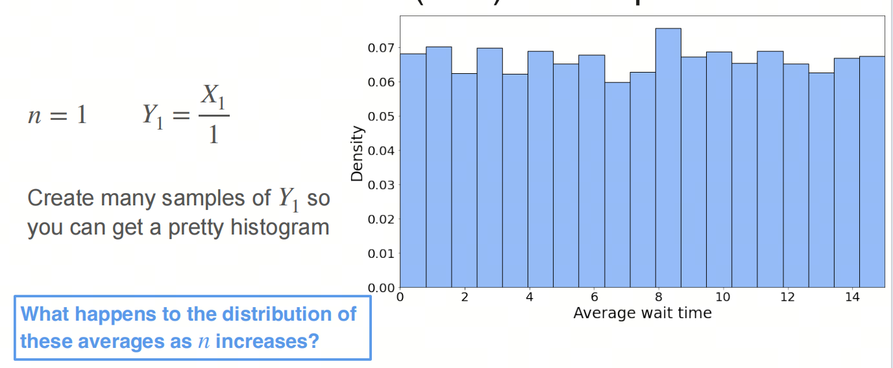
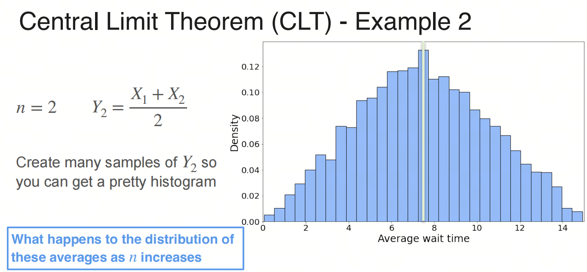
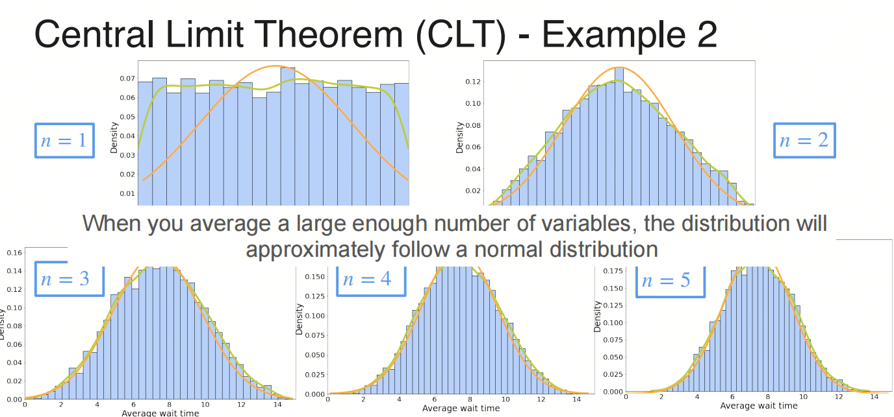

0基础学习AI大模型必备数学知识之概率统计（三）中心极限定理

## 1. 系列介绍

AI是理科+工科的交叉学科，牢固的数学知识有助于理解算法的本质。

概率统计是AI领域的基础数学知识之一，掌握概率统计知识对于理解深度学习算法和模型至关重要。本系列将介绍AI大模型必备的概率统计知识，帮助大家更好地理解AI大模型的原理和应用。

我们会着重介绍各种基础概念，关键数学名词会加注英文以求更好的理解。我们也会分享一些大学里老师不会教的小知识，目的是帮助大家建立起对概率统计的直觉式认识。

- 概率论 Probability 是描述随机现象发生可能性的数学工具，是一种数学模型，用来描述不确定性的程度；
- 统计学 Statistics 是收集、处理、分析和解释数据的科学，是一种研究数据的方法，用来从数据中提取信息. 

## 1. 正态分布 Normal Distribution

- 正态分布（Normal Distribution），又称高斯分布（Gaussian Distribution），是概率统计中最重要的分布之一，也是最常见的分布之一。

你肯定了解过正态分布，也知道它是自然界中最常见的分布，甚至它的英文都是'Normal'，比如人的身高、体重、智商等等，都符合正态分布。

那你知道为什么人的身高、体重、智商等符合正态分布吗？因为：中心极限定理！Central Limit Theorem

中心极限定理指出，随着随机变量数量的增加，许多具有有限方差的独立的且相同分布的随机变量的总和将趋于正态分布。

一个人的身高、体重、智商等等是由很多基因决定的，每一个基因都是一个随机变量，而这些随机变量的总和就是一个人的身高、体重、智商等等，根据中心极限定理，这些总和将趋于正态分布。

## 2. 大数定律 Law of Large Numbers

大数定律（Law of Large Numbers）是概率统计中的一个重要定理，它描述了随机变量序列的均值在重复试验中趋于其期望值的现象。

大数定律分为弱大数定律和强大数定律两种。

- 弱大数定律：对于独立同分布的随机变量序列，其均值在重复试验中趋于其期望值的概率为1。

- 强大数定律：对于独立同分布的随机变量序列，其均值在重复试验中几乎肯定收敛于其期望值。

## 3. 中心极限定理 Central Limit Theorem

### 直觉式理解

中心极限定理的直观理解是：对于任意分布的随机变量，只要重复试验次数足够多，其和的分布将趋于正态分布。

### 离散型随机变量的中心极限定理 CLT for Discrete Random Variables

考虑投硬币的例子，投硬币的结果是正面或者反面，正面朝上为1，那结果是0或1，结果服从二项分布。

投1次，可能的情况是0、1,概率为0.5、0.5；

投2次，可能的情况是0、1、2,概率为0.25、0.5、0.25；

投3次，可能的情况是0、1、2、3,概率为0.125、0.375、0.375、0.125；

随着投硬币的次数增加，分布图像将趋于正态分布

### 连续型随机变量的中心极限定理 CLT for Continuous Random Variables

考虑一个均匀分布uniform distribution，这边考虑的是客服电话的等待时长，假设时长在0到15分钟之间，那么时长服从均匀分布。

采样打一次电话的分布：

采样打两次电话的等待时间和的分布：

采样打三次电话的等待时间和的分布：

随着采样次数的增加，分布图像将趋于正态分布

## 4. 中心极限定理的历史

中心极限定理有着有趣的历史。这个定理的第一版被法国数学家棣莫弗发现，他在1733年发表的卓越论文中使用正态分布去估计大量抛掷硬币出现正面次数的分布。这个超越时代的成果险些被历史遗忘，所幸著名法国数学家拉普拉斯在1812年发表的巨著《Théorie Analytique des Probabilités》中拯救了这个默默无名的理论。

拉普拉斯扩展了棣莫弗的理论，指出二项分布可用正态分布逼近。但同棣莫弗一样，拉普拉斯的发现在当时并未引起很大反响。直到十九世纪末中心极限定理的重要性才被世人所知。

1901年，俄国数学家里雅普诺夫用更普通的随机变量定义中心极限定理并在数学上进行了精确的证明。如今，中心极限定理被认为是概率论中的首席定理

## 参考

[1] [robability-and-statistics](https://www.coursera.org/learn/machine-learning-probability-and-statistics/home/week/3)

[2] [中心极限定理](https://zh.wikipedia.org/wiki/%E4%B8%AD%E5%BF%83%E6%9E%81%E9%99%90%E5%AE%9A%E7%90%86)