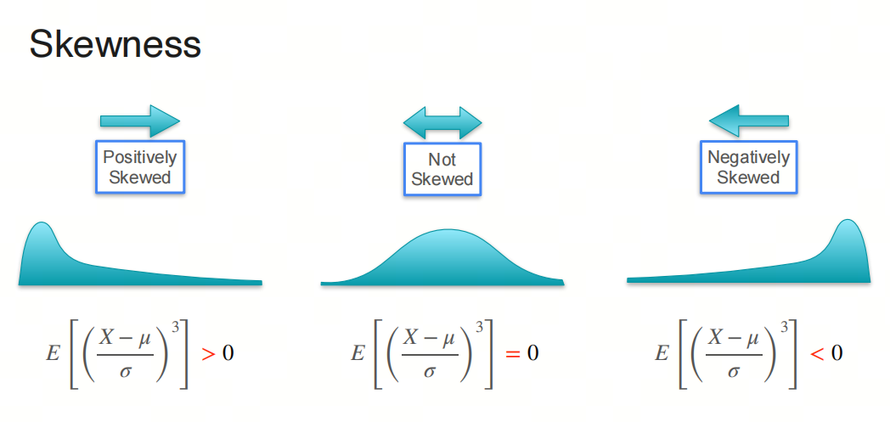
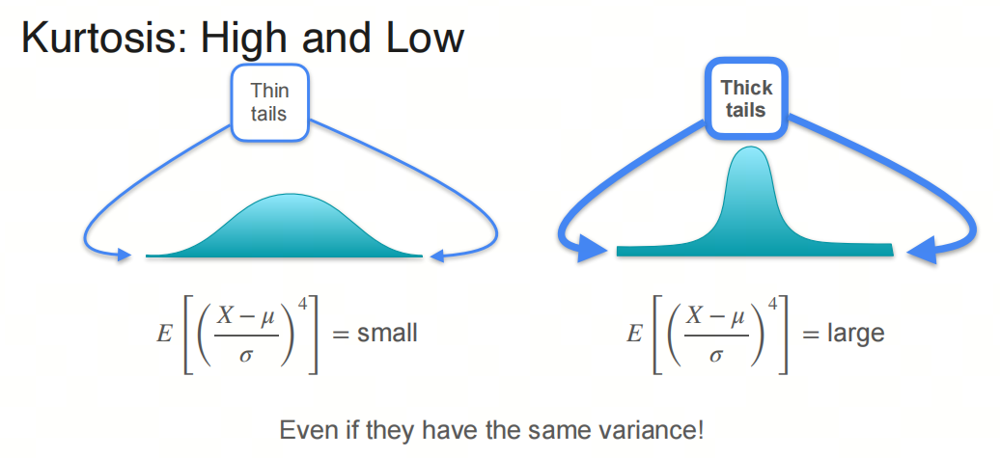
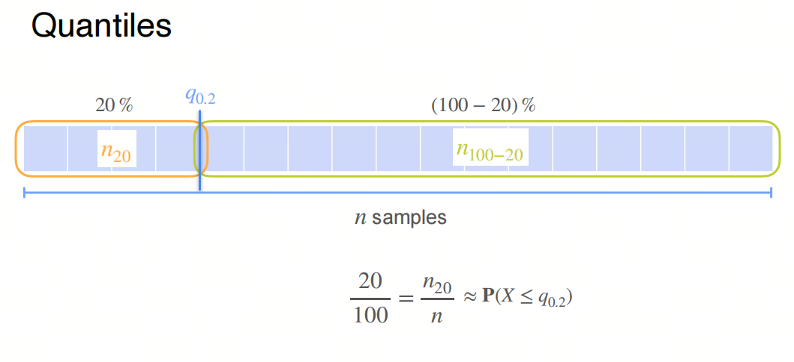
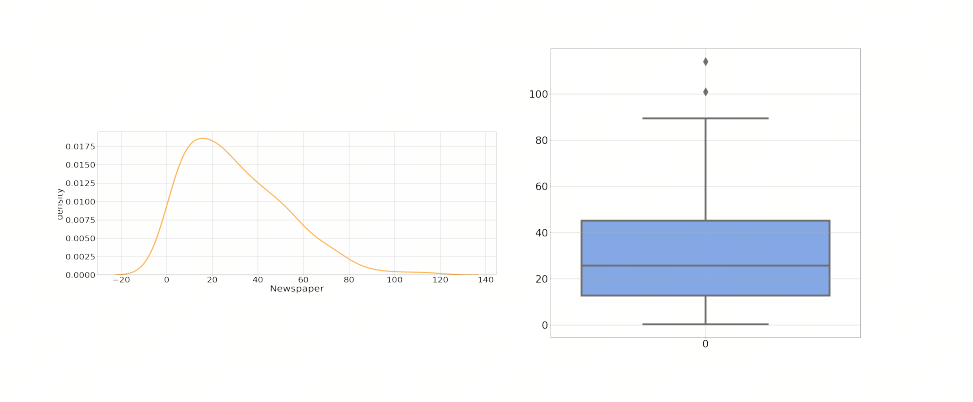

0基础学习AI大模型必备数学知识之概率统计（二）分布的描述方法

## 1. 系列介绍

AI是理科+工科的交叉学科，牢固的数学知识有助于理解算法的本质。

概率统计是AI领域的基础数学知识之一，掌握概率统计知识对于理解深度学习算法和模型至关重要。本系列将介绍AI大模型必备的概率统计知识，帮助大家更好地理解AI大模型的原理和应用。

我们会着重介绍各种基础概念，关键数学名词会加注英文以求更好的理解。我们也会分享一些大学里老师不会教的小知识，目的是帮助大家建立起对概率统计的直觉式认识。

- 概率论 Probability 是描述随机现象发生可能性的数学工具，是一种数学模型，用来描述不确定性的程度；
- 统计学 Statistics 是收集、处理、分析和解释数据的科学，是一种研究数据的方法，用来从数据中提取信息. 

## 1. 期望和方差 Expectation and Variance

期望（Expected Value）和方差（Variance）是概率论和统计学中的两个基本概念，它们分别描述了随机变量的 ***中心趋势*** 和 ***离散程度*** 。

### 期望（Expected Value）
期望是随机变量的平均值或长期平均值。对于离散型随机变量 $X$，其期望 $E(X)$ 定义为：
$E(X) = \sum_{i} x_i \cdot P(x_i)$
其中 $x_i$ 是随机变量 $X$ 的所有可能取值，$P(x_i)$ 是 $X$ 取值 $x_i$ 的概率。

对于连续型随机变量 $X$，其期望 $E(X)$ 定义为：
$E(X) = \int_{-\infty}^{\infty} x \cdot f(x) \, dx$
其中 $f(x)$ 是 $X$ 的概率密度函数。

### 方差（Variance）
方差是衡量随机变量离散程度的指标，它描述了随机变量的值与其期望值的偏离程度。对于离散型随机变量 $X$，其方差 $Var(X)$ 定义为：
$Var(X) = E[(X - E(X))^2] = \sum_{i} (x_i - E(X))^2 \cdot P(x_i)$

对于连续型随机变量 $X$，其方差 $Var(X)$ 定义为：
$Var(X) = E[(X - E(X))^2] = \int_{-\infty}^{\infty} (x - E(X))^2 \cdot f(x) \, dx$

方差的平方根称为标准差（Standard Deviation），它与原随机变量具有相同的单位，因此在实际应用中更直观。

### 期望和方差的性质
1. 期望的线性性质：对于任意常数 $a$ 和 $b$，以及随机变量 $X$ 和 $Y$，有：
   $E(aX + bY) = aE(X) + bE(Y)$

2. 方差的性质：对于任意常数 $a$ 和 $b$，以及随机变量 $X$，有：
   $Var(aX + b) = a^2 Var(X)$
   注意，常数 $b$ 不会影响方差，因为方差只关心离散程度，与位置无关。

## 2. 偏度和峰度 Skewness and Kurtosis

期望和方差是描述随机变量分布的中心趋势和离散程度的两个基本统计量。期望（Expected Value）给出了随机变量的平均值，而方差（Variance）描述了随机变量值与其期望值的偏离程度。尽管这两个统计量提供了随机变量分布的重要信息，但它们并不足以全面描述一个分布的所有特征，这就是为什么我们还需要偏度（Skewness）和峰度（Kurtosis）这两个统计量的原因。

### 偏度（Skewness）
偏度是描述分布不对称性的统计量。它衡量了分布的偏斜程度，即数据分布的尾部哪一侧更长或更短。如果一个分布是对称的，那么它的偏度为0。如果分布的右侧（正侧）比左侧长，那么偏度为正，称为右偏或正偏；如果左侧比右侧长，那么偏度为负，称为左偏或负偏。偏度的计算公式为：
$Skewness = \frac{E[(X - \mu)^3]}{\sigma^3}$
其中，$\mu$ 是均值，$\sigma$ 是标准差。



### 峰度（Kurtosis）
峰度是描述分布“尖峭”或“平坦”程度的统计量。它衡量了分布顶部的尖锐程度和尾部的厚度。峰度与正态分布相比较，正态分布的峰度为0。如果一个分布的峰度大于0，那么它比正态分布更尖锐，称为尖顶峰；如果峰度小于0，那么它比正态分布更平坦，称为平顶峰。峰度的计算公式为：
$Kurtosis = \frac{E[(X - \mu)^4]}{\sigma^4} - 3$
其中，$\mu$ 是均值，$\sigma$ 是标准差。



### 为什么需要偏度和峰度
1. **更全面的分布描述**：期望和方差只能描述分布的中心位置和离散程度，而偏度和峰度提供了关于分布形状的额外信息，使得我们能够更全面地理解数据的分布特性。
2. **识别异常分布**：偏度和峰度有助于识别那些不符合正态分布假设的数据分布，这对于许多统计分析和模型建立是非常重要的。
3. **风险管理**：在金融等领域，偏度和峰度是评估风险的重要工具，因为它们提供了关于极端值可能性的信息，这对于投资组合管理和风险控制至关重要。

综上所述，偏度和峰度是描述随机变量分布特征的重要补充，它们与期望和方差一起，为我们提供了一个更完整的分布特征描述。

## 3. 分位数和箱线图 Quantile and Boxplot

### 3.1 分位数 Quantile

分位数（Quantile）是统计学中用来描述数据分布的特定值，它将数据集分为具有相同概率的连续区间。分位数可以用来衡量数据的相对位置，以及数据分布的形状和离散程度。

### 定义
对于一个随机变量 $X$ 和一个给定的概率 $p$（其中 $0 < p < 1$），分位数 $Q(p)$ 是满足以下条件的值：

$P(X \leq Q(p)) = p$

这意味着分位数 $Q(p)$ 是随机变量 $X$ 的值，使得 $X$ 小于或等于 $Q(p)$ 的概率为 $p$。

### 常见的分位数
1. **中位数（Median）**：中位数是 $p = 0.5$ 时的分位数，即 $Q(0.5)$。它将数据集分为两部分，每部分包含50%的数据。
2. **四分位数（Quartiles）**：四分位数将数据集分为四等分，每个部分包含25%的数据。它们分别是：
   - 第一四分位数（Q1）：$p = 0.25$ 时的分位数，即 $Q(0.25)$。
   - 第二四分位数（Q2）：$p = 0.5$ 时的分位数，即中位数。
   - 第三四分位数（Q3）：$p = 0.75$ 时的分位数，即 $Q(0.75)$。
3. **百分位数（Percentiles）**：百分位数是 $p$ 为0.01到0.99之间的分位数。例如，第90百分位数是 $p = 0.90$ 时的分位数，即 $Q(0.90)$。



### 计算方法
对于一个给定的数据集，计算分位数的步骤如下：

1. 将数据集按升序排列。
2. 确定分位数的位置。对于 $p$ 分位数，位置 $P$ 由以下公式给出：
   $P = np$
   其中 $n$ 是数据集的大小。
3. 如果 $P$ 是整数，那么 $p$ 分位数是第 $P$ 个数据点和第 $P+1$ 个数据点的平均值。
4. 如果 $P$ 不是整数，那么 $p$ 分位数是第 $\lceil P \rceil$ 个数据点，其中 $\lceil P \rceil$ 表示 $P$ 的向上取整。

### 应用
分位数在统计学中有很多应用，例如：

- 描述数据的分布形状和离散程度。
- 检测异常值和离群点。
- 进行数据的标准化和转换。
- 构建箱线图（Boxplot）来可视化数据的分布。

分位数是理解数据分布的重要工具，它们提供了关于数据相对位置和分布特征的有用信息。


### 3.2 箱线图 Boxplot

箱图（Boxplot），也称为箱线图或盒须图，是一种用于展示数据分布特征的统计图表。它能够提供数据的最小值、第一四分位数（Q1）、中位数（Q2）、第三四分位数（Q3）和最大值的直观展示，以及异常值（如果有的话）。以下是绘制箱图的基本步骤：

### 手动绘制箱图的步骤：

1. **收集数据**：首先，你需要一组数据来进行分析。

2. **排序**：将数据从小到大排序。

3. **计算四分位数**：
   - **Q1（第一四分位数）**：数据下半部分的中位数（如果数据集大小为奇数，则不包括中位数）。
   - **Q2（第二四分位数/中位数）**：整个数据集的中位数。
   - **Q3（第三四分位数）**：数据上半部分的中位数（如果数据集大小为奇数，则不包括中位数）。

4. **确定最大值和最小值**：
   - 最大值：除去异常值后数据集中的最大值。
   - 最小值：除去异常值后数据集中的最小值。

5. **绘制箱体**：
   - 箱体的下界是Q1，上界是Q3。

6. **绘制中位线**：
   - 在箱体内部绘制一条线，表示中位数Q2。

7. **绘制触须**：
   - 触须是从箱体延伸出去的线条，表示数据的范围，通常触须的末端是最小值和最大值，但如果有异常值，则触须延伸到非异常值的最小值和最大值。

8. **标记异常值**：
   - 异常值通常用点或星号标记，它们是超出触须范围的数据点。


#### Python（使用matplotlib和seaborn库）：
```python
import seaborn as sns
import matplotlib.pyplot as plt

# 假设data是一个Pandas Series或DataFrame的列
sns.boxplot(data)
plt.show()
```

### 3.3 核密度估计 Kernel Density Estimation

核密度估计（Kernel Density Estimation，简称KDE）是一种用于估计概率密度函数（Probability Density Function，简称PDF）的非参数方法。它通过在每个数据点周围放置一个“核”（通常是一个平滑的、对称的函数，如高斯函数），然后将这些核函数加起来，得到一个平滑的、连续的概率密度函数。

### 原理
假设我们有一个样本集 $\{x_1, x_2, \ldots, x_n\}$，我们想要估计这个样本集的概率密度函数 $f(x)$。核密度估计的方法是：

$\hat{f}(x) = \frac{1}{n} \sum_{i=1}^{n} K\left(\frac{x - x_i}{h}\right)$

其中：
- $\hat{f}(x)$ 是估计的概率密度函数。
- $K(\cdot)$ 是核函数，它是一个非负的、对称的函数，且满足 $\int K(u) \, du = 1$。
- $h$ 是带宽（Bandwidth），它是一个正数，控制着核函数的宽度，从而影响着估计的平滑程度。


### 常用的核函数
1. **高斯核（Gaussian Kernel）**：
   $K(u) = \frac{1}{\sqrt{2\pi}} e^{-\frac{u^2}{2}}$
   高斯核是最常用的核函数，它具有良好的平滑性和对称性。

2. **均匀核（Uniform Kernel）**：
   $K(u) = \begin{cases} 
   \frac{1}{2} & \text{if } |u| \leq 1 \\
   0 & \text{otherwise}
   \end{cases}$
   均匀核在 $|u| \leq 1$ 时为常数，否则为0。

3. **三角核（Triangular Kernel）**：
   $K(u) = \begin{cases} 
   1 - |u| & \text{if } |u| \leq 1 \\
   0 & \text{otherwise}
   \end{cases}$
   三角核在 $|u| \leq 1$ 时为线性函数，否则为0。

### 带宽的选择
带宽 $h$ 的选择对核密度估计的结果有重要影响。带宽太小，估计的密度函数会过于崎岖，出现过拟合；带宽太大，估计的密度函数会过于平滑，出现欠拟合。常用的带宽选择方法有：

1. **交叉验证（Cross-Validation）**：通过最小化估计的密度函数与实际密度函数之间的差异来选择带宽。
2. **Silverman's Rule of Thumb**：根据样本量 $n$ 和样本的标准差 $\sigma$ 来选择带宽，公式为：
   $h = \left(\frac{4\sigma^5}{3n}\right)^{\frac{1}{5}}$


### 3.4 小提琴图 Violin Plot

小提琴图（Violin Plot）是一种数据可视化图表，它结合了箱线图和核密度图的特点，用于展示数据的分布情况.




### 3.5 QQ图 Quantile-Quantile Plot

QQ图（Quantile-Quantile Plot）是一种用于检验数据是否符合某种分布的图表。它通过比较数据的分位数与理论分位数之间的关系，来判断数据是否符合某种分布。

QQ图通过比较样本数据的分位数与一个理论分布（通常是正态分布）的分位数来检验数据的分布情况。具体来说，它将样本数据的分位数（称为经验分位数）与理论分布的相应分位数（称为理论分位数）进行配对，并在散点图上表示这些配对点。


如果样本数据服从特定的理论分布，那么QQ图上的点应该近似地落在一条直线上，这条直线的斜率等于样本的标准差，截距等于样本的均值。


## 参考

[1] [robability-and-statistics](https://www.coursera.org/learn/machine-learning-probability-and-statistics/home/week/2)