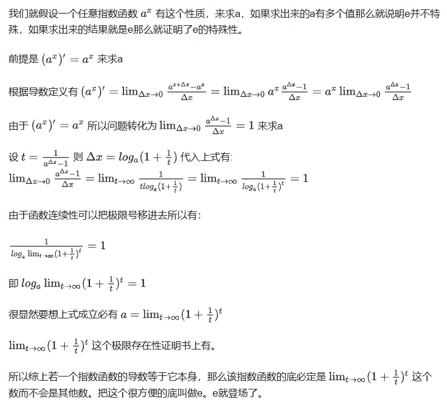

0基础学习AI大模型必备数学知识之微积分（一）导数

## 1. 系列介绍

AI是理科+工科的交叉学科，牢固的数学知识有助于理解算法的本质。

在谈到AI所需的数学知识时，有的人会想起大学时被高数支配的恐惧，或者在想是不是又要把高数上下册拿出来重新翻一遍。

其实，AI所需的高数相关知识，最基本的就是微积分，主要是为了梯度下降和反向传播。这些知识并不难，只要掌握了基本的微积分知识，就可以理解。

我们会着重介绍各种基础概念，关键数学名词会加注英文以求更好的理解。我们也会分享一些大学里老师不会教的小知识，目的是帮助大家建立起对微积分的直觉式认识。

- 虽然我们讲微积分calculus, 但是在AI相关的数学中，最重要的是微分 differentiation, 更进一步的是微分系数-导数 derivative.

## 2. 导数 derivative

导数存在两种符号，拉格朗日符号和莱布尼茨符号,因为它们分别由不同的数学家在微积分的发展历史上独立提出，并根据各自的理解和应用场景设计了不同的表示方法。

1. **拉格朗日符号**：这种符号是由法国数学家约瑟夫·路易·拉格朗日提出的，它使用撇号（'）来表示导数。例如，函数 $f(x)$ 的导数表示为 $f'(x)$。拉格朗日符号在表示高阶导数时更为直观和方便，例如二阶导数可以表示为 $f''(x)$，三阶导数表示为 $f'''(x)$，以此类推。

2. **莱布尼茨符号**：这种符号是由德国数学家戈特弗里德·威廉·莱布尼茨提出的，它使用分数形式来表示导数，例如函数 $f(x)$ 关于 $x$ 的导数表示为 $\frac{df}{dx}$。莱布尼茨符号在表示物理量的比值和求解分离变量的微分方程时具有优势，因为它强调了导数作为商的概念。

这两种符号各有优势和特点，因此在不同的领域和应用中被广泛使用。拉格朗日符号在表示方程组和计算求导时更为方便，而莱布尼茨符号在表示物理量的比值和处理多变量函数时更为直观。此外，莱布尼茨符号也因其在积分号中的使用而被广泛认可。这两种符号的并存，反映了微积分发展的多样性和丰富性，也为不同的数学和科学问题提供了灵活的表达方式。

## 3. 自然底数 e

在高中时我们就知道有一个特殊的数学常数 $e$，它是一个无限不循环小数，是一个无理数。

它有一个特殊的性质，就是它的导数是它自己，即 $e^x$ 的导数是 $e^x$。

关于e，查看先前的文章

## 4. 链式法则 chain rule

链式法则是微积分中的一个重要概念，用于求解复合函数的导数。复合函数是由一个函数和另一个函数组合而成的函数，例如 $f(g(x))$。链式法则描述了复合函数的导数与原函数的导数之间的关系，可以帮助我们计算复杂函数的导数。

## 参考

[1] [machine-learning-calculus](https://www.coursera.org/learn/machine-learning-calculus/home/module/1)