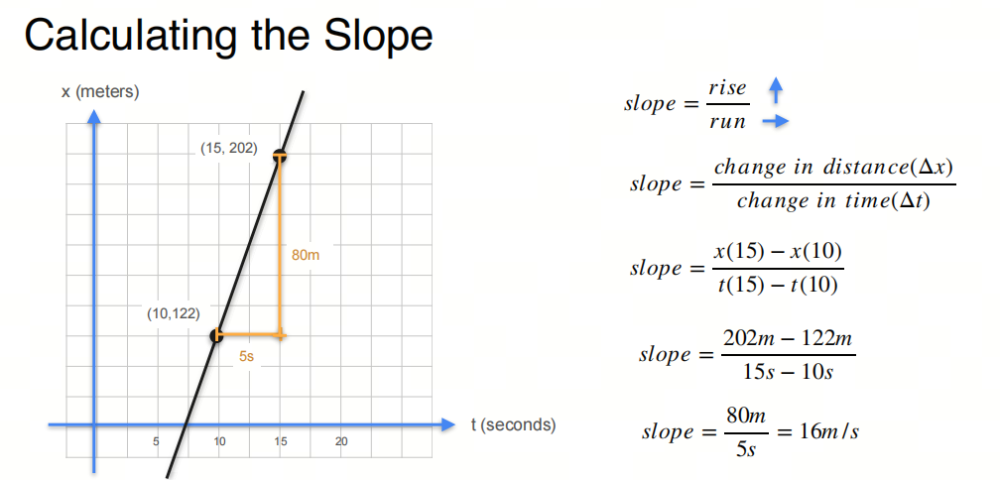
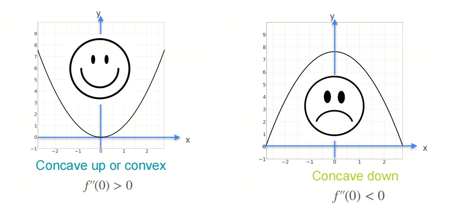
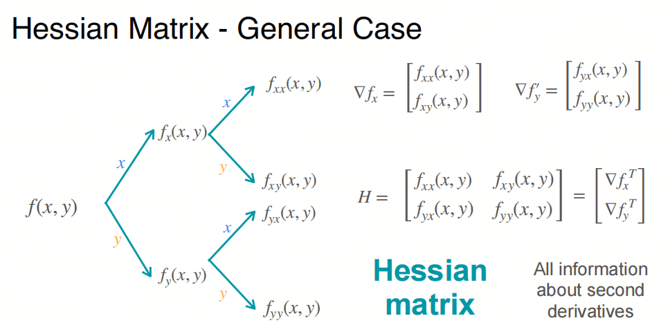

0基础学习AI大模型必备数学知识之微积分（二）梯度和梯度下降

## 1. 系列介绍

AI是理科+工科的交叉学科，牢固的数学知识有助于理解算法的本质。

在谈到AI所需的数学知识时，有的人会想起大学时被高数支配的恐惧，或者在想是不是又要把高数上下册拿出来重新翻一遍。

其实，AI所需的高数相关知识，最基本的就是微积分，主要是为了梯度下降和反向传播。这些知识并不难，只要掌握了基本的微积分知识，就可以理解。

我们会着重介绍各种基础概念，关键数学名词会加注英文以求更好的理解。我们也会分享一些大学里老师不会教的小知识，目的是帮助大家建立起对微积分的直觉式认识。

- 虽然我们讲微积分calculus, 但是在AI相关的数学中，最重要的是微分 differentiation, 更进一步的是微分系数-导数 derivative.

## 2. 偏导数 partial derivative

在多元函数中，如果只对其中一个变量求导，而其他变量视为常数，这种导数称为偏导数.

偏导数的计算方法与导数类似，只是要注意将其他变量视为常数.

偏导数的符号通常用 $\partial$表示，例如函数 $f(x, y)$对 $x$的偏导数表示为 $\frac{\partial f}{\partial x}$，对 $y$的偏导数表示为 $\frac{\partial f}{\partial y}$.

## 3. 梯度 gradient

***斜率 slope***
在单变量函数中，我们有斜率的概念，它表示函数在某一点的变化率.

***梯度 gradient***
在多元函数中，我们有梯度的概念，它表示函数在某一点的变化率.

## 4. 梯度下降 gradient descent

梯度下降是一种优化算法，用于最小化函数的值.

梯度下降法（Gradient Descent）是一种用于寻找函数局部最小值的迭代优化算法。在机器学习和深度学习中，它经常被用来最小化损失函数，从而找到模型参数的最优值。以下是梯度下降法的基本步骤和概念：

1. **目标函数**：首先，你需要有一个目标函数（通常是损失函数），该函数依赖于模型的参数。目标是找到参数的值，使得这个函数的值最小。

2. **梯度**：梯度是目标函数对每个参数的偏导数构成的向量。梯度指向函数增长最快的方向。

3. **下降方向**：为了最小化函数，我们需要沿着梯度的反方向（即最陡下降方向）更新参数。

4. **学习率**：学习率（Learning Rate）是一个正的标量，它决定了在梯度下降方向上移动的步长。如果学习率太大，可能会越过最小值甚至发散；如果学习率太小，收敛速度会很慢。

5. **迭代更新**：在每次迭代中，算法会计算当前参数的梯度，然后更新参数，使其沿着梯度下降的方向移动。这个过程会重复进行，直到满足某个停止条件，比如梯度足够小、达到预设的迭代次数或者目标函数值的变化低于某个阈值。

6. **停止条件**：梯度下降算法需要一个停止条件来确定何时停止迭代。常见的停止条件包括梯度的范数小于一个很小的正数、达到最大迭代次数或者目标函数的改善低于某个阈值。

梯度下降法的简单迭代公式如下：

$\theta_{\text{new}} = \theta_{\text{old}} - \alpha \nabla_\theta J(\theta_{\text{old}})$

其中，$\theta$表示模型参数，$\alpha$是学习率，$\nabla_\theta J(\theta)$是目标函数$J$对参数$\theta$的梯度。

目前在深度学习中，我们使用的优化算法见之前的文章

## 5. 二阶导数 second derivative

直观的说：二阶导数是导数的导数，表示函数的变化率的变化率.

在单变量函数中，二阶导数表示函数的曲率，正值表示函数向上凹，负值表示函数向下凹.

在多元函数中，二阶导数表示函数在某一点的曲率，Hessian矩阵是二阶导数的矩阵形式.

## 6. Hessian矩阵

对于下图的例子，我们可以算出每一个偏导数的二阶导数.

我们给出二阶导数的符号定义：

给出Hessian矩阵的定义：

至此二阶导数的形式如下：

### 7. 微积分总结

高数在大学数学中占了很大的比重，但是在AI中，我们需要的高数知识基本就在微积分这一块，主要是为了梯度下降和反向传播. 而这一块的工作，Pytorch或者Tensorflow框架已经帮我们做好了，我们只需要调用相应的函数即可.

## 参考

[1] [machine-learning-calculus](https://www.coursera.org/learn/machine-learning-calculus/home/module/2)

## 欢迎关注我的GitHub和微信公众号[真-忒修斯之船]，来不及解释了，快上船！

[GitHub: LLMForEverybody](https://github.com/luhengshiwo/LLMForEverybody)

仓库上有原始的Markdown文件，完全开源，欢迎大家Star和Fork！