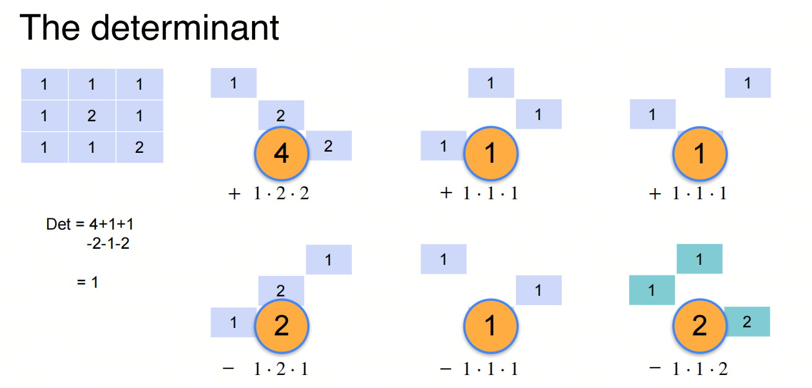

0基础学习AI大模型必备数学知识之线性代数（一）矩阵，奇异性和行列式

## 1. 系列介绍

AI是理科+工科的交叉学科，牢固的数学知识有助于理解算法的本质。

线性代数是AI领域的基础数学知识之一，掌握线性代数知识对于理解深度学习算法和模型至关重要。本系列将介绍AI大模型必备的线性代数知识，帮助大家更好地理解AI大模型的原理和应用。

我们会着重介绍各种基础概念，关键数学名词会加注英文以求更好的理解。我们也会分享一些大学里老师不会教的小知识，目的是帮助大家建立起对线性代数的直觉式认识。

## 2. 矩阵 matrix

对于我来说，第一次听到‘Matrix’ 这个词还是来源于《黑客帝国》（《The Matrix》）这部电影。在电影中，Matrix是一个虚拟世界，是由机器人控制的，人类被困在这个虚拟世界中，而不知道真实的世界是什么样子。

首先，矩阵只是matrix的一个翻译，matrix一词来自拉丁语，表示 “子宫”之意，子宫是孩子诞生之处，故也引申为各种事物的源出之处，即“发源地”。这个词后来被用在各种学科中。

在数学中，用其表示按照长方阵列排列的复数或实数集合，书写时用外括号括起来。方阵中设置不同的数字，从而生成不同阵列参数，这阵列参数及其理论广泛应用于电路学、力学、光学、量子物理学、计算机运算中。西尔维斯特将之命名为matrix，中文翻译为“矩阵”。从另外一个角度看，矩阵外括号包围着内部数据，形态上也像子宫孕育着即将诞生的婴儿一般。

- 我在先前的文章中将矩形排布的序列称为“Matrix”，盖因从中可以产生出各种不同的行列式，就如由同一个母体的子宫中孕育出来一样 ---- 西尔维斯特

## 3. 奇异性 singularity

***singular*** 作为形容词在英文中有两个意思：1. 单数的，2. 特别的；引人注意的. 在线性代数的语境中，我们取第二个意思，即特别的，引人注意的。并翻译成固定的数学名词 ***奇异*** / ***奇异的***;

为此 singularity作为名词，翻译成 ***奇异性*** / ***奇异点***;

有 ***奇异的***， 那肯定有 ***非奇异的***，即 ***non-singular***。

那什么样的矩阵是 ***奇异的***呢？换言之，什么样的矩阵是 ***引人注意的*** 呢？

我们用几个句子来类比一下：

### 3.1 句子类比1

上面有三组句子对，每组有两个句子：

1. 第一组句子描述有一只黑狗和一只橘猫，我们说这样的句子组是 ***完备的***（ ***complete***）；
2. 第二组句子描述有一只黑狗和一只黑狗，我们说这样的句子组是 ***冗余的***（ ***redundant***）；
3. 第三组句子描述有一只黑狗和一只白狗，我们说这样的句子组是 ***矛盾的***（ ***contradictory***）。

完备的句子组是非奇异的，冗余和矛盾的句子组是奇异的，这和现实生活中的逻辑是一样的，好事不出门，坏事传千里。不好的东西总是引人注意的。

### 3.2 句子类比2

对于更多的句子组，可以类比上述的方式看出其奇异性。

### 3.3 数学思考

完备的线性方程组有唯一解，冗余的线性方程组有无穷多解，矛盾的线性方程组没有解。这和上面的句子类比是一样的。

## 4. 行列式 determinant

对于一个矩阵，我如何判断它是奇异的还是非奇异的呢？这就要用到行列式的概念。

determinant 在英文中的意思是：决定因素。在线性代数的语境中，determinant决定了一个矩阵是奇异的还是非奇异的。也就是矩阵对应的增广矩阵（augmented matrix）是否有解和解的唯一性。我们将其翻译成 ***行列式***。

- 如果你不知道什么是增广矩阵，不用担心，我们会在下一篇文章中介绍。

- 关于行列式一词的由来： **矩阵** 之前被称为 **行列**，那决定 **行列**奇异性的计算公式值determinant，就是 **行列式**了，后来，**行列**改名为 **矩阵**，但 **行列式** 这个名字却一直保留了下来。

### 4.1. 行列式的计算
一个 $n$ 阶方块矩阵 $A$ 的行列式可直观地定义如下:

其中 $S_{n}$ 是集合 $\{ 1,2,...,n \}$上置换的全体，即集合 $\{1,2,...,n\}$ 到自身上的一一映射（双射）的全体.

除非你想要继续深入学习线性代数，否则你不需要知道上述的定义。我们只需要知道行列式的直观计算逻辑即可。

## 参考

[1] [machine-learning-linear-algebra](https://www.coursera.org/learn/machine-learning-linear-algebra/home/week/1)

[2] [Matrix和《黑客帝国》](https://www.sohu.com/a/297701917_120051601)

[3] [wiki:矩阵](https://zh.wikipedia.org/wiki/%E7%9F%A9%E9%98%B5)

[4] [wiki:西尔维斯特](https://zh.wikipedia.org/wiki/%E8%A9%B9%E5%A7%86%E6%96%AF%C2%B7%E7%B4%84%E7%91%9F%E5%A4%AB%C2%B7%E8%A5%BF%E7%88%BE%E7%B6%AD%E6%96%AF%E7%89%B9)

## 欢迎关注我的GitHub和微信公众号[真-忒修斯之船]，来不及解释了，快上船！

[GitHub: LLMForEverybody](https://github.com/luhengshiwo/LLMForEverybody)

仓库上有原始的Markdown文件，完全开源，欢迎大家Star和Fork！